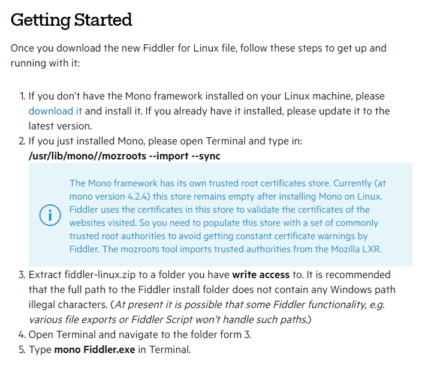
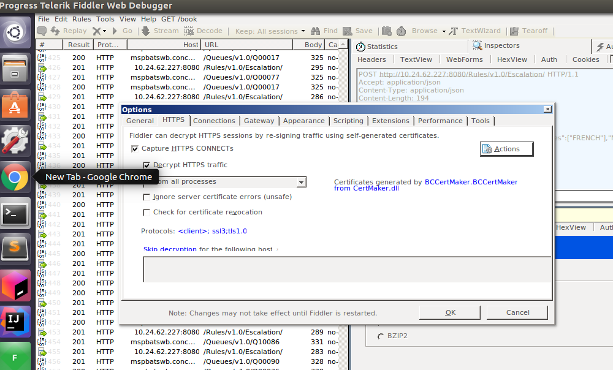
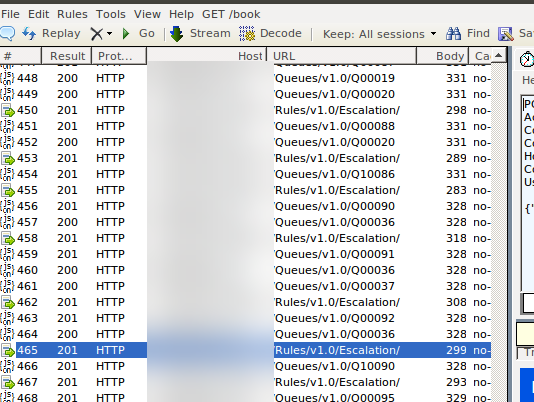

I recently ran into a need to capture HTTP traffic directly from my Intellij code (i.e. running in the JVM). I released I didn’t know how to capture Intellij through Fiddler. I.e. the http traffic that my application was generating.

Even though I am quite familiar with using Fiddler, I did find this took a while to get working. So hopefully someone else benefits from this post on Intellij through Fiddler

# Installing Fiddler for Linux

This link to the official [Fiddler](http://www.telerik.com/blogs/fiddler-for-linux-beta-is-here) site was all I needed.

The team at Telerik have release Fiddler for Linux beta, and its great. I haven’t been able to capture Intellij through Fiddler traffic until this point, and it has come as a big help in my day to day work with HTTP and particularly API testing.

To get it working, I simply followed the 5 Getting Started steps in the instructions:

# Running Intellij through Fiddler

I then setup the options in Fiddler like so. At the moment the application that I am testing is not behind HTTPS, so I don’t have to setup an SSL certificate. If you are testing a HTTPS application, I suggest you check this guide through the [Fiddler Book](https://www.fiddlerbook.com/fiddler/help/httpsdecryption.asp) . By the way, I have the Fiddler book and I can highly recommend it.

Now, to carry on with Intellij through Fiddler I change my configuration in Intellij as so:

This is what I put into VM options (I also left the defaults in Fiddler):

Now when I run my application, the code goes through Fiddler:

# Summary

That’s all for this short blog post!

Hopefully you find this useful if you ever need to do this.

I know from watching some of [Alan Richardsons](http://eviltester.com/) videos that he runs all of this traffic through a proxy whenever he is working.

I have found that it is certainly a useful habit to get into.

If nothing else, it gives you the opportunity to go backwards as you are stepping through your code and seeing what has been going on!
