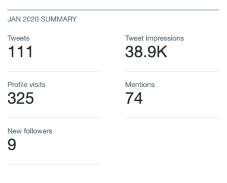
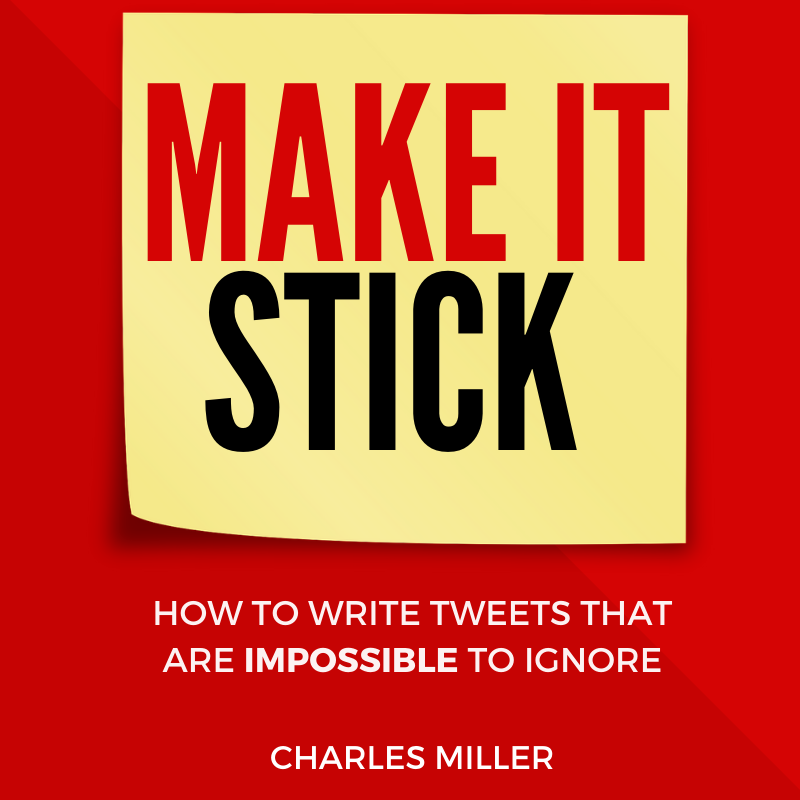

[[info]]
| This post is an honest and unbiased review of the book [Make it Stick](https://gumroad.com/a/539915379). For complete transparency - the links in this post are affiliate links. If you purchase the book I will get a small commission - with no extra charge to you.

# Twitter is the BEST Social Media platform

Although my [Twitter account](https://twitter.com/james_willett1) is over 10 years old, I only recently came to realise the **power** and **potential** of the platform.

If you want to build a following around _anything_ to do with:

- Software Engineering
- Mindset
- Health & Fitness
- Making money online
- Learning new skills

Then there is little doubt in my mind that **Twitter is the best platform for it.**

# How NOT to grow a following on Twitter

In an effort to start growing, I started posting regular tweets.

Although I had a decent following (built up over the previous 10 years) - _I was getting hardly any engagement._

Honestly, I was lucky to get more than 5 likes on even my "best" tweets...

And retweets were non-existent.

My stats were pretty embarrassing:

No one was _remotely_ interesting in what I was saying.

**It felt as if I was tweeting at a wall** - and it was disheartening.

Something was wrong with my strategy - but I was clueless as to what it was.

# Enter 'Make it Stick'

One day, as I was enviously scrolling through Twitter watching account similar to mine grow at a rate of knots, I came across the resource that would change everything for me.

That resource was this book - [Make it Stick by Charles Miller](https://gumroad.com/a/539915379)

The tagline of the book is **How to write tweets that are impossible to ignore**, and it's very apt.

Reading through the description of the book on [Gumroad](https://gumroad.com/a/539915379) - I knew right away it was exactly what I was looking for.

I purchased the book and binged through it in one sitting.

Immediately, _I knew what I had been doing wrong._

And more importantly... **I know exactly how to fix it.**

# Progress after reading 'Make it Stick'

I started implementing the strategies from Make it Stick right away. Over the next 4 weeks, my progress was astounding.

This is the analytics from my account over the next month:

In no time at all, I went from having hardly any engagement to being swamped with followers, likes and retweets.

# Contents of 'Make it Stick'

Charles does a great job of explaining the content of his book on the [Gumroad](https://gumroad.com/a/539915379) page.

But i'll include a brief list of some highlights here:

- Details of Topics and Styles that generate interest
- The difference between Engagement and Followers
- Process for crafting a Tweet
- Detailed analysis of 25 viral tweets =

The book weighs in at around 60 pages.

There is literally **no fluff**. Everything is condensed straight to the point for the maximum impact.

# Final Thoughts

[Make it Stick](https://gumroad.com/a/539915379) cost me \$35 when I purchased it.

To me, it is worth _many_ times that - simply from the huge jump in engagement and following I have generated.

There are a lot of similar resources like this available online... but I can categorically say this is the real deal.

I would highly recommend grabbing ['Make it Stick'](https://gumroad.com/a/539915379) before the price inevitability goes up!
