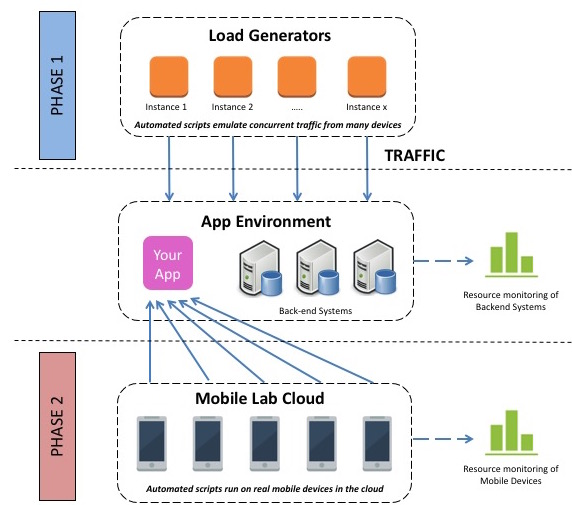

It is no secret that applications which run on mobile phones (‘Apps’) are relentlessly becoming more popular and seeing more widespread use. In fact, they are becoming so popular that their usage is surpassing how we would traditionally access applications and services on a normal desktop or laptop computer. So what does all of this mean for us in the performance testing world?

Firstly, let’s talk about the different types of apps that are available for mobile devices. There are three distinct types to consider, there is a good write-up of them in this article on the different types of [Mobile Apps](http://www.nngroup.com/articles/mobile-native-apps/) . To summarise, the three different types of app are:

- **Native Apps** – theses apps live on the device and are typically installed through the Apple App Store or Google Play (depending on your device). They are developed for a single platform (e.g. iOS) and can take advantage of the device features (such as the camera).

- **Mobile Web Apps** – these are not real apps, they are really just websites that look and feel like native apps. They are run by a browser and are typically written in HTML5.

- **Hybrid Apps** – these apps are part native app, part web app. They live in the app store and can take advantage of the device features. Like web apps, they also rely on HTML being rendered in a browser.

At my current client I have been tasked with heading up the performance testing of a new customer facing Native iOS web application. The app is actually a replacement of another app that was released previously (without being thoroughly tested!) and has had woeful reviews on the app store. The client can not afford to release such a poor quality app again and so it is imperative that this version performs much better.

Although I have a lot of performance testing experience, this is the first time I have performance tested a native mobile app and I was keen to get my approach right. I spent a considerable amount of time Googling the subject, finding as many articles, blogs and videos that I could find on ‘Performance testing Mobile Web Applications‘. Considering what a huge (and rapidly growing) area this is, I was quite surprised about how little real information there was out there, especially with regard to a clearly defined performance test approach.

Native Web Apps will almost always communicate with HTTP/HTTPs so it should be relatively straightforward to setup a proxy and capture traffic that can be turned into scripts. As such, there are many tools out there that promise to thoroughly performance test your mobile app, simulating 100’s of transactions that mimic the traffic from real devices. This is all well and good, but it is not telling the full story when it comes to mobile app performance, because there is so much more to consider.

Let’s rewind for a moment and consider traditional performance testing of some regular website or web application. We record our user journeys in whatever performance testing tool we choose, we run our tests and simulate lots of load whilst keeping an eye on the transaction response times and checking the utilisation of the key metrics on the various backend servers are within acceptable limits.

Now in traditional performance testing this is a reasonable approach, because when you access that site through the web browser the vast majority of the work to generate the content you see on the screen is happening on the back-end, the web browser just has to render everything. This is called ‘thin-client‘, most of the work happens elsewhere and is then just delivered to your computer.

With native mobile apps the story is very different – mobile apps are essentially ‘thick-client‘. Although the mobile device receives data from the back-end servers, the device still has to do a lot of work to generate the content on the screen. As a result of this, to do proper mobile app performance testing we need to test how the application is performing on the mobile device itself AS WELL AS the overall performance of the back-end systems.

I consider performance testing of mobile apps to have two distinct phases, which should eventually be combined to form the overall approach. Take a look at the diagram below:

In Phase 1 at the top of the diagram, we have our traditional performance testing approach, where we record our user journey scripts and have the load generators send lots of transactions to the app that cause lots of load to build up on the backend.

In Phase 2 we have different automated scripts (but of the same or very similar user journeys) running on real or virtual mobile devices. The role of the tests in this phase is to determine exactly how well the app will run on the device by measuring how long the entire transaction is taking to complete, e.g. how long from clicking LOGIN that the user is logged in and everything is rendered on the device – not just how long it takes to return all of the requested information for the login from the back-end systems (this is what is measured in Phase 1).

The tests in Phase 2 will also record the usage metrics on the device, such as CPU % used, battery consumed etc. to give a full picture of how well the application performs. There are lots of tools and solutions out there that can provide this. Here are a few of the tools that I have come across:

- **[Xamarin Test Cloud](http://xamarin.com/test-cloud)** – (I will be using this on my current project, so will aim to blog more about my experiences with it)

- **[Perfecto Mobile](http://www.perfectomobile.com/)**

- **[MonkeyCloudLab](https://www.cloudmonkeymobile.com/)**

- **[SOASTA Touch Test](http://www.soasta.com/touchtest/)**

The above solutions all claim to largely do the same thing. They have lots of emulated or real devices in the cloud and they provide the ability to run automated tests on those devices. As the tests are running, as well as recording data such as the transaction response time they also record the performance of the mobile device (statistics like CPU %, battery used etc.). I have not used any of the above tools in great detail yet, so I can’t reliably state which is better.

So now we can see that to do thorough testing of a native mobile app we need two distinct tools. A traditional performance testing tool (like JMeter) to generate lots of load on the backend and a mobile automation tool that can record how well the application is running on an actual device.

Traditional performance testing (just phase 1 above) is a complex task in itself, with many variables and factors to consider. Adding in the automated testing of devices in phase 2 has made the exercise more complex still. Unfortunately, with mobile testing there are even more factors to consider, such as:

- **Network Utilisations:** these days when we are performance testing a desktop application we can reasonable expect the internet connection to be fast and stable (the days of dial-up modems for example are mostly gone). With mobile testing the same cannot be said, we must consider how the device will perform on 3G, 4G, GPRS etc. To make it more complex still, we must consider what the impact on the performance will be when the connection to any of the above networks is poor (e.g. having just 1 bar of signal strength)

- **Different devices:** We need to consider how our application will perform on different devices, and so we need to test on many devices. If our application is for Android there are a tremendous number of different devices, with wide ranging performance depending on the handset and the age of the device. Even with just iOS applications, the performance difference of an app on an iPhone4 and an iPhone6 has been seen to vary by as much as 50%. The device used will therefore have massive implications on our performance testing results.

- **Different OS:** As with using different devices, using different operating systems on the device also has a wide reaching effect on the performance, another consideration to factor in.

- **Fringe cases:** There are many fringe cases with mobile testing that also need to be considered. What happens when the battery is low? On modern devices, the OS will typically reduce the CPU when the battery is low in an attempt to prolong the battery life – this will impact the performance of our application. What happens when the mobile connection is lost for a few seconds? Does the application crash or can it recover?

I expect that from the above you get an idea that proper, thorough performance testing of mobile applications is a complex and difficult task. However, with the rise and continued dominance of mobile, this field of testing creates exciting challenges and opportunities for testers and testing solutions in the marketplace.
