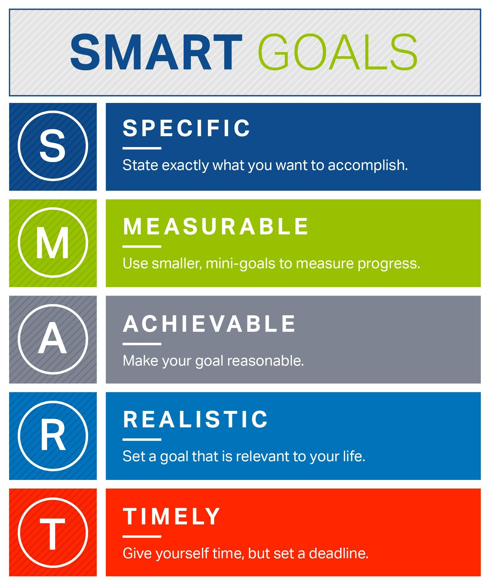

[[info]]
| I originally wrote this post back in late 2015. Five years have passed, so I decided to give it an update - incorporating some of the experiences I’ve obtained in the past few years.

Coming up with new objectives is **hard**. Absolutely no doubt about it. You know it. I know it.

With all too regularity, you have to come up with _balanced, nuanced and interesting_ objectives that meet both your developmental and career aspirational needs.

But just as importantly, they also need to serve the needs of the **company** you work for.

Of course, there is the guy or girl on the other side of the fence - _the manager_. Spare a thought for them! They are constantly having to think up and balance new objectives to distribute to each team member.

Exhausting, isn’t it?

I have been in both of these positions. I know what this situation is like.

The worst part? **_Neither engineers or managers get appropriate training on proper objective setting_**. Sure, the manager might go on a half-day workshop once in a blue moon.

Or the engineer might be lucky enough to endure a 1-hour presentation from HR on the subject (\*_shudders_\*)

_But is that really enough?_

Objectives play a **fundamental** role in the career aspirations of all employees. _So why isn’t more time spent ensuring that the most interesting, engaging and rewarding objectives get consistently set?_

This is a big part of the reason I wrote a book about setting quality, compelling and meaningful objectives.

The focus of the book is on **QA engineers**, as for some reason coming up with those objectives can _seem_ even harder. The truth is, _the typical QA engineer has a diverse range of skills_ (beyond just technical) which **actually increases the range of objectives** they can be set!

But back to this post, and ill discuss a few of the objectives that I have been assigned in my career, and how they have impacted me.

All of the objectives below follow the [SMART](https://www.mindtools.com/pages/article/smart-goals.htm) criteria.

Hopefully, you can draw inspiration from these objectives below!

---

# Objective 1 - Create a Promotional Video

## Background

_Creating my first promotional video changed my life_. I know it sounds crazy to say that, but it’s true.

I was a year or so into working at a software test consultancy in London, SQS (now [Expelo](https://expleogroup.com/)). I had just finished a major load testing performance assignment, and I had learned a few new interesting tricks and techniques from the project.

I thought - _“why not showcase a few of these tips?”_

Right away, I began going through the SMART criteria:

## SMART Criteria

### Specific

I knew exactly what I needed to do for the goal. Create a promotional video that showcased a performance enhancement within the code of a recently completed project.

### Measurable

Simple to measure - in the sense that either the video is either created or not!

### Achievable

Although I felt this goal would be a lot of work for me (..._I had to learn video content creation practically from scratch_...), I knew that it was something that I had in me.

### Realistic

The process of crafting quality, polished and concise media to teach software development & testing concepts had always interested me. It was something that I was interested in learning more about.

### Timely:

I had a good 3 months to achieve the objective, which I felt was a fair amount of time relative to the scale of the objective being set. If the objective had been set for shorter, I would have felt more nervous about achieving it (given my additional usual “normal “workload !)

## Outcome

This objective went better than I could ever have imagined. The video was well-received right across the company. Almost overnight, _I grew a reputation for being able to create video tutorial content_.

This objective had a **profound** impact on my career. It would lead to the creation of my first online courses, allowing me to teach content all over the web and _begin earning additional income as an online instructor_.

---

# Objective 2 - Attend a Training Course and Present back to the Team

## Background

Back when [HP Loadrunner](https://www.microfocus.com/en-us/products/loadrunner-professional/overview) was a widely used tool, I attended a 4-day performance engineering and training workshop.

With Loadrunner being a widely-used tool within the testing organization I was a part of, I knew that information gathered from the course would be worthwhile presenting back to the team.

I was desperate to attend the training but knew it wouldn’t be cheap. Especially after adding in the usual expenses like accommodation, travel etc.

**_I needed a way to justify the cost to my manager._**

That’s when I came up with this objective. I knew it was a good one, as the **entire team** stood to benefit from it.

As usual, I went through the SMART criteria:

## SMART Criteria

### Specific

The goal was specific enough - attend a training course and report back to the team any key findings.

### Measurable

I would attend the workshop and report back to the team in the form of a presentation session.

### Achievable

Knowing that I had to report back to my colleagues with what I had learned, **I was more focussed and committed** in the workshop.

### Realistic

Although I had multiple other engagements happening at the time of the objective, I felt that I could amend my schedule sufficiently so as to accommodate the objective.

### Timely

A timescale of 2 weeks was set from my return to deliver the team presentation. I actually delivered the presentation after 3 days, as the content was fresh in my mind and I wanted to take advantage of that.

## Outcome

I was **distinctly** more alert and attentive whilst at the course, as I knew I needed to prepare a presentation upon my return to the office! I absorbed more of the course content than I otherwise might have done.

The presentation that I gave to my peers was well received, and my manager was delighted with the contribution to the department.

A real win win!

---

# Objective 3 - Create a Blog or Website for the team

## Background

To showcase the work and contributions from our team members to the organisation, I was set the objective of creating a blog or website to highlight the team’s work.

I had become interested in front-end development recently, practising with tutorials on sites like [Pluralsight](https://www.pluralsight.com/) and [Udemy](https://www.udemy.com), and was eager to have a project to work on. _This gave me the perfect opportunity._

## SMART Criteria

### Specific

The requirements of the objective were clear and simple, create a website that will host and showcase:

- Key events in our team throughout the year
- A profile of each team member

I could use any technology that I deemed appropriate - I decided to go with [GatsbyJS](./https://www.gatsbyjs.org/).

### Measurable

There was a tangible measurement criteria to the objective - the creation of the website to host the content as defined in the objective above.

### Achievable

I knew it would be quite a lot of work to learn Front-end development, but a concrete project to practice on would motivate me. I felt that the objective stretched me sufficiently - not too comfortable and not too easy.

### Realistic

As the project wasn’t seen as hugely critical at the time, it felt as if there was less pressure on the outcome. I found this creative freedom helpful, in enabling me to take the time to properly learn JavaScript and other technologies needed for development

### Timely

There was an exact deadline set for the launch of the website. Having a specific date allowed me to work backwards and creating checkpoints/deadlines to map the way to launching the site live.

## Outcome

When I took on this objective, I initially felt somewhat _overwhelmed_. This is when I learned that
breaking a large and daunting task like launching a website down into smaller chunks is an important process. It clears your mind of holding all the pieces and allows you to easily prioritize what to work on.

You can then simply pick one task, work through it to its conclusion, cross it off and pick the next one.

**Momentum** builds as you tick each task off the list.

If you can start work on things like this as early as possible in the day, momentum can take you through to great things.

The final website I created was admittedly not perfect! But the skills and experience in web development I gained from completing the objective were of the _utmost_ value.

I have gone on to design and build many websites since, each better than the last, and this objective really started me on that journey.

# Summary

Hopefully, you have found the objectives highlighted in these posts useful.

Having objectives like these set have been beneficial to my career development, no doubt about it.

The importance of **good objectives** in the workplace should **never** be underestimated.

They give the engineer an area or idea to focus on.

They give the manager a way to assess performance.

Having the end of year conversation about _bonuses_, _promotions_ and _pay rises_ will always be much smoother knowing that you have tangible evidence of work completed.
