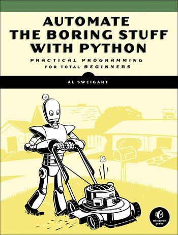

I have been in my current job for around 5 months now. It is a relatively large multi-national company (around 6k employees), and anyone who has worked in this sort of environment will know that it is almost universally required for employees to have some personal objectives set for a performance review or appraisal that typically occurs every 6 or 12 months. Having these objectives in place (and meeting them, obviously) gives the employee something to work towards and makes it easier for them to justify whether (or not) they get a raise or promotion.

In my career I have already worked for very large and very small companies, as well as everything in between, and I have been at both ends of the spectrum when it comes to objectives. Some companies spent so much time and effort defining, planning, implementing and reviewing objectives that it bordered on the ridiculous and certainly seemed to me to be counter-intuitive.

On the other hand, I have worked in places where there are no objectives / appraisals whatsoever, and you just get a random pay rise / promotion when the company is doing well (if you are lucky, or you indicate that you might leave soon…) This obviously isn’t great either, and can lead to situations where the people who are the loudest or most popular in the team are getting a far greater share of the rewards than the quiet introvert who is silently working away keeping everything from imploding.

# Setting (Good) Objectives is not easy!

Let’s be clear, writing good objectives is NOT easy. This is true whether you are writing them for yourself, or for someone else. If you are anything like me, you probably won’t be able to just sit down and dash off a list of meaningful objectives in a 10 minute session. It will more likely require you to think at length and in depth about what the objectives should be, and how you are going to actually complete whatever it is you are committing to. By the way, if you CAN come up with the objectives quickly and easily, kindly fill me in on your approach!

Now I don’t know about you, but I have always HATED setting objectives, either for myself or for other people. To be honest, in the past when I was younger and more naive, I really couldn’t see the point. However, now that I have been around for a while (and am somewhat reluctantly moving up the management ladder myself) I can see more and more the benefit of good objectives (both for your manager, and for you, when you want to justify that badly needed pay rise). So I decided to do some digging, and see if I could find out how to set GOOD objectives, particularly for someone working in Software Testing.

# Everyone (Mostly…) Hates it!

From a few hours of digging around on the Internet and asking others in the same situation, it turns out that this is almost a universal pain felt by most people in most industries, not least in development and even more so in testing. I mean, if you think about it, testing is such an intellectual activity, how do you really measure that? I saw a great quote on a forum whilst I was looking for inspiration that sums it up nicely; when Louis Armstrong was asked what makes good Jazz? He said “I don’t know, but I know it when I hear it” . You could say the same thing when it comes to testing, “I don’t know what makes good testing, but I know it when I see it“. It’s going to be tough to come up with solid objectives for a tester then.
Anyway all this complaining is all well and good, but like it or not we still have to set those pesky objectives, so let’s work through it. The first good piece of fairly obvious advise is to make your objectives SMART. You have probably heard this before, and although it is classic corporate / management speak, it is a good thing to bare in mind with objective setting. A SMART objective is:

- **S**pecific
- **M**easurable
- **A**ttainable
- **R**elevant
- **T**ime-bound

I am not going to bother going into each of the above, you can probably get an idea just from the words what each one means and how they relate to good objectives. If you want to look into it further, have a look at [SMART objectives on Wikipedia](https://en.wikipedia.org/wiki/SMART_criteria) or Google it.

# Try and Think Outside the Box

So back to thinking specifically about QA / Testing objectives. A good approach might be to think about your job from the perspective of your boss, and come up with goals that will improve his job in some way (even if its only a small improvement). Is there a project that you could step-on with, and take control of the testing? Could you perhaps come up with some new test plan or test strategy for the project, or is there a new tool that you could configure / implement that will help improve the project? Remember, the objective has to be SMART! You have to have a clear specific goal in mind, that you can clearly demonstrate has been achieved when it comes to your review.

Perhaps there is some laborious process in the team that needs to be completed by certain team members or even your manager, maybe something like sanity checks on an environment every time a new build is deployed, or compiling some daily / weekly bug or status reports, or something similar. Can you take this on yourself? Better yet, can you implement an automation approach to this task that would save time for both you are your team? I still find it amazing the number of repetitive processes that can be automated relatively easily by something like Python. A book that was a real eye-opening for me was [AUTOMATE THE BORING STUFF WITH PYTHON](https://automatetheboringstuff.com/) by Al Sweigart …. I highly suggest checking it out, as it might provide you with some great inspiration!

# Keep Control of the Outcome!

As a QA / tester, when you are coming up with your objectives, you want to make sure that you are in control of the outcome as much as possible (ideally in total control). You don’t really want to be dependent on some other person or team delivering something to you in order for you to do your work to complete the objective. It should be something that you can start working towards straight away, not something that will be put off for a few months. We are all under ridiculous workload pressures at work these days I know, and time to work on objectives can be hard to find, so the earlier that you can start, the better!

# A Great Objective that Works Pretty Much Everywhere…

Now I know that I mentioned above that it is very difficult to quickly come up with a useful and meaningful objective…. but as a reward to you for reading this far, I am going to share something from my experience that has worked wonders in pretty much every situation. A really great objective to set is to commit to giving a presentation or a talk on a topic that you either know a lot about, or are interested in learning more. For some reason, I have found that as a QA, setting (and achieving) this objective seems to carry even more weight (than say compared to a regular Dev), probably because it is really going above and beyond what is expected of most QAs. Of course, to produce something of quality is going to take a considerable effort on your part, but the rewards can really be well worth it.

Now if you already know a lot about some relevant topic, then you should be able to give a valuable talk that provides useful content to your peers. If you don’t know much about the topic, then by being committed to having to give the talk then you are virtually guaranteed to learn a lot as you prepare. Either way, both of these tick all of the boxes for a SMART objective, and are also a great way to get your name better known around the company. I am lucky where I am currently, as we hold a weekly “Lunch & Learn session”, where people are encouraged to present, but if you are at a place that doesn’t currently do that, then introduce it! Hey, even that could be a fantastic objective in itself, “Organise weekly / monthly Lunch’N’Learn sessions” where you get some food in, and people give a presentation. If you can’t get anyone to present, then you could all just watch some sort of training video or a talk from an industry leader (think of TED talks)

# And if you REALLY want to Impress the Boss…

To go even further on the “Give a presentation” objective, another activity that has served me incredibly well in pretty much every role I have been in, is to produce a video / screen cast on some relevant topic. There is plenty of screen cast software out there (I am a fan of [Camtasia Studio](https://www.techsmith.com/camtasia.html)) , which has a nice 30 day free trial, and isn’t even that expensive at around \$99), but there are plenty of options out there. You might not think that you know how to make these videos, but there is tonnes of information and guidance out there if you go and look for it (you could even take a class on somewhere like Udemy that teaches you how to make these videos). I was able to learn how to make decent quality screen cast videos of me writing code in only a few hours, and whilst it does take some time and practice to become good, it is a skill that I have never regretted investing in.

As with everything, the more you do it the better and more efficient you become. Making a video is just such a great objective, and the great thing is that once it is done, you have it forever. You can send it around to your interested colleagues at the office and showcase your skills, you can publish it on-line (if it doesn’t show sensitive material), and you can even play it to your boss during your appraisal to remind him why he should give you a pay rise then and there! What more could a boss, who is having to do the appraisal of the 15th employee today, really want? I know what I would want as the boss in that situation, someone to come to me with exactly that.

In terms of the topic to give the talk or video on, that is going to be completely up to you, and will depend on your situation and what your team is currently working on. For myself, I have recently started developing a mobile automation framework with [Appium](http://appium.io/) (look out for a post series on that right here soon!), so that is a perfect objective for me. We are also doing a lot more work with WebServices at my place currently, so I could do a talk or demonstration of [REST Assured](https://github.com/rest-assured/rest-assured). But really, it totally depends on you!

Well I hope that you have found the above of some use. For myself, taking the time to sit down and right this has actually helped me to come up with my own work objectives for this year, and that is certainly a nice thing to have crossed off my to-do list! (now to make that video….!)

Until next time.
