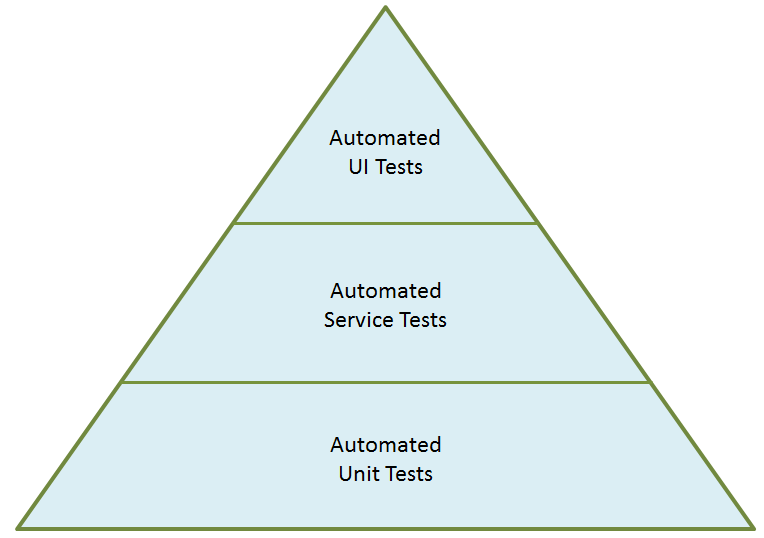
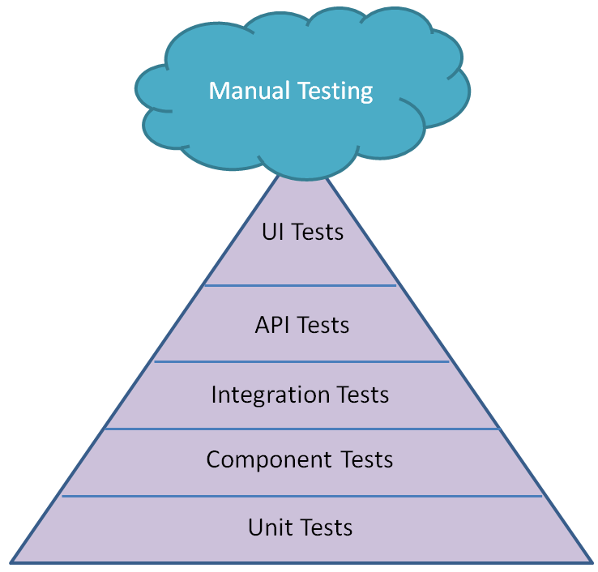
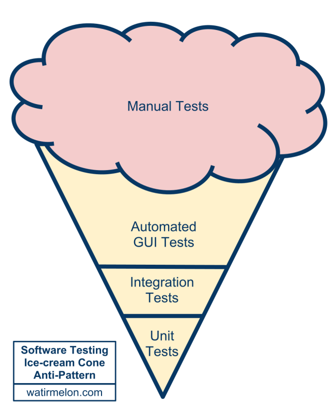

At work I was recently tasked with leading a case study that would explore the differences between Unit testing and Functional Testing, with the overall aim being to determine if we should be focusing on one over the other, perhaps even exclusively. I figured that since I was going to be doing this work, it would be a good opportunity to write a blog post or two on the subject.

Some of my colleagues in the group were arguing for more unit tests, citing that we should be following the methodology of the “Testing Pyramid” as the core reason. Whilst I agree in principle with the analogy of the “Testing Pyramid”, I do feel that it has some flaws and I think that above all it is easy to forget that it is just an abstract model that shouldn’t necessarily be applied 100% to every software project.

So to try and set the scene for this upcoming case study in this blog post, I felt that a good place to start would be an explanation of the original “Testing Pyramid”, and also a discussion on how it has evolved over the last few years and how arguably complete anti-patterns of the challenges it was originally created to help tackle have formed from it in many organisations. Let’s get to it then!

# THE ORIGINAL TEST “AUTOMATION” PYRAMID

The image below shows the original [Testing Automation Pyramid created by Mike Cohn](https://www.mountaingoatsoftware.com/blog/the-forgotten-layer-of-the-test-automation-pyramid) . One key thing to note straight away is that it was actually called the ‘Test Automation Pyramid’, as it was originally created just for test automation purposes. As time has gone on and the concept of the pyramid has been used more and more in software testing discussions it seems that in many cases the “automation” keyword got lost or muddled in with all types of testing during the evolution of the concept, but we will look at that in more detail later in the post.

So the Test Automation Pyramid has three different layers of tests from bottom to top; Unit, Service and UI. Let’s look at each of the three types individually:

### Automated Unit Tests

These are at the base of the pyramid and make up the largest segment. A unit test should test a small amount of independent code that doesn’t have dependencies on anything outside that code, the reason being that if that unit test fails, you will know straight away where the problem is. The Testing Pyramid shows that you should have more unit tests, the thinking behind that being that they are quick and cheap to create and maintain.

### Automated Service Tests

As you move up the pyramid you have service tests which include things like API tests and Integration tests. They are a bit more complex to create and maintain, but they test how two or more parts of the system work together. The pyramid suggests you should have some service tests, but less of them than unit tests.

### Automated UI Tests

Finally on top of the pyramid are UI tests which cover the full blown end to end flow of some activity through the system. You should have less of these because they are more ‘expensive’ (in terms of development and maintenance), but they cover a lot of ground and they might just be the only tests that will actually convince other stakeholders that the system does indeed work.

Now let me say that, as far as test automation goes, there is very little wrong with this model. It absolutely makes sense that, in most cases, you should have more unit tests than service tests and more service tests than UI tests. But it is very important to remember that this is just a model, it is not a hard and fast rule that should be adhered to in every software project. For example, you might be developing a mobile application that relies heavily on the UI – in this case you would absolutely want to focus more on UI testing, particularly if there is critical activity happening at that level. In fact the pyramid might become more of a cylinder, with equal numbers of tests in all the of the three layers. I just think that sometimes organisations fall into the trap of having to follow this pyramid explicitly (particularly if, for example, it is defined in some high-level corporate test strategy) and get hung up on the number of tests at each level. Anyway I digress, let’s look at how the original automation pyramid has evolved!

# THE “TEST PYRAMID” – for all testing!

So as we talked about above, as time has gone on and the Test Automation Pyramid has been used and discussed in boardrooms and test strategy meetings, others have inevitably tried to refine and add more to it. This led to the creation of what we could simply call the “Test Pyramid“, with the word “automation” dropped altogether.

In this pyramid the service layer got expanded into 3 different layers; Component tests, Integration tests & API tests. An external cloud helpfully appeared on the top to represent manual testing, with the idea being that this is separate from the pyramid and can occur at any time. Since the word “automation” has been removed from the diagram, this led to manual and automation testing activities being blurred in the diagram and in some cases being misrepresented as the pyramid is now trying to encapsulate all testing activities rather than just focusing soley on automation.

Again though, at a fundamental level, I don’t have a problem with this diagram. I think it is a fair representation of a generic testing situation on a software project and it certainly makes sense in theory to follow the guidelines for the quantities of tests at each different layer, certainly when starting out and you don’t have much else to go on in the early days of your testing efforts.

But there are arguments that the pyramid is flawed. In fact there is an [argument from Todd Gardener](http://www.joecolantonio.com/2015/12/09/why-the-testing-pyramid-is-misleading-think-scales/) that the Test Pyramid is flawed for 2 reasons. The first reason is that it misses market risk, i.e. determining whether the project itself is a good idea and if we are delivering the right thing. Whilst I understand where he is coming from here, I do feel that whether or not the entire project is correct is something that has to be specifically out of scope for the test pyramid. That needs to have been decided and determined (by whatever criteria) before you begin the process of trying to implement the pyramid in the first place.

The second argument is more compelling – that the pyramid implies volume at the different levels, and this is what we have talked about already. The pyramid shows that you should have more unit tests than integration or end to end tests because unit tests are cheaper to write, but should that really be the primary concern? Surely it should be more about the value and the risks addressed by the tests? If one type of testing is providing substantially more value that other types in our project, then why not focus more of the effort there? Instead of worrying about the number of tests that you have at each level, it would be better to look at the risks present in the system, and build the test coverage appropriately to address those risks. At the end of the day, we have to remember that this pyramid is a MODEL. As the statistician [George E. P. Box](https://en.wikipedia.org/wiki/George_E._P._Box) so eloquently put it, “All models are wrong, but some are useful” . The focus really should be on where the risk lies in the software project, and then focusing the testing to address that risk for that project, regardless of whether that fits in with the pyramid or not.

# The “Ice Cream Cone” – The anti-pattern to the Pyramid

Now the creator of the “Test Pyramid”, Alastair Scott, noticed that after some time trying to implement the pyramid it had became apparent that organisations were often falling into the the trap of accidentally creating “inverted” pyramids. Alastair called this the [Software Testing Ice Cream Cone](https://watirmelon.blog/testing-pyramids/), as the pyramid has been inverted (although manual testing is still stuck on the top of the cone). I’ll borrow the image from his post here.

With this, you have lots of automated GUI testing on the top of the cone, some integration testing in the middle and a little unit testing at the bottom, with a big dollop of manual testing on the top (tasty!)

This forms an [anti-pattern](https://en.wikipedia.org/wiki/Anti-pattern) of the testing pyramid, but in my experience it is surprisingly common to find this situation in many organisations. It is actually pretty easy for organisations to fall into this trap, especially if they neglect to implement a culture early on in the project where the developers are encouraged to create unit tests. Ideally, unit tests should be created at the time that the code is written, or even better yet by following a [test driven development process](https://en.wikipedia.org/wiki/Test-driven_development), which has the handy artefactual output of the unit tests themselves.

Now the creator of the “Test Pyramid”, Alastair Scott, noticed that after some time trying to implement the pyramid it had became apparent that organisations were often falling into the the trap of accidentally creating “inverted” pyramids. Alastair called this the Software Testing Ice Cream Cone, as the pyramid has been inverted (although manual testing is still stuck on the top of the cone). I’ll borrow the image from his post here.

With this, you have lots of automated GUI testing on the top of the cone, some integration testing in the middle and a little unit testing at the bottom, with a big dollop of manual testing on the top (tasty!)

This forms an anti-pattern of the testing pyramid, but in my experience it is surprisingly common to find this situation in many organisations. It is actually pretty easy for organisations to fall into this trap, especially if they neglect to implement a culture early on in the project where the developers are encouraged to create unit tests. Ideally, unit tests should be created at the time that the code is written, or even better yet by following a test driven development process, which has the handy artefactual output of the unit tests themselves.

But if that doesn’t happen, and the responsibility of the testing falls squarely on the Testing / QA team, then inevitably this will lead to the creation of more tests at the service and UI levels to compensate for this. Even with the rise of Agile an DevOps in software development, there is still a clear distinction in many organisations between developers and testers, particularly in large organisations. In many cases the Testing / QA team will not have access to the code base, and therefore if the Developers are not creating the Unit tests then no one will. This means more tests created at the other layers to compensate, which leads to the anti-pattern of the pyramid.

Another reason that organisations might fall into the trap of creating more UI tests is pressure from upper management or other stakeholders that don’t have a proper understanding of testing. Constraints might be placed on a team where the only way a project can be signed off is if there is testing to demonstrate that all the functionality works from end to end – that the code works on a unit level might not be sufficient evidence for some. If you find yourself in this situation, it is so important to educate others on the need for and importance of a cohesive test strategy with suitable amounts of testing at each layer. This is not always easy to do, particularly in a large organisation that has always done things a certain way, but is important to ensure the long term success of the project.

A great comment that I noticed on [John Stevenson’s blog](http://steveo1967.blogspot.co.uk/2015/10/mewt4-post-1-sigh-its-that-pyramid.html) pointed out that, with the metaphor of an ice cream cone, over time the over-reliance on manual tests will cause a melting at the top which will trickle down to the other layers of the cone resulting in a complete mess. This is so true, because as software projects evolve at an ever increasing pace, there is more and more demand being placed on testing teams and to have full end to end tests of every conceivable situation is neither realistic or efficient. Eventually the whole thing will collapse.

In conclusion, I think that the Testing Pyramid is a good place to start when looking at how your testing should be distributed, but it is important to remember that it is only a model and that you shouldn’t get hung up on having more tests in one layer than the pyramid says you should. The key focus on software testing should always be on risk, and what testing can be implemented that addresses those risks. A decision can then be made on balancing the cost of implementing and maintaining those tests against the risks that are mitigated.

In the next post in this series, I want to talk about how to find the correct balance between Unit tests and Functional Tests in your project by working through some fictional case studies. See you next time!
