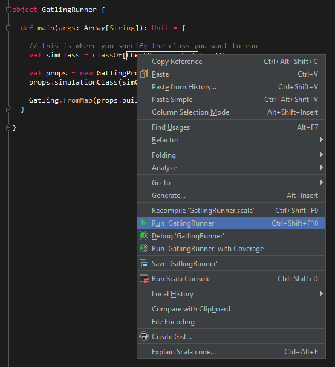
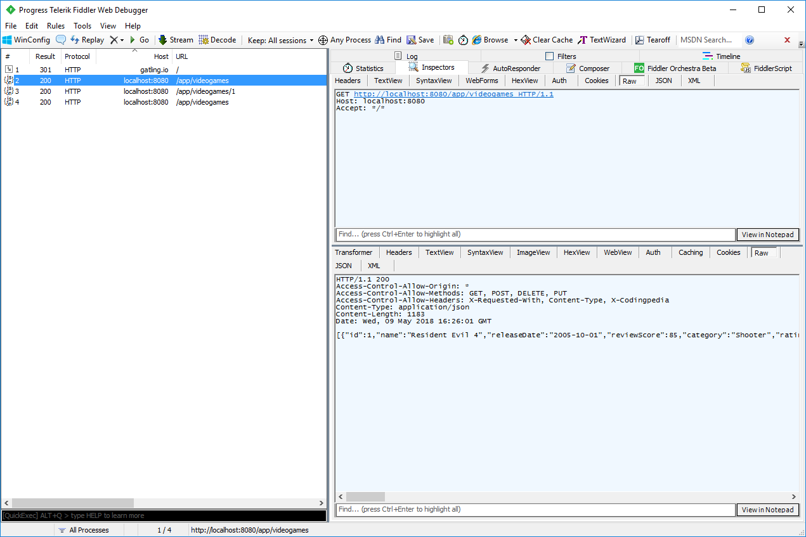

You might be recently starting out writing Gatling scripts. Or you might be a seasoned expert. Either way, it’s important to be able to debug Gatling scripts in an efficient manner. This post will help you to do that.

It’s not immediately obvious how to enable debugging in Gatling. It’e even more difficult if you are only starting out using the tool. But fear not! This post will guide you through.

Before we start, I suggest you read through my Gatling through Gradle post. Following these instructions will get you setup with Gatling in the Intellij IDE. From here, you can start to debug Gatling scripts.

Without further ado, let’s look at 5 ways to debug Gatling scripts.

## 1. Run Gatling through an IDE with an Object Runner

I will normally execute my Gatling tests through the command line. But for the purposes of developing and debugging Gatling scripts, being able to right click and run through Intellij is useful. It also enables you to add breakpoints and step through scripts that are running.

This is an example of a simple Gatling runner:

```scala
import io.gatling.app.Gatling
import io.gatling.core.config.GatlingPropertiesBuilder

object GatlingRunner {

def main(args: Array[String]): Unit = {

    // this is where you specify the class you want to run
    val simClass = classOf[YOURCLASSNAME].getName

    val props = new GatlingPropertiesBuilder
    props.simulationClass(simClass)

    Gatling.fromMap(props.build)

}

}
```

Now running your Gatling script is a matter of right-clicking on main and selecting run:



##2. Direct Traffic through a Proxy to debug Gatling scripts

The next method of debugging, that also works well in conjunction with the Object Runner above, is directing traffic through a proxy. I use [Fiddler](https://www.telerik.com/fiddler) as my proxy, and it works on all platforms. But feel free to use whatever you like the most.

Running traffic through a proxy is a great way to debug Gatling. You can see exactly what is getting sent and received, response body, headers etc.

Sending Gatling traffic through a proxy is easy. Add this code to your httpConf in your script:

```scala
  val httpConf = http
    .baseURL("http://localhost:8080/app/")
    .proxy(Proxy("localhost", 8888).httpsPort(8888))
```

The above code assumes your proxy listens on port 8888. Make sure the proxy is running, and run your Gatling test. You can see traffic in Fiddler as below:



## 3. Print out Session Variables & Info

Another way to debug Gatling scripts is to print out all the session variables of each virtual user. You can also print out session information for each virtual user that is running.

To do that, add an .exec { } block at the end of your http call like this example:

```scala
val scn = scenario("YourScenarioName")
    .exec(http("YourHTTPCall")
        .get("yourendpoint")
        .check(status.is(200)))
        .exec { session => println(session); session }
```

Now all the session info of the virtual user is printed when the HTTP call executes. It will also print out all the saved variables for the session (although we didn’t specify any in this example).

## 4. Print out Response Body

Another cool trick similar to the above is to print out the response body of the HTTP request. You can do that by first saving the response body to a variable. Then printing out that variable in an .exec { } block, like this:

```scala
  val scn = scenario("YourScenario")
      .exec(http("YourHTTPCall")
      .get("yourendpoint")
        .check(status.in(200 to 210)) // check status is in a range
        .check(bodyString.saveAs("responseBody"))) // this will print the whole response body
        .exec { session => println(session("responseBody").as[String]); session}
```

Now when this HTTP request is executed, the response body is printed out. Very handy to debug Gatling scripts in development.

## 5. Configure logback.xml to Print Debug Messages

Finally, you can configure Gatling logging by editing the logback.xml file. We created this file in the setup process for this project in the Gatling through Gradle post . In my example project its in the src/gatling/resources/conf folder. If you are running Gatling externally, the logback.xml file should be in the Gatling installation folder.

Let’s look at a few things you can do with logback.xml:

### Log all Requests & Responses

If you want to log full details of every request / response, edit the logback.xml to look like this:

```xml
<?xml version="1.0" encoding="UTF-8"?>
<configuration>
    <appender name="CONSOLE" class="ch.qos.logback.core.ConsoleAppender">
        <encoder>
            <pattern>%d{HH:mm:ss.SSS} [%-5level] %logger{15} - %msg%n%rEx</pattern>
            <immediateFlush>false</immediateFlush>
        </encoder>
    </appender>
    <!-- Uncomment for logging ALL HTTP request and responses -->
   <logger name="io.gatling.http.ahc" level="TRACE" />
   <logger name="io.gatling.http.response" level="TRACE" />
    <!-- Uncomment for logging ONLY FAILED HTTP request and responses -->
    <!--   <logger name="io.gatling.http.ahc" level="DEBUG" /> -->
    <!--    <logger name="io.gatling.http.response" level="DEBUG" /> -->
    <root level="WARN">
        <appender-ref ref="CONSOLE" />
    </root>
</configuration>
```

Be warned. If you run this with a lot of users it will generate a huge amount of text. But its useful to debug Gatling scripts with a single user.

### Log Only Errors

You can also have Gatling log as above only when an error occurs. To do that, edit the logback.xml to look like this:

```xml
<?xml version="1.0" encoding="UTF-8"?>
<configuration>
    <appender name="CONSOLE" class="ch.qos.logback.core.ConsoleAppender">
        <encoder>
            <pattern>%d{HH:mm:ss.SSS} [%-5level] %logger{15} - %msg%n%rEx</pattern>
            <immediateFlush>false</immediateFlush>
        </encoder>
    </appender>
    <!-- Uncomment for logging ALL HTTP request and responses -->
  <!-- <logger name="io.gatling.http.ahc" level="TRACE" /> -->
  <!-- <logger name="io.gatling.http.response" level="TRACE" /> -->
    <!-- Uncomment for logging ONLY FAILED HTTP request and responses -->
       <logger name="io.gatling.http.ahc" level="DEBUG" />
        <logger name="io.gatling.http.response" level="DEBUG" />
    <root level="WARN">
        <appender-ref ref="CONSOLE" />
    </root>
</configuration>
```

Now Gatling will only log if there is an error.

### Log to a File

So far we have only logged to the command line. If you want to log to a file instead, you can add an additional log appender like this:

```xml
<?xml version="1.0" encoding="UTF-8"?>
<configuration>
    <appender name="CONSOLE" class="ch.qos.logback.core.ConsoleAppender">
        <encoder>
            <pattern>%d{HH:mm:ss.SSS} [%-5level] %logger{15} - %msg%n%rEx</pattern>
            <immediateFlush>false</immediateFlush>
        </encoder>
    </appender>
    <appender name="FILE" class="ch.qos.logback.core.FileAppender">
        <file>../gatling.log</file>
        <append>true</append>
        <encoder>
            <pattern>%d{HH:mm:ss.SSS} [%-5level] %logger{15} - %msg%n%rEx</pattern>
        </encoder>
    </appender>
    <!-- Uncomment for logging ALL HTTP request and responses -->
 <!--  <logger name="io.gatling.http.ahc" level="TRACE" /> -->
 <!--   <logger name="io.gatling.http.response" level="TRACE" /> -->
    <!-- Uncomment for logging ONLY FAILED HTTP request and responses -->
       <logger name="io.gatling.http.ahc" level="DEBUG" />
        <logger name="io.gatling.http.response" level="DEBUG" />
    <root level="WARN">
        <appender-ref ref="CONSOLE" />
    </root>
    <root level="DEBUG">
        <!--<appender-ref ref="FILE" />
    </root>
</configuration>
```

This allows you to open the file later. Perhaps after an overnight test. And you have a persistent file that you can use to debug Gatling tests.

---

# Gatling Fundamentals for Stress, Load & Performance Testing – Out now on Udemy!

My Udemy course on [Gatling Fundamentals](https://www.udemy.com/gatling-fundamentals/?couponCode=JAMESW) is out now on Udemy.

In the course I take you through everything needed to start using Gatling through Gradle with the minimum of hassle.

[](https://www.udemy.com/gatling-fundamentals/?couponCode=JAMESW)

For readers of my blog, I am offering the course with a heavy discount – just click the link above!
