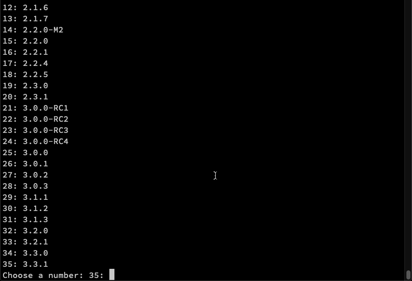

# Overview

Need to do some load testing of your HTTP server? Gatling is a great tool for the job! This post is a complete, detailed and exhaustive guide to proficiently using Gatling for load testing.

No idea what Gatling is? Check out my [Gatling Introduction](./gatling-introduction) post first.

<TODO - put in a summary from the link about>

Content of this blog post: TODO
https://stackoverflow.com/questions/11948245/markdown-to-create-pages-and-table-of-contents
https://gist.github.com/jonschlinkert/ac5d8122bfaaa394f896#sub-sub-heading

- Heading 1
- Heading 2

# Performance Testing

<Todo - given an intro to performance testing, get some content from here: https://blog.pragmatists.com/load-testing-with-gatling-io-2a128fccfb3e>

# Installation

Before you do anything, make sure that you have the [JDK8](https://www.oracle.com/technetwork/java/javase/downloads/jdk8-downloads-2133151.html) (or newer installed). If you need help with this, check out this guide on [Installing the JDK](https://www3.ntu.edu.sg/home/ehchua/programming/howto/JDK_Howto.html).

The simplest way to install Gatling is to download the [open-source Gatling](https://gatling.io/open-source) version from the [Gatling.io](https://gatling.io/) website. Click **Download Now**, and a ZIP file will be downloaded:


Unzip the file anywhere on your computer. Open up the new folder, and browse to the **bin** directory. From here, run either:

- **gatling.bat** - If you are on Windows
- **gatling.sh** - If you are on a Mac or Unix machine

Gatling will load, and you will be asked to choose a simulation to run:


Press **0** to choose the `computerdatabase.BasicSimulation`. You will be asked to enter a **run description**, but this is optional and can be left blank.

Gatling will go ahead and run the script that you choose - which executes a basic load test against the [Gatling computer database training site](http://computer-database.gatling.io/computers).

# Gatling Recorder

Running the scripts that ship with Gatling is fine, but doubtless you will want to develop scripts against your own application.

Once you become proficient with Gatling (by the end of this post!) you should be able to write scripts from scratch in your IDE or even text editor.

But before doing any of that, it can be handy to use the built in **Gatling Recorder** to record your user journey.

## Generate HAR File

The best way I have found to use the Gatling Recorder, is to first generate HAR (Http Archive) file of your user journey in Google chrome.

Generating these files, and importing them into the Gatling Recorder, allows you to overcome issues with HTTPS recordings.

Follow these steps to produce a HAR file:

1. Open the [Gatling computer database training site](http://computer-database.gatling.io/computers) - this is the site we will record a user journey against.
2. Open **Chrome Developer Tools**, and click on the **Network** tab.
3. Click the **Clear** button to remove any previous network calls, and ensure that the red recording button is enabled.
4. Browse through the website to complete your user journey - for example, search for a computer, create a computer etc. You should see entries begin to populate inside the **Network** tab.
5. Right-click anywhere inside the **Network**, and choose `Save all as HAR with content`. Save the file somewhere on your machine.


6. Now, browse to your **Gatling Bin Folder** (where you first ran Gatling in the previous section) and run either `recorder.sh` on Mac/Unix or `recorder.bat` on Windows. The Gatling Recorder will load.
7. Change the **Recorder Mode** in the top right to `HAR Converter`.
8. Under the **HAR File** section, browse to the location of the HAR file you generated in step 5.
9. Give your script a name by changing **Class Name** to `MyComputerTest`
10. Leave everything else as default and click `Start !`
11. If you everything goes OK, you should get a success message.


12. To run your script, return to the Gatling Bin folder and run the `gatling.sh` or `gatling.bat` file again. Once Gatling loads, you can select the script that you just created.

If you want to take a look at the script you just created, you can find it in the **user-files/simulations** folder of your Gatling directory. Open up the `MyComputerTest` script you just recorded in a text editor. It should look something like this:

```scala
import scala.concurrent.duration._

import io.gatling.core.Predef._
import io.gatling.http.Predef._
import io.gatling.jdbc.Predef._

class MyComputerTest extends Simulation {

	val httpProtocol = http
		.baseUrl("http://computer-database.gatling.io")
		.inferHtmlResources()
		.userAgentHeader("Mozilla/5.0 (Macintosh; Intel Mac OS X 10_15_2) AppleWebKit/537.36 (KHTML, like Gecko) Chrome/79.0.3945.130 Safari/537.36")

	val headers_0 = Map(
		"Accept" -> "text/html,application/xhtml+xml,application/xml;q=0.9,image/webp,image/apng,*/*;q=0.8,application/signed-exchange;v=b3;q=0.9",
		"Accept-Encoding" -> "gzip, deflate",
		"Accept-Language" -> "en-GB,en-US;q=0.9,en;q=0.8",
		"Upgrade-Insecure-Requests" -> "1")


	val scn = scenario("MyComputerTest")
		.exec(http("request_0")
			.get("/computers")
			.headers(headers_0))
		.pause(9)
		.exec(http("request_1")
			.get("/computers?f=amstrad")
			.headers(headers_0))
		.pause(4)
		.exec(http("request_2")
			.get("/assets/stylesheets/bootstrap.min.css")
			.resources(http("request_3")
			.get("/assets/stylesheets/main.css")))

	setUp(scn.inject(atOnceUsers(1))).protocols(httpProtocol)
}
```

This is your Gatling script. Don't worry if all this code looks alien to you, we will cover everything you need to know in the rest of the post.

# Gatling Project Setup

So now you have had a taste of what a Gatling script looks like (and how to run a load test with it), let's move on and start setting up a proper development environment for the creation of our scripts. The first thing that we need to choose is an IDE:

## Choose an IDE for Gatling Load Test Script Development

Although it is totally possible to develop Gatling scripts in any text editor, it's much easier (and more efficient) to do it in an IDE. At the end of the day, we are writing Scala code here. Scala sits on top of the JVM, so any IDE that supports the JVM should be good.

You have a few options here:

- You could use [Eclipse](https://www.eclipse.org/ide/), which is a widely used Java IDE. I haven't used Eclipse much recently, so check out this [How to Set up and Run Your Gatling Tests with Eclipse](https://dzone.com/articles/how-to-set-up-and-run-your-gatling-tests-with-ecli) article if that's the route you want to go.

- Another option that has (recently) become available is [Visual Studio Code](https://code.visualstudio.com/), or VS Code for short. This IDE has grown at a breakneck speed over the past few years, and has become popular with developers of many different tech stacks. Check out my blog post on [developing gatling with scripts with VS Code](./gatling-vscode) for pointers on getting setup.

- My preferred option, and the one I'll be following in this blog post, is [IntelliJ IDEA](https://www.jetbrains.com/idea/download). The community edition is fine, and comes with built-in Scala support. Perfect for developing Gatling scripts.

Now that we have chosen our IDE, we will want a build tool to go with that:

## Choose your Build Tool for Gatling

Now of course, you could use Gatling without a build tool and just run it from the raw zip files (as we did in the first section). But chances are, before long you will want to use a **build tool** with your Gatling load testing project. This will facilitate easy maintenance in a version control system. Again, you have a few options to choose from here:

- You could use [Gradle](https://gradle.org/), which is an extremely popular build tool. Strangely the Gatling project doesn't provide an _official_ plugin for Gradle, so the one that I recommend is the [Gradle Gatling Plugin by lkishalmi](https://github.com/lkishalmi/gradle-gatling-plugin). Check out my blog post on [Running Gatling through Gradle](./running-gatling-through-gradle/) if you need help getting that setup.

- Another good option is the [Scala Build Tool](https://www.scala-sbt.org/), or **SBT** for short. Gatling does provide an [official SBT plugin](https://gatling.io/docs/current/extensions/sbt_plugin/). Be sure to check out the [Gatling SBT Plugin Demo](https://github.com/gatling/gatling-sbt-plugin-demo) project as well, to see how its setup.

- The third choice, which is again my preferred and the one i'll be using in this post, is [Maven](https://maven.apache.org/download.cgi). If you have worked with Java for any length of time, likely you will have used Maven at some point. There is an [official Gatling Maven plugin](https://gatling.io/docs/current/extensions/maven_plugin/), and a [Gatling Maven Plugin Demo](https://github.com/gatling/gatling-maven-plugin-demo) project that you can check.

I'll walkthrough setting up a brand new project in **IntelliJ Idea** with a **Maven** archetype in the rest of this section.

## Create Gatling Project with Maven Archetype

Open a terminal or command prompt and type:

```shell
mvn archetype:generate
```

Eventually, you will see this prompt:

```shell
Choose a number or apply filter (format: [groupId:]artifactId, case sensitive contains):
```

Go ahead and type in `shell±gatling`.

You should then see:

```shell
Choose archetype:
1: remote -> io.gatling.highcharts:gatling-highcharts-maven-archetype (gatling-highcharts-maven-archetype)
```

Simple type `shell±1` to choose the Gatling archetype. On the next screen, choose the latest version:



I typed in `35` to choose version **3.3.1** for this tutorial.

For the **groupId** type in `com.gatlingTest`.

For the **artifactId** type in `myGatlingTest`.

For the **version**, simple press enter to accept `1.0-SNAPSHOT`.

Finally for the **package**, press enter again to accept `com.gatlingTest` as the package name.

Last of all type in `Y` to confirm all settings, and Maven will create a new project for you.

The next thing to do is import this project into your IDE. Here, I will import into IntelliJ.

From the IntelliJ welcome page, select **Import Project**.


Browse to the project folder that you just created, and select the `pom.xml` file. Click **open**, and Intellij will begin importing the project into the IDE for you.

Once the project is imported, open up the **Project Directory** pane on the left and expand the _src > test > scala_ folder. Double click on the **Engine.scala** class. You might see a message `No Scala SDK in module` at the top of the screen. If so, click on **Setup Scala SDK**:


Check which versions of Scala you have available:


If you don't have any version listed here, click on _Create_, choose a **2.12 version** and click **download**:

**<span style="color:red">NOTE: I HIGHLY recommend using version 2.12 of Scala with IntelliJ - 2.13 doesn't seem to play nicely with Gatling</span>**


Alternatively, if you are having trouble downloading the Scala binaries through IntelliJ, you can instead [download the Scala binaries](https://www.scala-lang.org/download/) directly from [Scala-lang](https://www.scala-lang.org). Click on **Download the Scala binaries** as in this screenshot:


Save the binaries somewhere on your hard drive, and extract the ZIP file. Back in IntelliJ, click on **Setup Scala SDK** again, and this time click on **Configure**. Click the **Add** button in the bottom left corner:


Browse to the folder that you just downloaded and extracted, and select the **lib** folder:


You should now be able to choose the Scala Library that you downloaded when on the **Add Scala Support** dialogue:


At this point, you might also need to mark the **scala** folder as source in IntelliJ. To do that, right-click on the **scala** folder and click _Mark Directory As -> Test Sources Root_:


To be safe, also mark the main **src** folder as **sources root** as well:


Finally, right-click on the `Engine` object and select **Run**:


You should see a message like `There is no simulation script. Please check that your scripts are in user-files/simulations`. This is fine, we will begin setting up our Gatling load tests scripts next.

## Add a Sample Gatling Script

To test our new Gatling development environment, let's add a basic Gatling script. This script will run a test against the [Gatling Computer Database](http://computer-database.gatling.io/computers).

_Note: In the rest of this post, we will write Gatling tests against a custom application that I have created to teach Gatling... I just wanted to show a simple script against the Gatling Computer Database here, so that we can check our environment is setup ok!_

Right-click on the **scala** folder and select _New > Scala Package_ - give the package a name of `computerdatabase` . Right click on this folder and select _New > Scala Class_ - give the class a name of `BasicSimulation`. Go ahead and copy all the code below into the new class:

```scala
package computerdatabase

import io.gatling.core.Predef._
import io.gatling.http.Predef._
import scala.concurrent.duration._

class BasicSimulation extends Simulation {

  val httpProtocol = http
    .baseUrl("http://computer-database.gatling.io") // Here is the root for all relative URLs
    .acceptHeader(
      "text/html,application/xhtml+xml,application/xml;q=0.9,*/*;q=0.8"
    ) // Here are the common headers
    .acceptEncodingHeader("gzip, deflate")
    .acceptLanguageHeader("en-US,en;q=0.5")
    .userAgentHeader(
      "Mozilla/5.0 (Macintosh; Intel Mac OS X 10.8; rv:16.0) Gecko/20100101 Firefox/16.0"
    )

  val scn =
    scenario("Scenario Name") // A scenario is a chain of requests and pauses
      .exec(
        http("request_1")
          .get("/")
      )
      .pause(7) // Note that Gatling has recorder real time pauses

  setUp(scn.inject(atOnceUsers(1)).protocols(httpProtocol))
}
```

Now let's run the script. Right-click on the **Engine** object and select _Run Engine_. Gatling will load, and you should see a message `computerdatabase.BasicSimulation is the only simulation, executing it.` Press enter, and the script will execute.

We can also run our Gatling test directly through _Maven_ from the command line. To do that, open a terminal within your project directory and type `mvn gatling:test`. This will execute a Gatling test using the _Gatling Maven plugin_.

Our Gatling development environment is ready to go! Now we need an application to test against. We could use the [Gatling Computer Database](http://computer-database.gatling.io/computers), but I have instead developed an API application specifically for teaching Gatling - **The Video Game Database**.

# Application Under Test - The Video Game DB

For the rest of this blog post, we will be writing tests against the [Video Game Database](https://github.com/james-willett/VideoGameDB). This application is a fictional database of videogames. It boasts a simple API documented with [Swagger](https://swagger.io/) that features all the HTTP verbs (Get, Put, Update, Delete), and supports both XML and JSON payloads.

I would recommend cloning the [Video Game Database](https://github.com/james-willett/VideoGameDB) and running it locally. To do that, first clone or download the [repository](https://github.com/james-willett/VideoGameDB) and open a terminal at the location you saved it to on your machine. From there, you can start the application with either:

- **Gradle** - `./gradlew bootRun`
- **Maven** - `mvn spring-boot:run`

After a few seconds, the application will load and you can browse to it at this address: http://localhost:8080/swagger-ui/index.html#/

You should see the Swagger homepage for the Video Game DB, which should look like this:


Feel free to play around with the API a bit through Swagger, trying out the various calls with XML and JSON.

_Note: If you don't want to (or can't) download and run the application yourself locally, I also host a version of the [Video Game Database on AWS](http://video-game-db.eu-west-2.elasticbeanstalk.com/swagger-ui/index.html). The reason that I suggest to run it locally, is that anyone with the AWS address can manipulate that data in the database, so you might see different data than what is shown in this blog post!_

Now that we have access to the Video Game Database, we can start writing some Gatling scripts!

# Gatling Scripting

We are going to write a series of Gatling scripts in the remainder of this blog post, to explore some of the _core concepts_ of Gatling script development. Let's start by creating a new **package** inside the _scala_ folder of our project, to hold the Gatling scripts. Give the package a name of `simulations`.

## Basic Makeup of a Gatling Script

Inside the package, create a new Scala class called `MyFirstTest`. Add the following code:

```scala
package simulations

import io.gatling.core.Predef._
import io.gatling.http.Predef._

class MyFirstTest extends Simulation {

  // 1 Http Conf
  val httpConf = http.baseUrl("http://localhost:8080/app/")
    .header("Accept", "application/json")
    .proxy(Proxy("localhost", 8888))


  // 2 Scenario Definition
  val scn = scenario("My First Test")
    .exec(http("Get All Games")
      .get("videogames"))

  // 3 Load Scenario
  setUp(
    scn.inject(atOnceUsers(1))
  ).protocols(httpConf)

}
```

This is pretty much the most basic Gatling script we can develop. It makes a single call to the endpoint at http://localhost:8080/app/videogames.

Let's talk through each part of the script in turn:

### Import statements

We added these two import statements at the top of the script:

```scala{numberLines: false}
import io.gatling.core.Predef._
import io.gatling.http.Predef._
```

These imports are where the Gatling packages get imported - they are _both required for all Gatling scripts_.

### Extend Simulation

Next we extended our Scala class with the Gatling `Simulation` class:

```scala{numberLines: false}
class MyFirstTest extends Simulation {
```

Again, we must always extend from the `Simulation` class of the Gatling package, to make a Gatling script.

On to the actual code inside the class, and it is divided into 3 distinct areas:

### 1 - HTTP Configuration

The first thing that we do is setup the **HTTP configuration** for our Gatling script.

The HTTP configuration for our class looks like this:

```scala{numberLines: false}
// 1 Http Conf
val httpConf = http.baseUrl("http://localhost:8080/app/")
    .header("Accept", "application/json")
```

Here we are setting the `baseUrl` that will be used in all our subsequent API calls in the script.

We are also setting a default `header` of **Accept -> application/json**, which will also be sent in every call.

Other items can be set in the HTTP configuration - for the full list, check out the [Gatling Documentation on HTTP configuration](https://gatling.io/docs/current/http/http_protocol).

### 2 - Scenario Definition

The **Scenario Definition** is where we define our user journey in our Gatling script. These are the steps that the user will take when interacting with our application, for example:

- Go to this page
- Wait 5 seconds
- Then go to this page
- Then POST some data through a form
- etc.

For our scenario definition in this script, we simply execute a single GET call to the `videogames` endpoint. Note that this calls the full endpoint of http://localhost:8080/app/videogames , as we defined the **baseUrl** in the HTTP configuration above:

```scala{numberLines: false}
// 2 Scenario Definition
val scn = scenario("My First Test")
		  .exec(http("Get All Games")
      		.get("videogames"))
```

### 3 - Load Scenario

The third and final part of the Gatling script is the **Load Scenario**. This is where we set the load profile (such as the number of virtual users, how long to run for etc.) for our Gatling test. Each of the virtual users will execute the scenario that we defined in part 2 above. Here, we are simply setting up a _single user with a single iteration_:

```scala
// 3 Load Scenario
setUp(
   scn.inject(atOnceUsers(1))
   ).protocols(httpConf)
```

There we have it, a very basic Gatling script! We can run it by running the **Engine** class, and selecting the `MyFirstTest` script went prompted:


These 3 parts form the basic makeup of all Gatling scripts, i.e.:

- HTTP Configuration
- Scenario Definition
- Load Scenario

Let's create more scripts to explore further Gatling functionality:

## Pause Time and Check Response Codes

In this script, we introduce `pause` time between requests. We also are also checking the HTTP response code that we get back.

Go ahead and create a new Scala class in the _simulations_ folder called **CheckResponseCode**. Add in the following code:

```scala{numberLines: true}
package simulations

import io.gatling.core.Predef._
import io.gatling.http.Predef._

import scala.concurrent.duration.DurationInt

class CheckResponseCode extends Simulation {

  val httpConf = http.baseUrl("http://localhost:8080/app/")
    .header("Accept", "application/json")

  val scn = scenario("Video Game DB - 3 calls")

    .exec(http("Get all video games - 1st call")
      .get("videogames")
      .check(status.is(200)))
    .pause(5)

    .exec(http("Get specific game")
      .get("videogames/1")
      .check(status.in(200 to 210)))
    .pause(1, 20)

    .exec(http("Get all Video games - 2nd call")
      .get("videogames")
      .check(status.not(404), status.not(500)))
    .pause(3000.milliseconds)

  setUp(
    scn.inject(atOnceUsers(1))
  ).protocols(httpConf)

}
```

### Pause Times

In the above script, we make 3 API calls. One to **videogames**, one to **videogames/1** and then another to **videogames**.

We introduced a different pause at the end of each call.

Firstly, on line **18** we typed `scala±.pause(5)` - this will pause for 5 seconds.

Then we line **24** we did `scala±.pause(1, 20)` - this will pause for a _random_ time between 1 and 20 seconds.

Finally on line **29** we typed `scala±.pause(3000.milliseconds)` - as you might expect, this paused the Gatling script for 3000 milliseconds. Note: for Gatling to recognize **milliseconds**, we need to import `scala.concurrent.duration.DurationInt` into our class

### Check Response Codes

For each of our API calls, Gatling is checking the response code that codes back. If the response code does not match the assertion, Gatling will throw an error.

On line **17**, we did `scala±.check(status.is(200)))` - to check for a 200 response code.

Then on line **23** we checked `scala±.check(status.in(200 to 210)))` - this will check that the response code is anywhere from 200 to 210.

Finally on line **28** we check that the response code was NOT something, with `scala±.check(status.not(404, status.not(500)))` - to check that the status code is not a 404 or 500.

## Correlation in Gatling with the Check API

The Check API in Gatling is used for 2 things:

- Asserting that the response contains some expected data
- Extracting data from that response

In this code example, we will use [JSONPath](https://jsonpath.com/) to check for some text in the response body. We will then use JSONPath in another call, to extract some data from the response body and save that data into a _variable_. We will then use **that** variable in a subsequent API call in our Gatling script.

This process is called **correlation**, and is a common scenario dealth with in load and performance testing.

Go ahead and create a new script in the _simulations_ folder called `CheckResponseBodyAndExtract`. Here is the code:

```scala{numberLines: true}
package simulations

import io.gatling.core.Predef._
import io.gatling.http.Predef._

class CheckResponseBodyAndExtract extends Simulation {

  val httpConf = http.baseUrl("http://localhost:8080/app/")
    .header("Accept", "application/json")

  val scn = scenario("Check JSON Path")

      // First call - check the name of the game
      .exec(http("Get specific game")
      .get("videogames/1")
      .check(jsonPath("$.name").is("Resident Evil 4")))

      // Second call - extract the ID of a game and save it to a variable called gameId
      .exec(http("Get all video games")
      .get("videogames")
      .check(jsonPath("$[1].id").saveAs("gameId")))

      // Third call - use the gameId variable saved from the above call
      .exec(http("Get specific game")
      .get("videogames/${gameId}")
      .check(jsonPath("$.name").is("Gran Turismo 3"))

  setUp(
    scn.inject(atOnceUsers(1))
  ).protocols(httpConf)

}
```

Here we are making 3 different API calls. In the first call, we are using JSONPath to check that the value of the **name** key in the JSON returned is _Resident Evil 4_ :

```scala{3}
  .exec(http("Get specific game")
  .get("videogames/1")
  .check(jsonPath("$.name").is("Resident Evil 4")))
```

The above call was simply a check and assert on the game name. In the second call, we actually extract a value and save it into a variable. We are extracting the **id** of the second game returned in the JSON (i.e. the game at index 1):

```scala{3}
  .exec(http("Get all video games")
  .get("videogames")
  .check(jsonPath("$[1].id").saveAs("gameId")))
```

Now that we have this `gameId` variable saved, we can go ahead and use that variable in the URL of the 3rd API call:

```scala{2}
  .exec(http("Get specific game")
  .get("videogames/${gameId}")
  .check(jsonPath("$.name").is("Gran Turismo 3"))
```

This is how to perform correlation in Gatling, by extracting with the `.check()` method, and then saving into a variable with `.saveAs`.

You can read more about the [Check API in the Gatling Docs](https://gatling.io/docs/current/http/http_check)

## Code Reuse in Gatling with Methods & Looping Calls

In the example scripts that we have seen so far, we are writing out all the code for each HTTP call individually. If we want to make another HTTP call to the same endpoint, it would be better to refactor this code into a method.

Doing this has the added benefit of making our scenario steps look clearer, as the logic behind each step is abstracted away.

Create a new script in the _simulations_ folder called `CodeReuseWithObjects`. Here is the code:

```scala{19,25}
package simulations

import io.gatling.core.Predef._
import io.gatling.http.Predef._

class CodeReuseWithObjects extends Simulation {

  val httpConf = http.baseUrl("http://localhost:8080/app/")
    .header("Accept", "application/json")


  def getAllVideoGames() = {
    repeat(3) {
      exec(http("Get all video games - 1st call")
        .get("videogames")
        .check(status.is(200)))
    }
  }

  def getSpecificVideoGame() = {
    repeat(5) {
      exec(http("Get specific game")
        .get("videogames/1")
        .check(status.in(200 to 210)))
    }
  }

  val scn = scenario("Code reuse")
      .exec(getAllVideoGames())
      .pause(5)
      .exec(getSpecificVideoGame())
      .pause(5)
      .exec(getAllVideoGames())

  setUp(
    scn.inject(atOnceUsers(1))
  ).protocols(httpConf)

}
```

We have defined two different methods, for the two different API calls that we make in the script. The first is for `getAllVideoGames()`:

```scala{2}
  def getAllVideoGames() = {
    repeat(3) {
      exec(http("Get all video games - 1st call")
        .get("videogames")
        .check(status.is(200)))
    }
  }
```

Note that we added the `scala±repeat(3)` method - this means that the code inside the block will repeat 3 times (i.e. it will make 3 HTTP calls).

The second HTTP call is to get a specific game:

```scala{2}
  def getSpecificVideoGame() = {
    repeat(5) {
      exec(http("Get specific game")
        .get("videogames/1")
        .check(status.in(200 to 210)))
    }
  }
```

Again, we added a `scala±repeat(5)` method to loop this call 5 times.

We can now call these methods in our scenario, along with some **pause time** in between each method. This scenario now looks clearer:

```scala
  val scn = scenario("Code reuse")
      .exec(getAllVideoGames())
      .pause(5)
      .exec(getSpecificVideoGame())
      .pause(5)
      .exec(getAllVideoGames())
```

Following the above pattern is useful when your scripts grow to be more complex. This is particularly true if you often make the same or similar API calls throughout your Gatling script.

# Gatling Feeders

Soon or later, you will need to start adding **test data** into your Gatling scripts. Since we are doing performance testing with Gatling, we will want to use different data for each virtual user. For example, you might want to login with different username/password combinations, or use different data in the same API calls.

Gatling has **Feeders** for this purpose. You can read about [Gatling Feeders in the documentation](https://gatling.io/docs/current/session/feeder).

Gatling offers a few different types of Feeders, namely:

- File based feeders (CSV, TSV, SSV, JSON)
- JDBC feeders
- Sitemap feeders
- Redis feeders
- Custom feeders

In this post we will first look at how to use a file based **CSV** feeder, before creating our own **Custom** feeders.

## CSV Feeders

Starting with the **CSV** feeder, the first thing that we need is a CSV file to read from. In your Gatling project directory, create a folder called _data_ inside the _src > test > resources_ folder. Create a new file in that folder called **gameCsvFile.csv**:


Add the following text to the CSV file with some game data:

```scala
gameId,gameName
1,Resident Evil 4
2,Gran Turismo 3
3,Tetris
4,Super Mario 64
```

Now let's make a new Gatling script to use this CSV file. Right click on your _simulation_ folder and add a new Scala class called _CsvFeeder_. Add in the following code:

```scala
package simulations

import io.gatling.core.Predef._
import io.gatling.http.Predef._

class CsvFeeder extends Simulation {

  val httpConf = http.baseUrl("http://localhost:8080/app/")
    .header("Accept", "application/json")

  val csvFeeder = csv("data/gameCsvFile.csv").circular

  def getSpecificVideoGame() = {
    repeat(10) {
      feed(csvFeeder)
        .exec(http("Get specific video game")
        .get("videogames/${gameId}")
        .check(jsonPath("$.name").is("${gameName}"))
        .check(status.is(200)))
        .pause(1)
    }
  }

  val scn = scenario("Csv Feeder test")
      .exec(getSpecificVideoGame())


  setUp(
    scn.inject(atOnceUsers(1))
  ).protocols(httpConf)

}
```

At the top of the script, we are adding in the location of our CSV file:

```scala
val csvFeeder = csv("data/gameCsvFile.csv").circular
```

Note that we are using the `circular` strategy for the file. Gatling offers 4 different strategies as follows:

- `.queue` - default behavior: use an Iterator on the underlying sequence
- `.random` - randomly pick an entry in the sequence
- `.shuffle` - shuffle entries, then behave like queue
- `.circular` - go back to the top of the sequence once the end is reached

What this script is doing is making 10 calls to the `videogames/${gameId}` endpoint. For each call, we substitute in a different `gameId` taken from the CSV file. We also check that the game name matches the one we expect, again taking the `gameName` from the CSV file:

```scala{5-6}
  def getSpecificVideoGame() = {
    repeat(10) {
      feed(csvFeeder)
        .exec(http("Get specific video game")
        .get("videogames/${gameId}")
        .check(jsonPath("$.name").is("${gameName}"))
        .check(status.is(200)))
        .pause(1)
    }
  }
```

We told the method to `repeat` 10 times, and provided the csv file with `feed(csvFeeder)`.

Because we loop in a `circular` fashion, once we run out of entries in the CSV file, Gatling goes back to the top of the file and begins iterating through again.

## Custom Feeder

Using CSV files (or other types of file) is great for test data, if you know exactly what all your test data permutations are upfront. But often, that is not the case.

Fortunately, Gatling offers a **Custom** feeder that will allow us to create test data directly in our code. These custom feeders require no data file, and instead are formed of pure Scala code.

In this example, we want to create new games in our database by sending **HTTP Post** requests to the API. Each of those requests must contain data for the game (game ID, game name etc.), in the form of either JSON or XML. We will use a custom feeder to create that data.

Create a new Scala class in the _simulations_ folder, give it a name of _CustomFeeder_. Add in the following code:

```scala
package simulations

import java.time.LocalDate
import java.time.format.DateTimeFormatter

import io.gatling.core.Predef._
import io.gatling.http.Predef._

import scala.util.Random

class CustomFeeder extends Simulation {

  val httpConf = http.baseUrl("http://localhost:8080/app/")
    .header("Accept", "application/json")

  var idNumbers = (11 to 20).iterator
  val rnd = new Random()
  val now = LocalDate.now()
  val pattern = DateTimeFormatter.ofPattern("yyyy-MM-dd")

  def randomString(length: Int) = {
    rnd.alphanumeric.filter(_.isLetter).take(length).mkString
  }

  def getRandomDate(startDate: LocalDate, random: Random): String = {
    startDate.minusDays(random.nextInt(30)).format(pattern)
  }

  val customFeeder = Iterator.continually(Map(
    "gameId" -> idNumbers.next(),
    "name" -> ("Game-" + randomString(5)),
    "releaseDate" -> getRandomDate(now, rnd),
    "reviewScore" -> rnd.nextInt(100),
    "category" -> ("Category-" + randomString(6)),
    "rating" -> ("Rating-" + randomString(4))
  ))

  def postNewGame() = {
    repeat(5) {
      feed(customFeeder)
        .exec(http("Post New Game")
          .post("videogames/")
            .body(ElFileBody("bodies/NewGameTemplate.json")).asJson
          .check(status.is(200)))
        .pause(1)
    }
  }

  val scn = scenario("Post new games")
      .exec(postNewGame())

  setUp(
    scn.inject(atOnceUsers(1))
  ).protocols(httpConf)

}
```

The `customFeeder` is where the interesting code is. This is where we generate the values for all the parameters that we need for the test data:

```scala
val customFeeder = Iterator.continually(Map(
  "gameId" -> idNumbers.next(),
  "name" -> ("Game-" + randomString(5)),
  "releaseDate" -> getRandomDate(now, rnd),
  "reviewScore" -> rnd.nextInt(100),
  "category" -> ("Category-" + randomString(6)),
  "rating" -> ("Rating-" + randomString(4))
  ))
```

Whenever the `customFeeder` gets called in our script, it generates new values for the Map in this Iterator. The values come from the parameters and the methods that we defined above:

```scala
var idNumbers = (11 to 20).iterator
val rnd = new Random()
val now = LocalDate.now()
val pattern = DateTimeFormatter.ofPattern("yyyy-MM-dd")

def randomString(length: Int) = {
  rnd.alphanumeric.filter(_.isLetter).take(length).mkString
}

def getRandomDate(startDate: LocalDate, random: Random): String = {
  startDate.minusDays(random.nextInt(30)).format(pattern)
}
```

### Using a template file for JSON

If we look inside the `postNewGame()` method, that makes the HTTP Post call, we can see that we are using an `ElFileBody` :

```scala{6}
def postNewGame() = {
  repeat(5) {
    feed(customFeeder)
      .exec(http("Post New Game")
        .post("videogames/")
          .body(ElFileBody("bodies/NewGameTemplate.json")).asJson
        .check(status.is(200)))
      .pause(1)
    }
  }
```

We need to create this template file. Inside the _src > test > resources > bodies_ folder, create a new file called _NewGameTemplate.json_. Add in the following JSON:

```json
{
  "id": ${gameId},
  "name": "${name}",
  "releaseDate": "${releaseDate}",
  "reviewScore": ${reviewScore},
  "category": "${category}",
  "rating": "${rating}"
}
```

Now, when Gatling use the HTTP post method, the parameters in this JSON File (e.g. ${gameId}, ${name}) etc. Get substituted for the values that were generated by the custom feeder. They are substituted, because the parameters have the same name.

# Load Simulation Design

<Todo - some blurb on load simulation design>

## Basic Load Simulation

## Ramp Users Load Simulation

## Fixed Duration Load Simulation

# Running from the CLI

<Todo - some blurb on running from the CLI>

## Running test from the CLI

## Runtime Parameters

# Results Analysis

<Todo - some blurb and screenshots on the results, not too much>

# Summary & Conclusion

<Todo - summary of whats learned... whats still to come (CI, Graphana, Docker, Distrubted)... links to Gatling docs>

---
