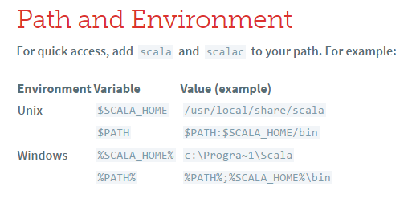
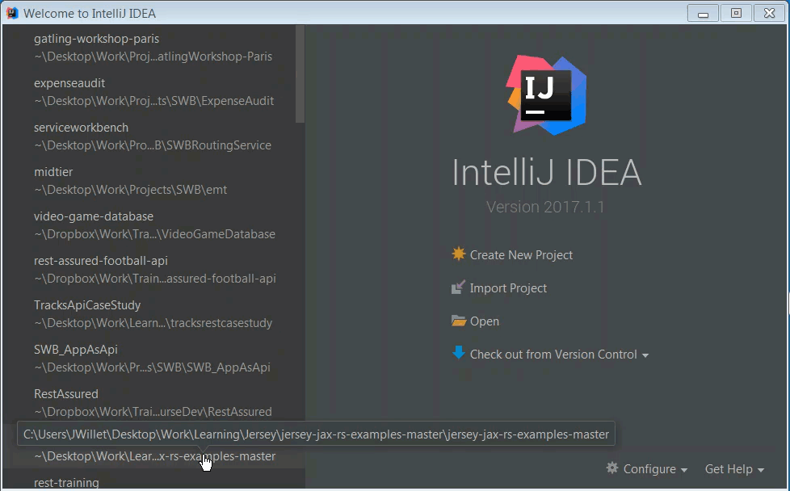
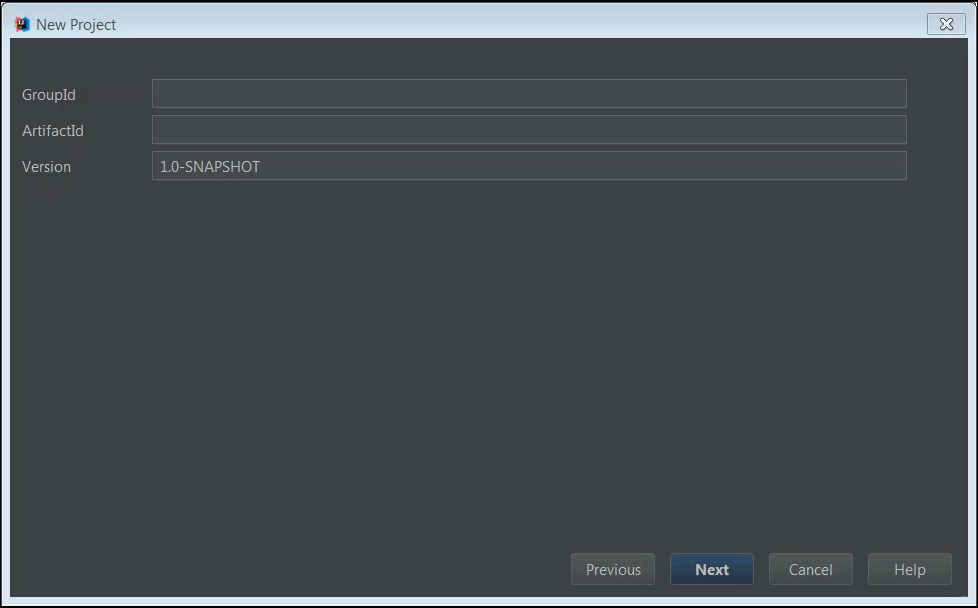
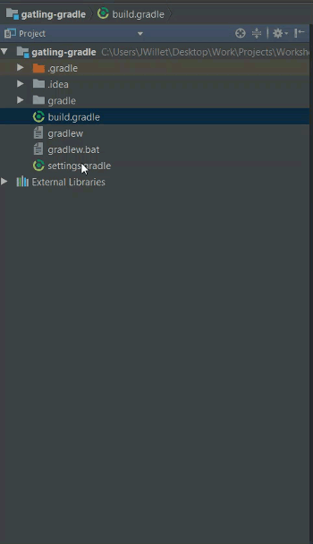
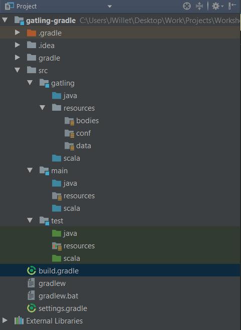
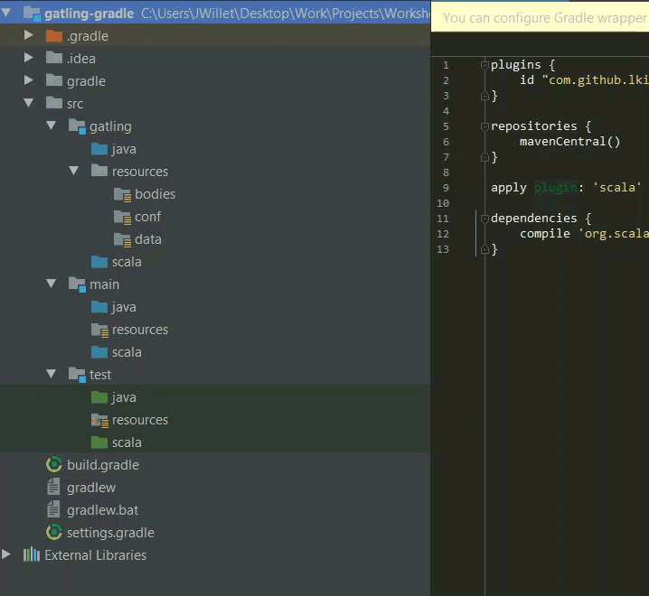
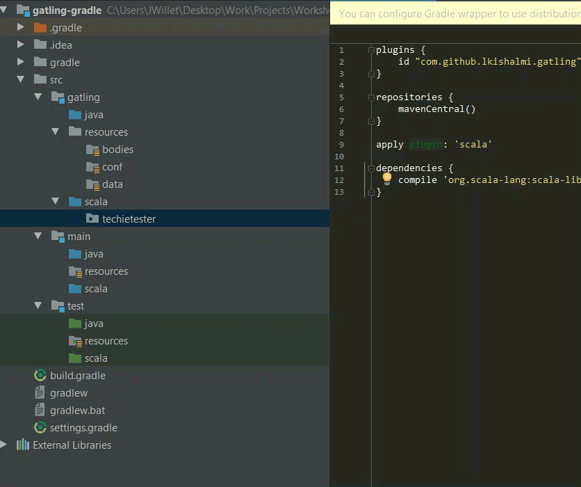
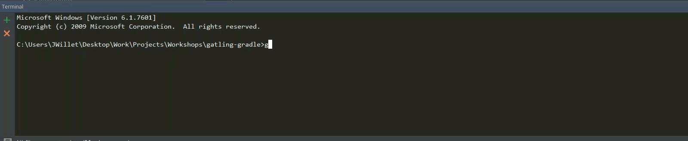
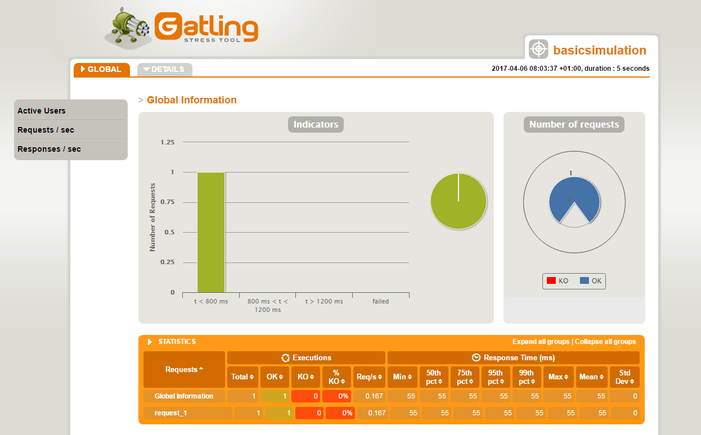

Want to use Gatling through Gradle? Then you are in the right place. I have been using the stress testing tool [Gatling](http://gatling.io/) alot recently. It is becoming one of my favourite performance testing tools. There is decent [getting started documentation on the Gatling website](https://gatling.io/docs/current/). But this involves downloading a zip file, then running a BAT or SH script to launch Gatling. You then select the test you want to run from the list.

So yes, it would be much nicer to do all the above through [Gradle](https://gradle.org/). Not to mention more convenient. Particularly if you want to run Gatling tests as part of Continuous Integration. One of the big advantages of doing that, is that you can have Gatling fail your CI build if a certain performance threshold is breached (such as too many errors, or average response time being too great etc.)

Fortunately there are some good Gatling through Gradle plugins out there. Not so fortunate, the documentation around getting any of these working is lacking. Especially if you are new to Gradle, Gatling or any of this stuff in general.

Not to worry! This Complete Beginners Guide to Running Gatling through Gradle will have you setup and ready to go in no time.

---

# Gatling Fundamentals for Stress, Load & Performance Testing – Out now on Udemy!

My Udemy course on [Gatling Fundamentals](https://www.udemy.com/gatling-fundamentals/?couponCode=JAMESW) is out now on Udemy.

In the course I take you through everything needed to start using Gatling through Gradle with the minimum of hassle.

[](https://www.udemy.com/gatling-fundamentals/?couponCode=JAMESW)

For readers of my blog, I am offering the course with a heavy discount – just click the link above!

---

To make this guide even more beginner friendly, we will configure it through an IDE (Intellij). Once the setup is done and working, you can switch to running solely through the command line if you wish.

Let me mention from the outset that I won’t be going into detail on Gatling in this post. I will publish a followup post with a comprehensive introduction to Gatling. This post’s focus is on getting you up and running with Gatling through Gradle in no time.

## Prerequisites

Before we begin, you should check off the list of 5 prerequisites below. Most likely you will have some if not all of them already. But I have listed them all here for completeness. Along with guides for installing each.

### 1. Java 8 JDK

You probably have this already, but if not there is an in depth guide on [installing the JDK](https://www3.ntu.edu.sg/home/ehchua/programming/howto/JDK_Howto.html), for all OS types, here.

### 2. Gradle 3.1 +

Suggest that you grab the latest version. See these guides:

- [Install Gradle on Windows](http://bryanlor.com/blog/gradle-tutorial-how-install-gradle-windows)
- [Install Gradle on OSx](https://kodejava.org/how-do-i-install-gradle-in-os-x/)
- [Install Gradle on Linux](https://gradle.org/install#manually)

### 3. Intellij

I’ll be using Intellij for this guide, you can grab the latest version of [Intellij](https://www.jetbrains.com/idea/download) here.

### 4. Scala SDK

Download the [Scala SDK binaries](https://www.scala-lang.org/download/install.html) from here and unpack the archive. Note that I am not installing the SBT (Scala Build Tool). If you have no idea what I’m talking about, just don’t worry!
As the guide says, you should add scala and scalac to your path. This is the same method as when you setup the Java JDK. See the 2 guides above if you need a reminder. As per the Scala instructions, the default folders are as follows:



Check that Scala is installed by launching a command prompt or terminal and typing scala.


### 5. Intellij Scala Plugin

Follow this guide to install the [Intellij Scala Plugin](http://nanxiao.me/en/getting-started-with-scala-in-intellij-idea-14-1/).

That’s all the prerequisites done. Now let’s get on to actually running Gatling through Gradle!

There are quite a few different Gatling plugins out there for Gradle. The one that I have had the most success with is from lkishalmi . See the Github page for the [Gatling Gradle Plugin](https://github.com/lkishalmi/gradle-gatling-plugin#installation) for more information. We will be downloading the plugin through Gradle as part of the guide.

---

## The 10 Step Guide To Running Gatling through Gradle

1. Open up Intellij and go to the landing page. Select “Create New Project“. Select Gradle, and deselect all libraries for the time being. Click next.



2. Enter a GroupID and ArtifactID. Click next. Tick ‘Auto Import‘ and ‘Create directories for empty content roots automatically‘. Click next. Enter a project name and location, then click finish.



3. When the project loads, open up the ‘build.gradle‘ file from the directory structure. Copy in the following code:

```groovy
plugins {
    id "com.github.lkishalmi.gatling" version "0.4.1"
}
repositories {
    mavenCentral()
}
apply plugin: 'scala'
dependencies {
    compile 'org.scala-lang:scala-library:2.11.8'
}
```

Note: you might see a popup in Intellij as in the image below. Click on “Ok, apply suggestion!“


4. Once you enter this code in the build.gradle file, Intellij should automatically build the project for you. If it doesn’t, simply right-click on the build.gradle file and select ‘Build Module‘.



5. Once the project has finished building, you should see that directory structure is created as in the screenshot.



6. Go into the folder src > gatling > scala . Right click and create a new package called ‘techietester‘.



7. Inside that new package, right click again and choose New Scala Class. Give the class a name of ‘BasicSimulation‘.



8. Copy in the following code to the BasicSimulation.scala class. This code is your Gatling script

```scala
package techietester
import io.gatling.http.Predef._
import io.gatling.core.Predef._
class BasicSimulation extends Simulation {
  val httpConf = http.baseURL("http://api.football-data.org/")
  val scn = scenario("Basic Simulation")
    .exec(http("request_1")
    .get("v1/teams/73"))
    .pause(5)
  setUp(
    scn.inject(atOnceUsers(1))
  ).protocols(httpConf)
}
```

9. Open up a command prompt / terminal. and browse to your root project folder. You can also do this in Intellij by pressing ALT + F12. Type gradlew gatlingRun . Your Gatling load test will execute!



10. The load test report generated by Gatling will be created in a folder like: C:\Work\gatling-gradle\build\reports\gatling\basicsimulation-1491462217892\index.html . It should look look something like this:



---

## ADDITIONAL NOTES

- Once you start developing additional scripts (i.e. tests), you can specify the name of the script that you want to run through Gradle. To do that, use the following command instead, specifying the full package name: gradlew gatlingRun-com.concur.BasicSimulation
- You can read in full about all the features of the [Gradle Gatling plugin](https://github.com/lkishalmi/gradle-gatling-plugin#installation) here.
- It is important to stick with the directory structure that the plugin creates in order to successfully run Gatling scripts. At the moment the folder structure is not configurable, although this feature may be added at a later date. See [this post](https://github.com/lkishalmi/gradle-gatling-plugin/issues/32) for more information.
- To successfully turn on logging, I had to add the following file in src > gatling > resources > conf > logback.xml . I wasn’t able to get logging to work as I wanted through the plugin, but adding this logback.xml file here worked instead. With this, you can change the logging level to whatever you like (trace, debug, warn etc.) . You can also turn logging on only for failing requests, which can be useful when running in production:

```xml
<?xml version="1.0" encoding="UTF-8"?>
<configuration>
   <appender name="CONSOLE" class="ch.qos.logback.core.ConsoleAppender">
      <encoder>
         <pattern>%d{HH:mm:ss.SSS} [%-5level] %logger{15} - %msg%n%rEx</pattern>
         <immediateFlush>false</immediateFlush>
      </encoder>
   </appender>
   <!-- Uncomment for logging ALL HTTP request and responses -->
   <logger name="io.gatling.http.ahc" level="TRACE" />
   <logger name="io.gatling.http.response" level="TRACE" />
   <!-- Uncomment for logging ONLY FAILED HTTP request and responses -->
   <!--   <logger name="io.gatling.http.ahc" level="DEBUG" /> -->
   <!--    <logger name="io.gatling.http.response" level="DEBUG" /> -->
   <root level="WARN">
      <appender-ref ref="CONSOLE" />
   </root>
</configuration>
```

- I ran into issues getting Scala setup through Intellij, as in [this post](http://stackoverflow.com/questions/40486489/gradle-scala-plugin-how-to-specify-zincclasspath) on Stack Overflow . I found that adding the following 4 lines to my build.gradle file fixed the issue:

```groovy
ScalaCompileOptions.metaClass.daemonServer = true
ScalaCompileOptions.metaClass.fork = true
ScalaCompileOptions.metaClass.useAnt = false
ScalaCompileOptions.metaClass.useCompileDaemon = false
```

Incidentally, I was able to delete these 4 lines after the Gradle project built, and I didn’t need to reenter them again. Most likely it’s a configuration issue on my machine, but I thought it was worth mentioning in case anyone else has an issue.

You should now be up and running with Gatling through Gradle!

---
