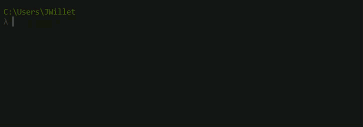
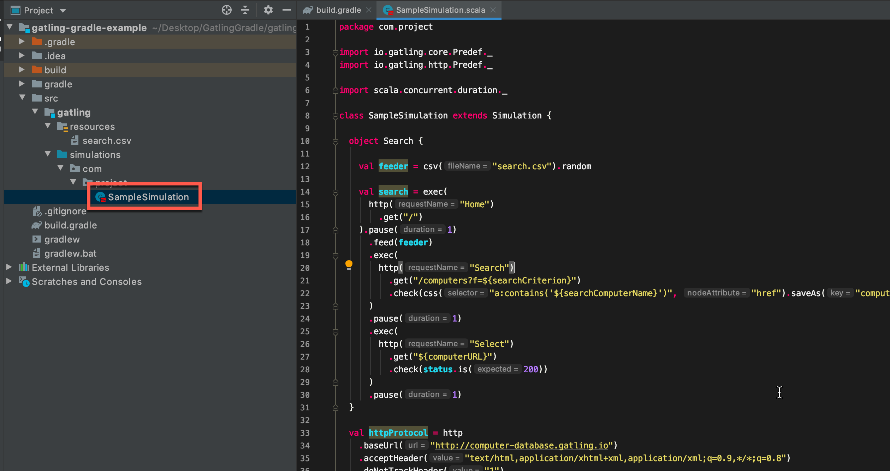

Want to use Gatling through Gradle? Then you are in the right place. I have been using the stress testing tool [Gatling](http://gatling.io/) alot recently. It is becoming one of my favorite performance testing tools. There is decent [getting started documentation on the Gatling website](https://gatling.io/docs/current/). But this involves downloading a zip file, then running a BAT or SH script to launch Gatling. You then select the test you want to run from the list.

So yes, it would be much nicer to do all the above through [Gradle](https://gradle.org/). Not to mention more convenient. Particularly if you want to run Gatling tests as part of Continuous Integration. One of the big advantages of doing that, is that you can have Gatling fail your CI build if a certain performance threshold is breached (such as too many errors, or average response time being too great etc.)

Fortunately there are some good Gatling through Gradle plugins out there. Not so fortunate, the documentation around getting any of these working is lacking. Especially if you are new to Gradle, Gatling or any of this stuff in general.

Not to worry! This Complete Beginners Guide to Running Gatling through Gradle will have you setup and ready to go in no time.

---

# Gatling Fundamentals for Stress, Load & Performance Testing – Out now on Udemy!

My Udemy course on [Gatling Fundamentals](https://www.udemy.com/gatling-fundamentals/?couponCode=JAMESW) is out now on Udemy.

In the course I take you through everything needed to start using Gatling with the minimum of hassle.

[](https://www.udemy.com/gatling-fundamentals/?couponCode=JAMESW)

---

To make this guide even more beginner friendly, we will configure it through an IDE (Intellij). Once the setup is done and working, you can switch to running solely through the command line if you wish.

Let me mention from the outset that I won’t be going into detail on Gatling in this post. If you want a comprehensive introduction to Gatling, check out my post [Load Testing with Gatling - The Complete Guide](../gatling-load-testing-complete-guide/).

# Prerequisites

Before we begin, you should check off the list of 5 prerequisites below. Most likely you will have some if not all of them already. But I have listed them all here for completeness. Along with guides for installing each.

## 1. Java 8 JDK

You probably have this already, but if not there is an in depth guide on [installing the JDK](https://www3.ntu.edu.sg/home/ehchua/programming/howto/JDK_Howto.html), for all OS types, here.

**I strongly recommend you use Java 8 with Gatling, as it's the most compatible**

## 2. Gradle

Suggest that you grab the latest version. See these guides:

- [Install Gradle on Windows](http://bryanlor.com/blog/gradle-tutorial-how-install-gradle-windows)
- [Install Gradle on OSx](https://kodejava.org/how-do-i-install-gradle-in-os-x/)
- [Install Gradle on Linux](https://gradle.org/install#manually)

## 3. Intellij

I’ll be using Intellij for this guide, you can grab the latest version of [Intellij](https://www.jetbrains.com/idea/download) here.

## 4. Scala SDK

Download the [Scala SDK binaries](https://www.scala-lang.org/download/2.12.8.html) from here and unpack the archive.

Note that I am not installing the SBT (Scala Build Tool), I am scrolling further down the page and downloading the Scala binaries:


**You should use Scala 2.12 with Gatling**

As the guide says, you could add scala and scalac to your path. This is the same method as when you setup the Java JDK. See the 2 guides above if you need a reminder. As per the Scala instructions, the default folders are as follows:


Check that Scala is installed by launching a command prompt or terminal and typing scala.



## 5. Intellij Scala Plugin

Follow this guide to install the [Intellij Scala Plugin](http://nanxiao.me/en/getting-started-with-scala-in-intellij-idea-14-1/).

That’s all the prerequisites done. Now let’s get on to actually running Gatling through Gradle!

There are quite a few different Gatling plugins out there for Gradle. The one that I have had the most success with is from lkishalmi . See the Github page for the [Gatling Gradle Plugin](https://github.com/lkishalmi/gradle-gatling-plugin#installation) for more information.

---

# Guide To Running Gatling through Gradle

Starting a Gradle project for Scala through Intellij is frustratingly difficult, as I have found out over the years.

The best way to get started, is to create a sample project.

1. Run the following command in a terminal or command prompt to create a sample project with the Gatling Gradle plugin:

```bash
curl -sL https://raw.githubusercontent.com/lkishalmi/gradle-gatling-plugin/master/bootstrap.sh | \
    bash -s ~/sample-gradle-gatling && \
    cd ~/sample-gradle-gatling && ./gradlew gatlingRun
```

2. Open the IntelliJ landing page and choose **Import Project**


3. Select the `build.gradle` file from the repository you downloaded in step 1, and click **Open**


4. Open the `SampleSimulation` file



5. You might see a popup similar to below. Choose `Setup Scala SDK`


6. Choose the SDK that you installed in the prereqs. If it isn't in the list, you may need to click `Configure` instead and point to the binaries you previously downloaded


7. That should be everything setup. To run a Gatling test through Gradle, type in:

```bash
./gradlew gatlingRun
```

Or to run a specific test:

```bash
./gradlew gatlingRun-SampleSimulation
```

For more information on using and configuring the plugin, check out the official documentation for the [Gatling Gradle Plugin](https://github.com/lkishalmi/gradle-gatling-plugin#installation)
