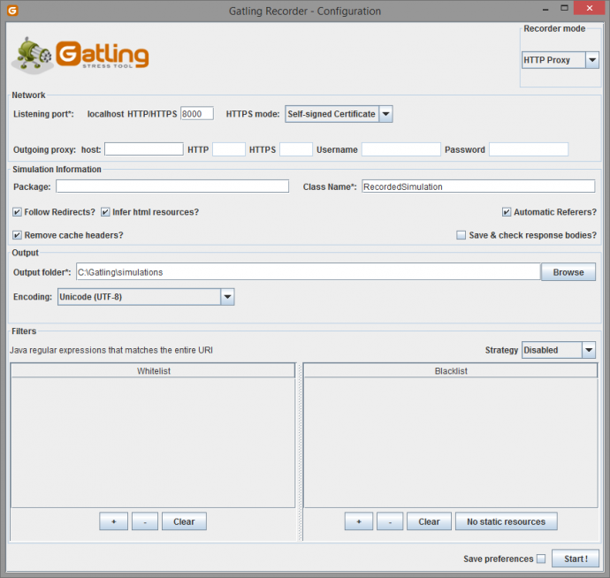
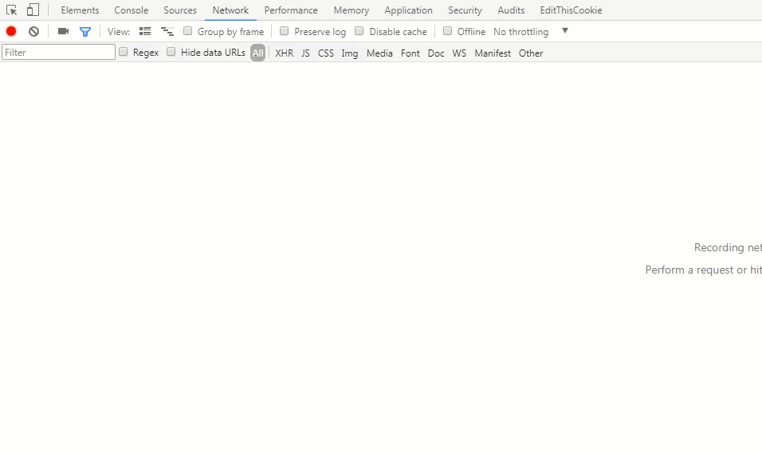
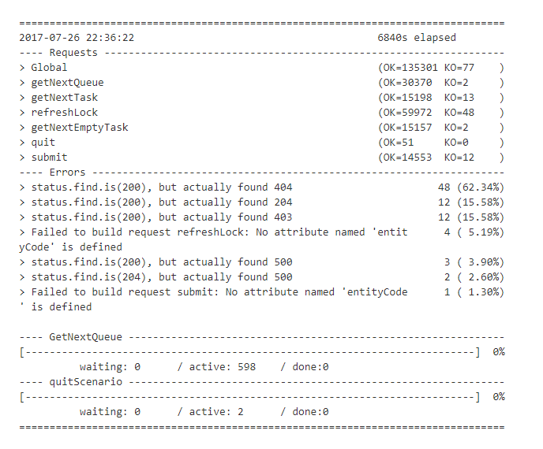
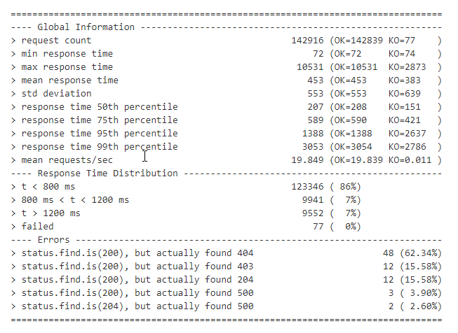
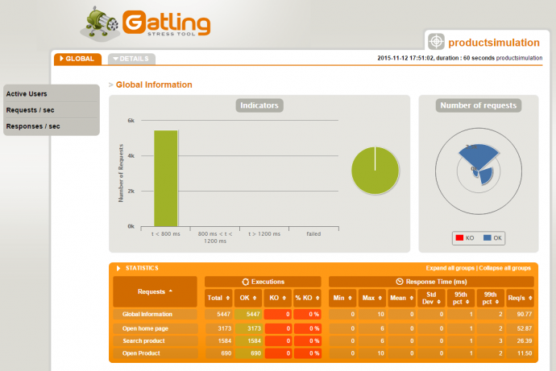
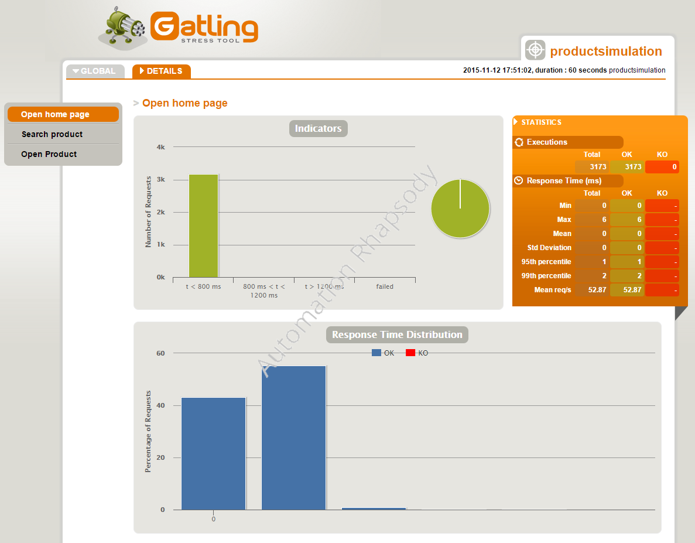

[[info|Video Presentation]]
| An extended version of the content in this blog post is presented in the video
| [**Gatling Introduction**](https://www.youtube.com/watch?v=5MYuQBQZ8Ys) on YouTube, feel free to watch that instead of reading this post

Previously I wrote a post on getting Gatling setup to run through Gradle, but I wrote that without giving much of a Gatling introduction. In this post I will remedy that with a full Gatling introduction, including some of the key features of this superb tool.

---

# Gatling Fundamentals for Stress, Load & Performance Testing – Out now on Udemy!

My Udemy course on [Gatling Fundamentals](https://www.udemy.com/gatling-fundamentals/?couponCode=JAMESW) is out now on Udemy.

In the course I take you through everything needed to start using Gatling through Gradle with the minimum of hassle.

[](https://www.udemy.com/gatling-fundamentals/?couponCode=JAMESW)

For readers of my blog, I am offering the course with a heavy discount – just click the link above!

---

## High Level Gatling Introduction – What is Gatling?

According to the [official Gatling site](http://gatling.io/) – “Gatling is a highly capable load testing tool. It is designed for ease of use, maintainability and high performance.”

Gatling is built on top of a toolkit called Akka. Akka is a toolkit for building highly concurrent, distributed and resilient message-driven applications for Java and Scala. Read more about [Akka](http://akka.io/) on the official site.

Since Gatling is using Akka’s message driven architecture, it is able to run thousands of virtual users on a single machine. This is because Akka overrides the JVM limitation of handling many threads. Virtual users in Gatling are threads not messages.

Gatling’s asynchronous architecture gives a huge scaling advantage over traditional thread based load testing tools such as JMeter and LoadRunner. It is no where near as easy to scale to thousands of users with these other tools.

## Features of Gatling

Continuing the Gatling introduction, at a high level some of the features are:

- **Excellent support for HTTP Protocol** – this makes Gatling a good choice for load testing any HTTP server or for calling APIs directly.
- **Simulation scripts written in Scala** – if you don’t have much experience with Scala this can make scenario creation and maintenance more challenging. Fortunately Gatling comes with an expressive DSL that is self explanatory. Writing load test scenarios in Scala code allows for huge flexibility.
- **GUI Recorder** – The Gatling recorder works as a proxy to capture all traffic in your user journey and then converts it into a Gatling scenario. This can be useful when creating a script for a more complex web application. Also useful as a starting point for generating a template Gatling scenario against a new application under test.
- **Code can be kept in VCS** – as Gatling load test scenarios are just Scala code, they can be kept in the Version Control System. Alongside the production code. This makes scenario code easier to maintain.
- **Easily run tests as part of CI** – Since the code is kept in the VCS, it is easy to run load tests in the Continuous Integration process. This is even easier because load tests in Gatling run from a single machine. In other tools a distributed environment of load injectors is often required for test execution, which is more complex to implement. Scenarios can be configured to fail the CI build if a certain threshold is breached, such as number of failures or high transaction response times.

## GUI Recorder

Once you have downloaded the Gatling ZIP file, you can run the recorder by executing “GATLING_HOME/bin/recorder.bat”



The recorder has two modes: HTTP Proxy and HAR Converter.

To use HTTP Proxy mode, you will need to configure your web browser to direct traffic through the proxy. You can follow the [tutorial on the official Gatling site](http://gatling.io/docs/current/quickstart/) if you are interested in doing this.

The other option (which I prefer) is to use the HAR Converter. HAR stands for HTTP Archive. Using this process makes generating and handling SSL certificates a lot easier, which can be difficult with the proxy method mentioned previously.

A HAR file can be recorded using Chrome Dev tools. Simply open the dev tools, click on the Network tab, select “Preserve Log”, load the page in the web browser, right click and choose “Save as HAR with content”. The animation below shows this in action:



## Overview of a Gatling Scenario / Script

Since this is a Gatling introduction, let’s take a look at an incredibly basic Gatling script:

```scala
package com.my.package

import io.gatling.http.Predef._
import io.gatling.core.Predef._

class BasicSimulation extends Simulation {

  val httpConf = http
	.baseURL("http://api.football-data.org/")
	.acceptHeader("image/png,image/*;q=0.8,*/*;q=0.5")
  .acceptEncodingHeader("gzip, deflate")
  .acceptLanguageHeader("en-US,en;q=0.5")
  .connection("keep-alive")

  val scn = scenario("Basic Simulation")
    .exec(http("request_1")
    	.get("v1/teams/73"))
    .pause(5)
    .exec(http("request_2")
    	.get("v1/teams/74"))

  setUp(
    scn.inject(atOnceUsers(1))
  ).protocols(httpConf)
}
```

We can carve the script up into 4 distinct sections.

Let’s do that now:

### Section 1: Script Setup

```scala
package com.my.package

import io.gatling.http.Predef._
import io.gatling.core.Predef._

class BasicSimulation extends Simulation {
```

First of all, we can can (optionally) declare a package for our script to reside in. This is no different from any other Java / Scala class.

We then import the required Gatling files to the class.

Finally we extend our class with the Gatling class “Simulation“. This effectively turns our class into a Gatling script.

### Section 2: Common HTTP Configuration

```scala
  val httpConf = http
	.baseURL("http://api.football-data.org/")
	.acceptHeader("image/png,image/*;q=0.8,*/*;q=0.5")
  .acceptEncodingHeader("gzip, deflate")
  .acceptLanguageHeader("en-US,en;q=0.5")
  .connection("keep-alive")
```

Now we define the .baseURL() that will be prepended to all HTTP requests.

We also add some headers that will be included in all of the requests.

### Section 3: The Scenario Profile

```scala
  val scn = scenario("Basic Simulation")
    .exec(http("request_1")
    	.get("v1/teams/73"))
    .pause(5)
    .exec(http("request_2")
    	.get("v1/teams/74"))
```

In this section we define the actual scenario that will be executed. Let’s talk through it line by line.

On line 1 we first declare a value called “scn“. We assign it the “scenario” (which is from the Scala DSL) and name it “Basic Simulation”

On line 2 we call the .exec() method. We supply it with “http” (again from the Scala DSL) and name it “request_1”. This is what the transaction will be called in the test report.

On line 3 we execute the .get() method and supply the endpoint to call. The full endpoint called here will be: “http://api.football-data.org/v1/teams/73”

One line 4 we pause for 5 seconds

Finally on lines 5 and 6 we do a similar call for “request_2” which calls a different endpoint.

This is an extremely simple scenario for our Gatling introduction. It simply calls an endpoint, waits 5 seconds, then calls another one.

### Section 4: Load Test Simulation Setup

```scala
  setUp(
    scn.inject(atOnceUsers(1))
  ).protocols(httpConf)
```

In the final section of our Gatling introduction script, we define how the scenario profile we created in section 3 will be executed in our load test.

We call Gatling’s “setup” from the DSL.

We pass in the “scn” that we created in section 2, and ask it to inject a single user at once.

Finally we supply the “httpConf” value, that we defined in section 2, to the .protocols() method.

I kept the functionality of this script very basic because this is just a Gatling introduction. But all Gatling scripts consist of this simple 4 section template.

## Load Simulation Text Report

Whenever you execute a Gatling test, there is a load simulation text report that is printed to the console every few seconds. This gives you a high level overview of how the test is going. The text looks like this:



There is some useful high level information here.

We can see the number of requests that have passed (OK) and failed (KO), broken down by the request name. Also the cumulative of all requests is represented by Global.

Further down we can see details of any errors that have occurred.

Finally we can see the number of virtual users waiting to start, currently active and finished.

At the end of the Gatling test, a report is printed to the console that gives a summary of the test. It looks like this:



This report has details of the passed and failed requests, as well as the various response time metrics such as min, max and various response time percentiles.

The distribution of the response times is also shown, broken down between the 800 and 1200 ms marks.

Finally, a breakdown of the errors that occurred during the test is shown.

## Load Simulation Graphical Report

Once the Gatling test has completed, a graphical report in the form of a HTML file is created. The report looks like this:



The report shows various statistics in relation to the transactions that were executed in the test. Specifically, it details the transaction response times and the number of passed / failed transactions.

In addition to the Global report, you can also view reports that go into detail on specific transactions:



One thing that is important to note. Gatling is great at telling you how long transactions took. And how many passed and failed. But it won’t tell you where the performance problems in your system are, save for the transactions that are taking a long time.

To find that information, you will need to install external server monitoring software on the systems you are testing. There are many examples of this type of software ([New Relic](https://newrelic.com/) and [App Dynamics](https://www.appdynamics.com/) are two of the heavy weights), and many cloud system providers ship with some sort of monitoring.

It’s just important to remember – Gatling can’t monitor your system resource utilisation for you. I only mention this because it’s a question I get asked a lot whenever I give a Gatling introduction.

I hope that you found this Gatling introduction post helpful. Lookout for more in-depth Gatling tutorials soon.
