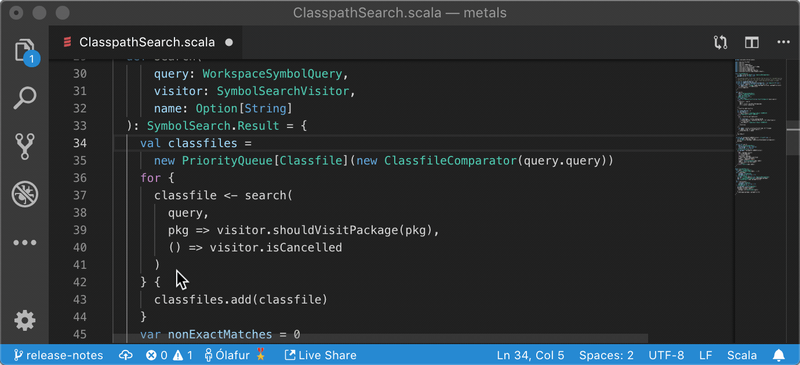
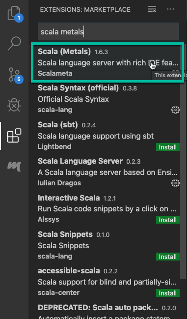
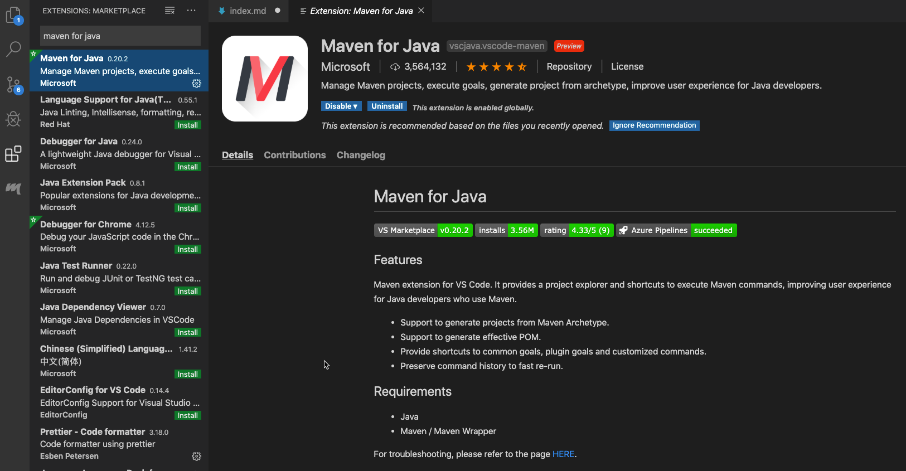
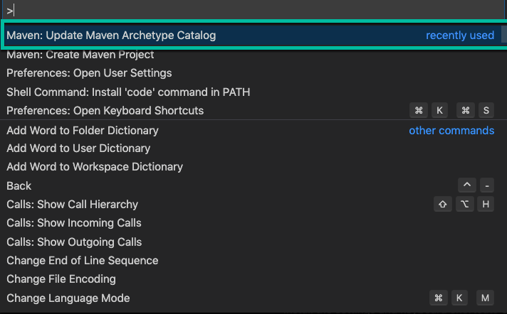
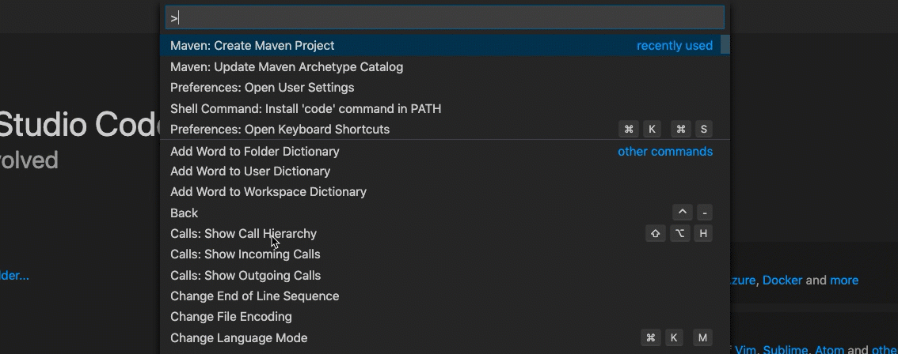
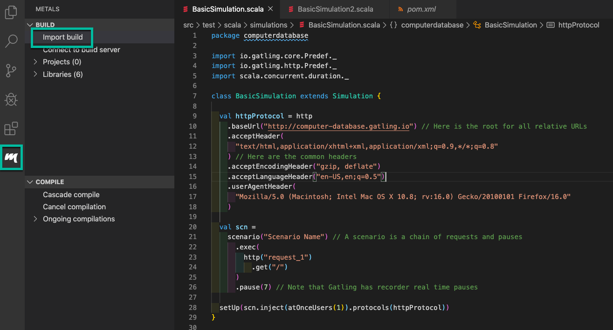

# Overview

Recently I learned, through a comment from a student in my [Gatling Fundamentals](https://www.udemy.com/course/gatling-fundamentals/) course, that you can develop Gatling scripts using the [Visual Studio Code](https://code.visualstudio.com/) IDE. I honestly had no idea that this was possible - but was pleasantly surprised to find that it works well!

In this post, we will explore how to get your Gatling script development environment setup in VS Code. We will cover both the **Maven** and **SBT** build tools.

# Install Metals

The first thing to do, whether you plan to run with **Maven** or **SBT**, is to install the [Scala Metals](https://marketplace.visualstudio.com/items?itemName=scalameta.metals) plugin inside VS Code. This plugin will enable a Scala language server to run within VS Code, and provide the typical features that you expect of an IDE.



Install the plugin from within VS Code in the normal way, by clicking on the _Extensions_ tab, and searching for **Scala (Metals)**:



With Metals installed, let's first look at how to get Gatling running in VS Code with Maven.

# Gatling VScode with Maven

Firstly you need to have Maven installed - you can [download Maven](https://maven.apache.org/download.cgi) from the official site, and follow the installation instructions on that page.

Next, install the [Maven for Java](https://marketplace.visualstudio.com/items?itemName=vscjava.vscode-maven) plugin inside VS Code:



Still inside VS Code, open up the _Command Pallette_ (View > Command Pallette) and select `Maven: Update Maven Archetype Catalog`:



As you might expect, this will update the catalog of Maven archetypes that are available.

Now, we want to create a new Gatling project from the Gatling Maven Archetype. To do that, first open the _Command Pallette_ again, and choose `Maven: Create Maven Project`. When selecting an archetype, click `more`. Type in `Gatling`, and the Gatling archetype should appear. See the video below for the steps:



Save the project in a suitable place on your computer. Then open the project as normal in VS Code. You might need to import the build at this stage. To do that, click on the **Metals** tab in VS Code and click `Import Build`:



This will cause Maven to build your project.

Now go ahead and add your Gatling simulation code as normal. If you are following along and need a sample Gatling script, you can use this basic one below:

```scala
package computerdatabase

import io.gatling.core.Predef._
import io.gatling.http.Predef._
import scala.concurrent.duration._

class BasicSimulation extends Simulation {

  val httpProtocol = http
    .baseUrl("http://computer-database.gatling.io") // Here is the root for all relative URLs
    .acceptHeader(
      "text/html,application/xhtml+xml,application/xml;q=0.9,*/*;q=0.8"
    ) // Here are the common headers
    .acceptEncodingHeader("gzip, deflate")
    .acceptLanguageHeader("en-US,en;q=0.5")
    .userAgentHeader(
      "Mozilla/5.0 (Macintosh; Intel Mac OS X 10.8; rv:16.0) Gecko/20100101 Firefox/16.0"
    )

  val scn =
    scenario("Scenario Name") // A scenario is a chain of requests and pauses
      .exec(
        http("request_1")
          .get("/")
      )
      .pause(7) // Note that Gatling has recorder real time pauses

  setUp(scn.inject(atOnceUsers(1)).protocols(httpProtocol))
}

```

To run the script, open a terminal within VS Code, and type `mvn gatling:test` . If you want to run a specific test script, you can do `mvn gatling:test -Dgatling.simulationClass=computerdatabase.BasicSimulation` instead.

Feel free to read more about the [Gatling Maven Plugin](https://gatling.io/docs/current/extensions/maven_plugin/).

# Gatling VScode with SBT

If you prefer to run and build your Gatling projects with the **Scala Build Tool** (SBT), I find that the easiest thing to do is to first clone the [Gatling SBT Plugin Demo](https://github.com/gatling/gatling-sbt-plugin-demo) project.

Once you have cloned the project, open it as normal in VS Code. Click on the **Metals** tab in VS Code and click `Import Build`:


VS Code should now build your Gatling project with SBT.

To run all the tests in your project, open a terminal and type `sbt gatling:test`. Or to run a single test script, you can do `sbt gatling:testOnly computerdatabase.BasicSimulation`.

You can learn more about the [Gatling SBT Plugin](https://gatling.io/docs/current/extensions/sbt_plugin/) in the documentation.

# Summary

In this post, we learned how to use Visual Studio Code for our Gatling script creation. We looked at how to get a Gatling project built and running for both the Maven and SBT build tools.

Although [IntelliJ IDEA](https://www.jetbrains.com/idea/) remains my IDE of choice for developing Scala and Gatling code, it's great to have the option of using the ever popular VS Code as well!
