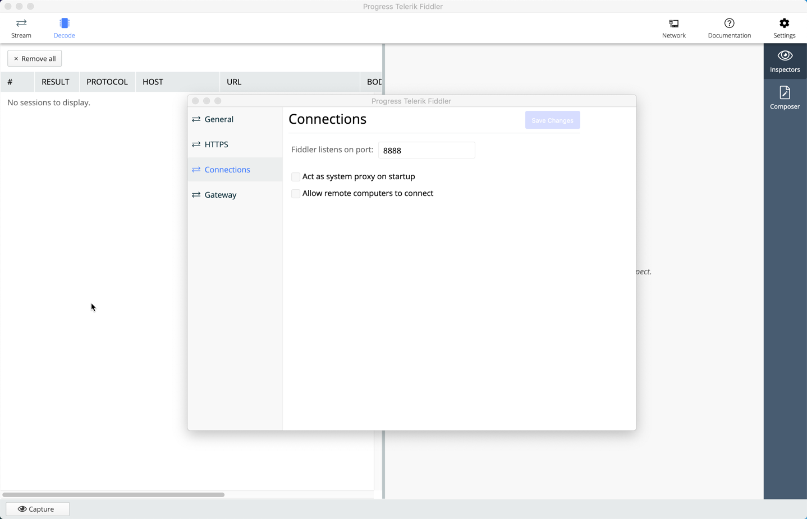

# Gatling Proxy Example

In this short post, we will see how to redirect our Gatling traffic through a locally running proxy server. Capturing traffic in this way is a great way to debug our scripts. It let's us see exactly what is being sent by Gatling in the HTTP Requests. We also see everything in the HTTP Response, including the headers.

# Choosing a HTTP Proxy for Gatling

There are plenty of HTTP proxies to choose from, here are a few of the popular ones:

- [Charles Proxy](https://www.charlesproxy.com/)
- [Burp Suite](https://portswigger.net/burp)
- [Fiddler](https://www.telerik.com/download/fiddler)

I'll be using [Fiddler](https://www.telerik.com/download/fiddler) for this post. It's free, and there are versions available for Mac and Windows.

# Configure Fiddler for Gatling Proxy

Download and install [Fiddler](https://www.telerik.com/download/fiddler). It should be straightforward to install, just follow the on-screen prompts. After you launch Fiddler, go to **Settings > Connections** and check which port Fiddler listens on. I normally set mine to `8888`:



Now that Fiddler is running, we just need to set the Gatling proxy in our source code.

# Setting Gatling Proxy Traffic

To set our traffic in Gatling through the Fiddler proxy, we need to add the following to our HTTP configuration:

```scala
val httpConf = http.proxy(Proxy("localhost", 8888))
```

This directs all Gatling traffic to the Fiddler proxy, which is running on `localhost` at port `8888`.

# Setting HTTPS and Credentials for Gatling Proxy

You can optionally set a different port for HTTPS, and supply proxy credentials:

```scala
val httpConf = http.proxy(Proxy("myProxyHost", 8888)
                      .httpsPort(8080)
                      .credentials("Username", "Password"))
```

# Disable Gatling Proxy for Given Hosts

You can disable the proxy for a given list of hosts with `scala±noProxyFor(hosts: String*)`:

```scala
val httpConf = http.proxy(Proxy("myProxyHost", 8888))
                    .noProxyFor("www.james-willett.com", "www.gatling.io")
```

# Summary

In this short post, we looked at how to direct our Gatling traffic through a HTTP proxy.

For further information on directing Gatling traffic through a Proxy, check the [Gatling Documentation](https://gatling.io/docs/current/http/http_protocol#proxy-parameters).
