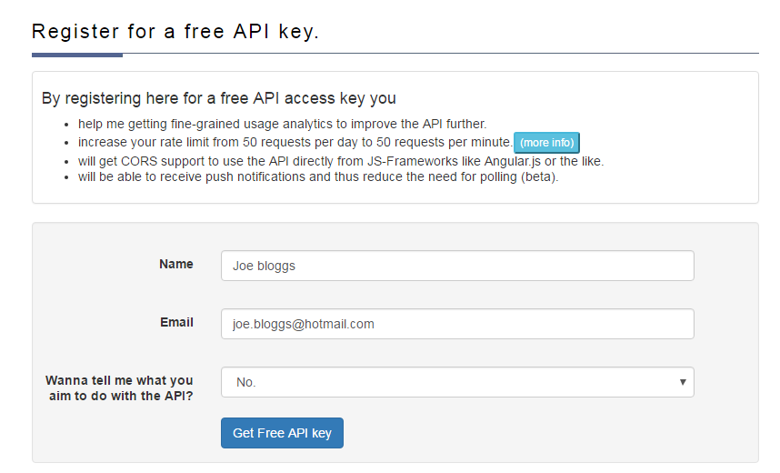
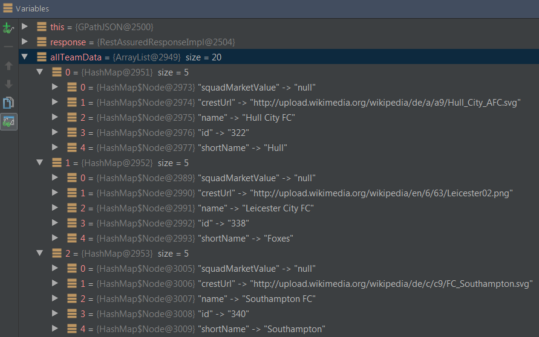
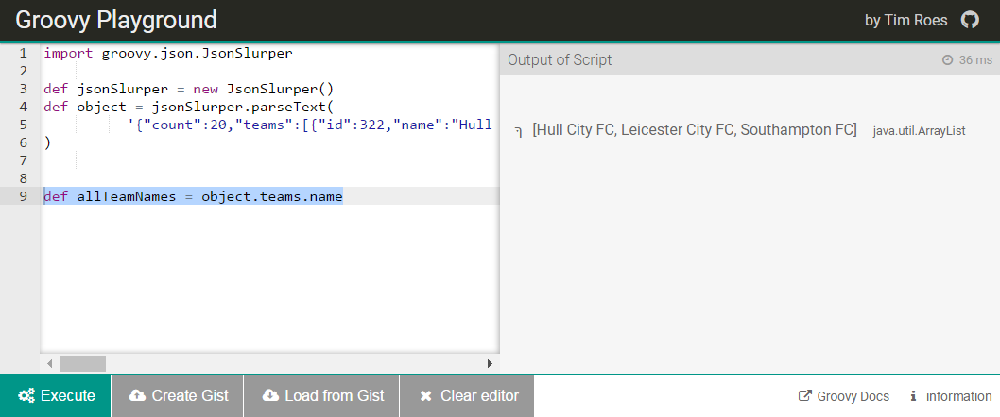

In part 1 of this series on how to effectively use Groovy GPath in REST Assured, we gave an overview of [Groovy](http://groovy-lang.org/). We also covered installation options, the [Groovy playground](https://groovy-playground.appspot.com/), and some of the basic concepts that will be useful to us for GPath in REST Assured. For part 2, we are going to focus purely on working with GPath JSON in REST Assured.

Although XML continues to be widely used amongst APIs (particularly legacy systems), there seems to undoubtedly be a shift towards JSON for newly developed APIs. My personal preference is for JSON, and it does seem to be the most popular. But if often doesn’t matter to us testers which we prefer to test, we will get whatever system we are given!

We need to understand how to use GPath in REST Assured to test both JSON and XML. Although there is a lot of crossover and similarities in the syntax for both uses of GPath in REST Assured, there are some key differences as well. We will see these differences as we go through the examples in the next two blog posts, starting with GPath JSON.

Since REST Assured is obviously just code, we can be very flexible in how we choose to write our tests. We will see that in the examples below.

In this blog post, we are going to cover the following:

- Register for an API token from football-data.org
- Add boilerplate REST Assured code to include the token and Base URL in all our requests
- Look at 5 different ways of writing the same GPath JSON REST Assured test
- Go through some straightforward GPath JSON examples
- Explore how to use Online JSON Viewer and the Groovy Playground to practice our GPath JSON expressions
- Demonstrate a wide range of more complex examples for writing GPath JSON expressions

---

# REST Assured Fundamentals – Out now on Udemy!

My Udemy course on **REST Assured Fundamentals** is out now on Udemy.

[](https://www.udemy.com/rest-assured-fundamentals/?couponCode=TECHIETESTER)

For readers of my blog, I am offering the course with an 80% discount – [just use this promotion code](https://www.udemy.com/rest-assured-fundamentals/?couponCode=TECHIETESTER) !

---

## The Football-Data.org API

For all the GPath JSON examples in the next two posts we will use the [football-data.org API](http://www.football-data.org/index) . This is an easy to use RESTful API that provides data on football fixtures, results, teams and players.

You can use the football-data API anonymously without a key, which is a nice feature. However, you will be limited to 100 requests per day from your IP. With the API key, you can make 100 calls a minute. So it’s worth registering for one. It’s free, and it only takes a minute. To register for a key, go to the [registration page on the football-data.org API](http://www.football-data.org/client/register) website.



You should get an email straight away with the key, or “X-Auth-Token“. It should look something like this: fze4b032141e23f453c22dbb2f78946b . This key is fake, so make sure you actually register and don’t just copy this!

## Add Boilerplate Code

With the key in hand we can begin setting up our boilerplate code in our project so that we can start using GPath JSON in REST Assured. We will be creating a @BeforeClass annotation. It will hold the REST Assured base URI and path, as well as a [request specification builder](https://james-willett.com/2015/07/specification-re-use-in-rest-assured-with-responsespecbuilder-and-requestspecbuilder/) with headers for the API key and another to reduce noise from the API by minimising the meta data returned.

In your REST Assured Java project, add the following class and code:

```java
import io.restassured.RestAssured;
import io.restassured.builder.RequestSpecBuilder;
import io.restassured.specification.RequestSpecification;
import org.junit.BeforeClass;
import org.junit.Test;
public class GPathJSONcopy {
    @BeforeClass
    public static void setupRestAssured() {
        RestAssured.baseURI = "http://api.football-data.org";
        RestAssured.basePath = "/v1/";
        RequestSpecification requestSpecification = new RequestSpecBuilder().
                addHeader("X-Auth-Token", "fze4b032141e23f453c22dbb2f78946b").
                addHeader("X-Response-Control", "minified")
                .build();
        RestAssured.requestSpecification = requestSpecification;
    }
}
```

This code will be executed before each of our GPath in REST Assured @Tests. It will set the base URI and path for us, and a couple of headers with the API Key and another to reduce the meta data in the response.

## The First Test for GPath JSON – Written in 5 Different Ways

### JSON Snippet – Details of a Team

Let’s write our first GPath JSON REST Assured test! We will call the API to get the details of a certain team (Manchester United), and printout the team name that is returned. This is the JSON that is returned from calling http://api.football-data.org/v1/teams/66

```json
{
  "id": 66,
  "name": "Manchester United FC",
  "shortName": "ManU",
  "squadMarketValue": null,
  "crestUrl": "http://upload.wikimedia.org/wikipedia/de/d/da/Manchester_United_FC.svg"
}
```

### Example 1 – Use path() on Response

Add the following @Test to your code:

```java
@Test
public void extractSingleValue_findSingleTeamName() {
    Response response = get("teams/66");
    String teamName = response.path("name");
    System.out.println(teamName);
}
```

And add the following static import at the top of your class:

```java
import static io.restassured.RestAssured.*;
```

Let’s talk through what we are doing here line by line. On the first line we call the API endpoint, we only need to put “teams/66” because the base URL is specified in the @BeforeClass. We save the response in an instance of the REST Assured Response class. We can use the REST Assured get() method because of the static import we specified at the top. If you didn’t include the static import, you could write this instead:

```java
Response response = RestAssured.get("teams/66");
```

On the 2nd line, we create a string called teamName. We call the .path() method on the response, and specify the JSONPath to this attribute (in this case simply “name”).

### Example 2 – Specify JSONPath

A quick note on the .path() method. How did REST Assured know to use JSONPath, instead of XMLPath? We didn’t specify it! That’s some of the magic of GPath in REST Assured. If we wanted to specifically tell REST Assured to use JSONPath, we could write the same example like this:

```java
@Test
public void extractSingleValue_findSingleTeamName_specifyJsonPath() {
   Response response = get("teams/66");
   JsonPath jsonPath = new JsonPath(response.asString());
   String teamName = jsonPath.get("name");
   System.out.println(teamName);
}
```

As you can see, this way is slightly longer, as we need to create an instance of JsonPath. But the result is the same, it is using GPath JSON.

### Example 3 – Response as String

Let’s look at another variation. This one requires us to save the response as a string, but we don’t need to instantiate JSONPath:

```java
@Test
public void extractSingleValue_findSingleTeamName_responseAsString() {
    String responseAsString = get("teams/66").asString();
    String teamName = JsonPath.from(responseAsString).get("name");
    System.out.println(teamName);
}
```

We grab the whole response as a string on the 1st line. On the 2nd line, we use JsonPath to extract the teamName from that string. Simple right!

### Example 4 - Single Line

Let’s see how we could get everything with a single line of code:

```java
@Test
public void extractSingleValue_findSingleTeamName_getEverythingInOneGo() {
    String teamName = get("teams/66").path("name");
    System.out.println(teamName);
}
```

This is doing the same thing as the other examples, but all the work happens on a single line. It’s down to personal preference which way you want to do it, and which way you think is more readable. I just wanted to show how many different ways you could write the same test using GPath JSON.

### Example 5 - Given, When, Then

Let’s finish by writing the same test using the traditional Given, When, Then syntax supported by REST Assured. Instead of just printing out the team name, this test will check that it is actually correct:

```java
@Test
public void extractSingleValue_findSingleTeamName_useAssertion() {
    given().
    when().
            get("teams/66").
    then().
            assertThat().
            body("name", equalTo("Manchester United FC"));
}
```

We don’t need to specify a given() since that is handled in the @BeforeClass at the start. If we didn’t have the @BeforeClass, we would include the headers for the call here.

For the when() we ask to get the endpoint at http://api.football-data.org/v1/teams/66 .

Finally for the then(), we assert that the response body contains a name key with the value “Manchester United“.

Now that we have done the initial setup, and looked at different ways of writing the same test, lets look at some more complex examples. Remember, you can write these in whatever format is most suitable for you, as I demonstrated above.

## Simple GPath JSON Examples

### JSON Snippet – Data for many Teams

This is a snippet of the JSON that is returned when calling http://api.football-data.org/v1/competitions/426/teams . Actually more data is returned than is shown here, but I have trimmed it for example purposes. You should be able to call the URL above (even without an API key) and see the full response:

```json
{
  "count": 20,
  "teams": [
    {
      "id": 322,
      "name": "Hull City FC",
      "shortName": "Hull",
      "squadMarketValue": null,
      "crestUrl": "http://upload.wikimedia.org/wikipedia/de/a/a9/Hull_City_AFC.svg"
    },
    {
      "id": 338,
      "name": "Leicester City FC",
      "shortName": "Foxes",
      "squadMarketValue": null,
      "crestUrl": "http://upload.wikimedia.org/wikipedia/en/6/63/Leicester02.png"
    },
    {
      "id": 340,
      "name": "Southampton FC",
      "shortName": "Southampton",
      "squadMarketValue": null,
      "crestUrl": "http://upload.wikimedia.org/wikipedia/de/c/c9/FC_Southampton.svg"
    }
  ]
}
```

We will use the above JSON in the next few examples.

### Extract First or Last Value from Multiple Matches

Suppose that you wanted to find the first “name” this is returned in the JSON response. You could do that like this with GPath JSON in REST Assured:

```java
@Test
public void extractFirstValueWhenSeveralReturned_findFirstTeamName() {
    Response response = get("http://api.football-data.org/v1/competitions/426/teams");
    String firstTeamName = response.path("teams.name[0]");
    System.out.println(firstTeamName);
}
```

If you wanted to get the last team “name” that shows up in the JSON, you could do it like this:

```java
@Test
public void extractLastValueWhenSeveralReturned_findLastTeamName() {
    Response response = get("http://api.football-data.org/v1/competitions/426/teams");
    String lastTeamName = response.path("teams.name[-1]");
    System.out.println(lastTeamName);
}
```

Obviously you could also extract another team name from the middle if you knew the index order number that it would appear in.

### Extract All Values into a List

Instead of just grabbing a single team name, this example shows how you can get ALL The team names into a list:

```java
@Test
public void extractListOfValues_findAllTeamNames() {
    Response response = get("competitions/426/teams");
    ArrayList<String> allTeamNames = response.path("teams.name");
    System.out.println(allTeamNames);
}
```

### Extract Multiple Maps of Objects

Rather than just extracting each of the team names, suppose that you wanted to extract all of the data for each team (i.e. name, shortname, id etc.). You could do this by extracting a list, with each element in the list being a map of the team data:

```java
@Test
public void extractListOfMapsOfElements_findAllTeamData() {
    Response response = get("competitions/426/teams");
    ArrayList<Map<String,?>> allTeamData = response.path("teams");
    System.out.println(allTeamData);
}
```

REST Assured has given us a lot of power here, without having to write any complex code we are taking advantage of GPath JSON. This is what the ArrayList that we extracted above looks like visually in the IDE debugger:



## Technique to Practice GPath JSON Expressions

Before we dive into the more advanced GPath JSON examples, I want to show you a good way of practicing your GPath JSON expressions using the Groovy Playground. This will make it much easier when writing your expressions into your REST Assured code. You will need to have the following two sites open:

- [Groovy Playground](https://groovy-playground.appspot.com/)
- [Online JSON Viewer](http://jsonviewer.stack.hu/)

First in the Groovy Playground type the following template code:

```groovy
import groovy.json.JsonSlurper

def jsonSlurper = new JsonSlurper()
def object = jsonSlurper.parseText(
          '{JSON GOES HERE}'
)

println(object)
```

The above will fail at the moment if we execute it, as we haven’t copied in the JSON yet. The next thing to do, is copy your JSON string into your clipboard, and remove all the white space. To do that, paste the JSON blob into Online JSON viewer and click “remove white space”, then copy the result back to your clipboard (as in the video below):


Now that you have your JSON without the white space, paste that back into the Groovy Playground (as in the video below):


You are now able to practice your GPath JSON directly in the Groovy Playground. Let’s take one of the previous examples where we extracted a list of all the team names. To do that now in the Groovy Playground, you would add the following line:

```groovy
def allTeamNames = object.teams.name
```

So now your Groovy Playground would look like this, and you can see the ArrayList of team names when you execute the script:



I find this technique to be really useful when starting to write more complex GPath JSON that I need to figure out and test beforehand.

Let’s get into some of those examples now!

## Advanced GPath JSON examples – Using Groovy

The examples we have seen so far have been useful and powerful. But we still haven’t seen any of the more advanced features of using GPath JSON in REST Assured. Such as using closures to loop over it, using find() and findAll() etc.

In the next few examples, we will build on the basic Groovy that we learnt about in the first post of this series to demonstrate the remarkable flexibility and power of GPath JSON in REST Assured.

### Extract Map of JSON Object with Find

Let’s remind ourselves of the JSON that gets returned when we call the endpoint at http://api.football-data.org/v1/competitions/426/teams . Here is the snippet below again:

```json
{
  "count": 20,
  "teams": [
    {
      "id": 322,
      "name": "Hull City FC",
      "shortName": "Hull",
      "squadMarketValue": null,
      "crestUrl": "http://upload.wikimedia.org/wikipedia/de/a/a9/Hull_City_AFC.svg"
    },
    {
      "id": 338,
      "name": "Leicester City FC",
      "shortName": "Foxes",
      "squadMarketValue": null,
      "crestUrl": "http://upload.wikimedia.org/wikipedia/en/6/63/Leicester02.png"
    },
    {
      "id": 340,
      "name": "Southampton FC",
      "shortName": "Southampton",
      "squadMarketValue": null,
      "crestUrl": "http://upload.wikimedia.org/wikipedia/de/c/c9/FC_Southampton.svg"
    }
  ]
}
```

Suppose that from the above JSON, you wanted to extract a map with the key / value pairs of everything for Leicester City? So the id, name, shortName, squadMarketValue and crestUrl into a map.

Firstly copy all of the JSON returned from the response and remove the whitespace using Online JSON Viewer (as we saw above).

Then copy that trimmed JSON into the template in Groovy Playground (again as we saw above). Now we are ready to starting experimenting in Groovy Playground to find the right GPath JSON expression for us.

This is what the GPath JSON expression looks like in the Groovy Playground (mind the trimmed JSON below, replace that will the full JSON in yours):

```groovy
import groovy.json.JsonSlurper

def jsonSlurper = new JsonSlurper()
def object = jsonSlurper.parseText(
          '{"count":20,"teams":[{"id":322,"name":"Hull City FC","shortName":"Hull", .... }]}' // JSON trimmed for example
)

def allDataForSingleTeam = object.teams.find { it.name == 'Leicester City FC' }
```

And this is what it would look like in your REST Assured code:

```java
@Test
public void extractMapOfElementsWithFind_findAllTeamDataForSingleTeam(

    Response response = get("competitions/426/teams");
    Map<String,?> allTeamDataForSingleTeam = response.path("teams.find { it.name == 'Leicester City FC' }");
    System.out.println(allTeamDataForSingleTeam);
}
```

Just to reiterate what is happening here in REST Assured. We examine the “teams” node and using GPath JSON we iterate over every element until we find the one that has the name ‘Leicester City FC’. Once we find it, all the data for that team (name, id etc) is returned in a map.

This is really powerful and useful stuff! In the remaining examples, I am not going to talk through the process of going through Groovy Playground again, but I recommend that you use the process outlined above when experimenting with your own GPath JSON expressions. It can save you a lot of time compared to experimenting with the expressions in your REST Assured code and having to keep executing the @Test to check the expressions.

### Extract Single Value with Find

In the previous example, we extracted a map with all the data for a team. What about if we just wanted to extract a single value from the object, rather than the whole map?

For this example and the next few ones, we are going to use a new API endpoint. This is a subset of the JSON data that is returned from calling http://api.football-data.org/v1/teams/66/players :

```json
{
  "count": 24,
  "players": [
    {
      "id": 439,
      "name": "David de Gea",
      "position": "Keeper",
      "jerseyNumber": 1,
      "dateOfBirth": "1990-11-07",
      "nationality": "Spain",
      "contractUntil": "2019-06-30",
      "marketValue": null
    },
    {
      "id": 440,
      "name": "Sergio Romero",
      "position": "Keeper",
      "jerseyNumber": 20,
      "dateOfBirth": "1987-02-22",
      "nationality": "Argentina",
      "contractUntil": "2018-06-30",
      "marketValue": null
    },
    {
      "id": 441,
      "name": "Eric Bailly",
      "position": "Centre-Back",
      "jerseyNumber": 3,
      "dateOfBirth": "1994-04-12",
      "nationality": "Cote d'Ivoire",
      "contractUntil": "2020-06-30",
      "marketValue": null
    }
  ]
}
```

We want to extract the name of the player with jerseyNumber 20. To do that with GPath JSON in REST Assured:

```java
@Test
public void extractSingleValueWithFind_findAPlayerWithACertainJerseyNumber(

    Response response = get("teams/66/players");
    String certainPlayer = response.path("players.find { it.jerseyNumber == 20 }.name");
    System.out.println(certainPlayer);
}
```

### Extract List of Values with FindAll

If we wanted to extract a list of the player’s names that all had a jerseyNumber greater than 10, we could do that with findAll() :

```java
@Test
public void extractListOfValuesWithFindAll_findAllPlayersWithJerseyNumberGreaterThan10(

    Response response = get("teams/66/players");
    List<String> playerNames = response.path("players.findAll { it.jerseyNumber > 10 }.name");
    System.out.println(playerNames);
}
```

### Extract Single Value with Max and Min

Let’s find the name of the player with the highest and the lowest jersey number. To find the maximum in GPath JSON in REST Assured:

```java
@Test
public void extractSingleValueWithHighestValueOfOtherElement_findHighestPlayerNumber(

    Response response = get("teams/66/players");
    String highestNumberPlayer = response.path("players.max { it.jerseyNumber }.name");
    System.out.println(highestNumberPlayer);
}
```

And the lowest:

```java
@Test
public void extractSingleValueWithLowestValueOfOtherElement_findLowestPlayerNumber() {

    Response response = get("teams/66/players");
    String lowestNumberPlayer = response.path("players.min { it.jerseyNumber }.name");
    System.out.println(lowestNumberPlayer);
}
```

### Collect a list of values and sum() them

You can extract all the values of a particular type with collect and then sum() them. In this example, we collect all the jerseyNumbers and add them up:

```java
@Test
public void extractMultipleValuesWithCollectAndSumThem_addUpAllJerseyNumbers(

    Response response = get("teams/66/players");
    int sumOfJerseys = response.path("players.collect { it.jerseyNumber }.sum() ");
    System.out.println(sumOfJerseys);
}
```

### Combine Find and FindAll in your GPath JSON Expressions

You can combine find() and findAll() in your expressions. Here, we are searching for all players with a position of “Centre-Back” and then from all the players that are returned, we find the single player (because find() only returns one result) with a nationality of “Argentina”:

```java
@Test
public void extractMapOfObjectWithFindAllAndFind_findSinglePlayerOfACertainPositionAndNationality() {
    Response response = get("http://api.football-data.org/v1/teams/66/players");
    Map<String,?> playerOfCertainPosition = response.path("players.findAll { it.position == \"Centre-Back\" }.find { it.nationality == \"Argentina\" }");
    System.out.println(playerOfCertainPosition);
}
```

### Use Parameters in your GPath JSON Expressions

You can also use parameters in your expressions, to make them a bit easier to read. This is a similar example to the previous one, but using parameters instead and searching for a different position / nationality:

```java
@Test
public void extractMapOfObjectWithFindAllAndFindUsingParameters_findSinglePlayerOfACertainPositionAndNationality() {
    Response response = get("http://api.football-data.org/v1/teams/66/players");
    String position = "Right-Back";
    String nationality = "Ecuador";
    Map<String,?> playerOfCertainPositionByParameters = response.path("players.findAll { it.position == '%s' }.find { it.nationality == '%s' }",
            position, nationality);
    System.out.println(playerOfCertainPositionByParameters);
}
```

### Use Multiple FindAlls

In this example, we use findAll() multiple times to extract the full objects (i.e. all the details) of players that match the parameters we specify. We are extracting a list of maps:

```java
@Test
public void extractListOfMapOfElementsWithMultipleFindAlls_findAllPlayersOfACertainPositionAndNationality() {
    Response response = get("http://api.football-data.org/v1/teams/66/players");
    String position = "Centre-Back";
    String nationality = "England";
    ArrayList<Map<String,?>> allPlayersOfCertainPositionAndNationality = response.path("players.findAll { it.position == '%s' }.findAll { it.nationality == '%s' }",
            position, nationality);
    System.out.println(allPlayersOfCertainPositionAndNationality);
}
```

## Conclusion

I hope that you found the content of this post useful! In the next post, to complete the series, we will be exploring GPath XML for REST Assured.

Please subscribe to the mailing list to be notified of new REST Assured content!

---
