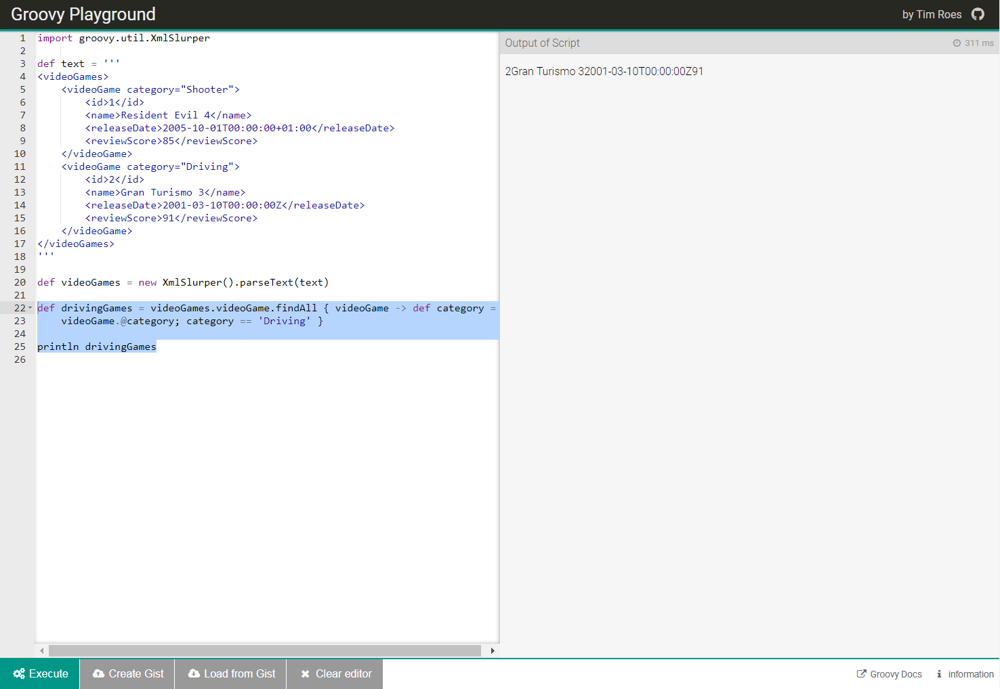

This post is the 3rd and final in the series on Groovy GPath in REST Assured, and will focus on GPath XML.

REST Assured uses [XmlPath](https://static.javadoc.io/com.jayway.restassured/rest-assured/1.4/com/jayway/restassured/path/xml/XmlPath.html) that can be queried with GPath expressions. XmlPath is an alternative to using XPath for easily getting values from an XML document. A lot of the functionality and syntax that we learned about in the previous post on GPath JSON is relevant and will work. But there are also some key differences when it comes to GPath XML.

Please note that in this post I will be using the terms ‘GPath XML‘ and ‘XmlPath‘ interchangeably.

We will discuss the differences as we work through the examples below.

In this post we will cover:

- The API used in this post – The “Video Game Database” – a simple application developed by me for my upcoming REST Assured video course
- Setting up the boilerplate code
- Snippet of XML from the API
- Simple GPath XML examples
- Practicing in the [Groovy Playground](https://groovy-playground.appspot.com/)
- Advanced GPath XML examples

---

# REST Assured Fundamentals – Out now on Udemy!

My Udemy course on **REST Assured Fundamentals** is out now on Udemy.

[](https://www.udemy.com/rest-assured-fundamentals/?couponCode=TECHIETESTER)

For readers of my blog, I am offering the course with an 80% discount – [just use this promotion code](https://www.udemy.com/rest-assured-fundamentals/?couponCode=TECHIETESTER) !

---

## The Video Game Database

For this blog post I will be using an API that I have developed as part of my upcoming video course on REST Assured. The API queries an imaginary [video game database](https://github.com/james-willett/VideoGameDB). Data is returned into either JSON or XML format depending on the headers supplied to the requests.

Since this post is on GPath XML, I will include a snippet of the XML returned when calling the API endpoint described in this blog post. This will allow you to follow along with the examples in this post without the need to install the application.

## Boilerplate Code

As in the previous post, we will add some boiler plate REST Assured code to get us setup. The main functionality that we are adding here is to always include the “Accept: application/xml” header in all of our requests.

This is the boilerplate code:

```java
import io.restassured.RestAssured;
import io.restassured.builder.RequestSpecBuilder;
import io.restassured.path.xml.XmlPath;
import io.restassured.path.xml.element.Node;
import io.restassured.response.Response;
import io.restassured.specification.RequestSpecification;
import org.junit.BeforeClass;
import org.junit.Test;

import java.util.ArrayList;
import java.util.List;
import java.util.Map;

import static io.restassured.RestAssured.\*;

public class GPathXML {

    @BeforeClass
    public static void setupRestAssured() {

        RestAssured.baseURI = "http://localhost";
        RestAssured.port = 8080;

        RequestSpecification requestSpecification = new RequestSpecBuilder().
                addHeader("Accept", "application/xml")
                .build();

        RestAssured.requestSpecification = requestSpecification;
    }

}
```

## XML Snippet

This is a snippet of the XML that is returned when calling the main GET endpoint of my Video Game Database. The API call is “http://localhost:8080/videogames”. The XML that is returned is:

```xml
<?xml version="1.0" encoding="UTF-8" standalone="yes"?>
<videoGames>
    <videoGame category="Shooter" rating="Universal">
        <id>1</id>
        <name>Resident Evil 4</name>
        <releaseDate>2005-10-01T00:00:00+01:00</releaseDate>
        <reviewScore>85</reviewScore>
    </videoGame>
    <videoGame category="Driving" rating="Universal">
        <id>2</id>
        <name>Gran Turismo 3</name>
        <releaseDate>2001-03-10T00:00:00Z</releaseDate>
        <reviewScore>91</reviewScore>
    </videoGame>
    <videoGame category="Puzzle" rating="Universal">
        <id>3</id>
        <name>Tetris</name>
        <releaseDate>1984-06-25T00:00:00+01:00</releaseDate>
        <reviewScore>88</reviewScore>
    </videoGame>
    <!-- further results excluded for brevity -->
</videoGames>
```

Now we are ready to move onto the GPath XML examples. Let’s start with some simple GPath XML examples.

## Simple GPath XML Examples

### Get Single XML Element Value

Let’s start with a simple example of GPath XML. Suppose that you wanted to get a single XML element value. In this case the “name” of the first video game. You could do that as follows:

```java
    @Test
    public void getSingleXmlElementValue_getVideoGameName() {

        Response response = get("/videogames");

        String name = response.path("videoGames.videoGame.name[0]");

        System.out.println(name); // returns "Resident Evil 4"
    }
```

### Get List of XML Element Values

We could extract a list of all the video game names. To do that, we would save the response as a string first before extracting our list of names:

```java
    @Test
    public void getListOfElementValues_getAllVideoGameNames() {

        String responseAsString = get("/videogames").asString();

        List<String> allNames = XmlPath.from(responseAsString).getList("videoGames.videoGame.name");

        System.out.println(allNames);
    }
```

### Get Single Xml Attribute

One of the key differences between XML And JSON is the use of “attributes” in XML. In the XML snippet below, observe the XML attributes of “category” and “rating”:

```xml
<videoGames>
    <videoGame category="Shooter" rating="Universal">
        <id>1</id>
        <name>Resident Evil 4</name>
        <releaseDate>2005-10-01T00:00:00+01:00</releaseDate>
        <reviewScore>85</reviewScore>
    </videoGame>
</videoGames>
```

In JSON these attributes would simply appear as regular entries within the object.

To extract these attributes in GPath XML, we can do the following:

```java
    @Test
    public void getSingleXmlAttribute_getVideoGameCategory() {

        Response response = get("/videogames");

        String category = response.path("videoGames.videoGame[0].@category");

        System.out.println(category);
    }
```

## Practice in the Groovy Playground

Before we move on and look at more advanced GPath XML examples, I wanted to show you a technique for practicing your GPath XML in the [Groovy Playground](https://groovy-playground.appspot.com/)

Open the Groovy Playground in a browser. Add the following boilerplate GPath XML code:

```groovy
def text = '''
<videoGames>
    <videoGame category="Shooter">
        <id>1</id>
        <name>Resident Evil 4</name>
        <releaseDate>2005-10-01T00:00:00+01:00</releaseDate>
        <reviewScore>85</reviewScore>
    </videoGame>
    <videoGame category="Driving">
        <id>2</id>
        <name>Gran Turismo 3</name>
        <releaseDate>2001-03-10T00:00:00Z</releaseDate>
        <reviewScore>91</reviewScore>
    </videoGame>
</videoGames>
'''
def videoGames = new XmlSlurper().parseText(text)
```

Now below this code, you can practice your GPath XML within the playground. For example, if you wanted to extract all the video games with a category of driving:

```groovy
def drivingGames = videoGames.videoGame.findAll { videoGame -> def category =
    videoGame.@category; category == 'Driving' }
println drivingGames
```

For reference, this is a screenshot of what the Groovy playground looks like with the code and output:



Using the above technique might save you some time when practicing your GPath XML. As opposed to having to call the endpoint each time in a trial / error fashion.

Let’s move on and look at some more advanced GPath XML examples.

## Advanced GPath XML Examples

### Get List of XML Nodes

We can get a list of all the videoGame XML nodes in our response with the following code:

```java
    @Test
    public void getListOfXmlNodes_getAllResults() {

        String responseAsString = get("/videogames").asString();

        List<Node> allResults = XmlPath.from(responseAsString).get("videoGames.videoGame.findAll { element -> return element }");

        System.out.println(allResults.get(2).get("name").toString()); //prints out "Tetris"
    }
```

When we print to console, we are getting the node at position 2 of the list and then getting the “name” element and converting that to a string.

### Get List of XML Nodes by .findAll() on an Attribute

Instead of getting all the XML nodes, suppose we only wanted to return video game nodes where the category is “Driving”. We can do that like so:

```java
    @Test
    public void getListOfXmlNodesByFindAllOnAttribute_getAllDrivingGames() {

        String responseAsString = get("/videogames").asString();

        List<Node> allDrivingGames = XmlPath.from(responseAsString).get("videoGames.videoGame.findAll { videoGame -> def category = videoGame.@category; category == 'Driving' }");

        System.out.println(allDrivingGames.get(0).get("name").toString()); // prints out "Gran Turismo 3"
    }
```

### Get List of Map of Attributes

We can do a “depth first” search in GPath XML with the “\*\*” shortcut, as we will see in this example. This one is a bit trickier. We want to extract an arraylist of maps. The maps are all the attributes of games that match a criteria. In this case, with a review score of 90. Here’s the code:

```java
    @Test
    public void getListofMapOfAttributes_getAllAttributesofCertainGames() {

        String responseAsString = get("/videogames").asString();

        // uses depth first search
        ArrayList<Map<String,?>> attributesOfGamesWithReviewScore90 = XmlPath.from(responseAsString).get("**.findAll { node -> node.reviewScore == '90' }*.attributes()");

        System.out.println(attributesOfGamesWithReviewScore90.toString()); // returns "[{rating=Universal, category=Platform}, {rating=Mature, category=Driving}]"
    }
```

### Get Single Node with .find() on an Element

Say we wanted to extract a single XML node, based on the value of some element within that node. In this case, we want to extract the video game node with the name of “Tetris”. We use the .find() method for that:

```java
    @Test
    public void getSingleNode_getSingleVideoGameData() {

        String responseAsString = get("/videogames").asString();

        Node videoGame = XmlPath.from(responseAsString).get("videoGames.videoGame.find { videoGame -> def name = videoGame.name; name == 'Tetris' }");

        String videoGameName = videoGame.get("name").toString();

        System.out.println(videoGameName);
    }
```

### Get Multiple Nodes in a List

We could also extract all of the nodes into a list. We would use the .findAll() method. To get a list of every node that is returned we can do this :

```java
    @Test
    public void getMultipleNodesInAList_getAllVideoGamesData() {

        String responseAsString = get("/videogames").asString();

        List<Node> allResults = XmlPath.from(responseAsString).get("videoGames.videoGame.findAll { element -> return element }");

        String nameOfThirdGame = allVideoGames.get(2).get("name").toString();
        System.out.println(nameOfThirdGame);
    }
```

Alternatively, we could extract a list of nodes based on some criteria. For example here, we extract all of the nodes with an ID greater than 0:

```java
    @Test
    public void getMultipleNodesInAList_getAllVideoGamesData() {

        String responseAsString = get("/videogames").asString();

        List<Node> allVideoGames = XmlPath.from(responseAsString).get("videoGames.videoGame.findAll { videoGame -> def id = videoGame.id.toFloat(); id > 0 }");

        String nameOfThirdGame = allVideoGames.get(2).get("name").toString();
        System.out.println(nameOfThirdGame);
    }
```

### Collect All Elements

We can use the .collect() GPath XML method to gather all the values of a certain element across all the nodes. To collect a list of all the review scores of the various games we can do:

```java
    @Test
    public void collectAllElements_getAllReviewScores() {

        String responseAsString = get("/videogames").asString();

        List<Integer> allReviewScores = XmlPath.from(responseAsString).get("videoGames.videoGame.collect { it.reviewScore }");

        System.out.println(allReviewScores);
    }
```

### Get Single Element with Depth First Search

Suppose that you wanted to get the value of a particular element within a node, by searching for the value of another element within that node. You can use a depth first search for that. To get the review score of a game with a certain name:

```java
    @Test
    public void getSingleElementWithDepthFirstSearch_getReviewScoreOfAGame() {

        String responseAsString = get("/videogames").asString();

        int reviewScore = XmlPath.from(responseAsString).getInt("**.find { it.name == 'Gran Turismo 3' }.reviewScore");

        System.out.println(reviewScore);
    }
```

### Get all Nodes Based on a Condition

Finally, say you wanted to extract all the XML nodes where the value of an element in the node matches a certain condition. In this case, we extract all the video games with a review score of over 90:

```java
    @Test
    public void getAllNodesBasedOnAConditionUsingParameter_getVideoGamesOverCertainReviewScore() {

        String responseAsString = get("/videogames").asString();

        int reviewScore = 90;

        List<Node> allVideoGamesOverCertainScore = XmlPath.from(responseAsString).get("videoGames.videoGame.findAll { it.reviewScore.toFloat() >= " + reviewScore + " }");

        System.out.println(allVideoGamesOverCertainScore);
    }
```

## Conclusion

Using GPath XML in REST Assured gives us a huge amount of versatility when it comes to extracting data from our responses. The examples in this post should provide you with a good starting point for writing your own GPath XML in your tests.

The topic of GPath for both JSON and XML will be is covered in depth in my [REST Assured video course](https://www.udemy.com/rest-assured-fundamentals/?couponCode=TECHIETESTER)

---
