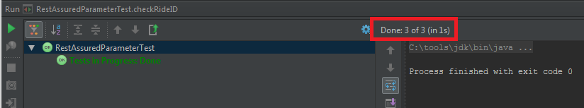
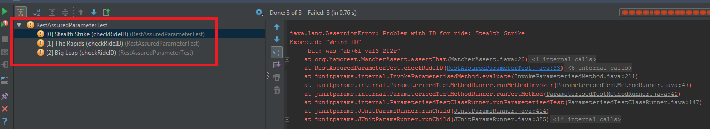

In [part 1 of this series on Going Further with Rest-Assured](http://james-willett.com/2015/06/going-further-with-rest-assured-part-1-writing-and-using-test-data-in-your-framework/), we looked at creating classes for our test data within our test code and then saw how we can put that data into a Java Map. We also took some example JSON and used Rest-Assured to create another Map of that data, so that we can compare the two. This post will follow on directly from the last one and will talk about how we can use the JUnitParams library to execute parameterised tests.

Firstly I should point out that I am not going to cover JUnitParams in great detail in this post, and will assume that you have a working knowledge of what it is. If you have no idea what it is, I suggest you follow the [Quick start for JUnitParams tutorial](https://github.com/Pragmatists/junitparams/wiki/Quickstart) to get up to speed. However, even if you don’t know much about JUnitParams you should still be able to follow along fine with the examples in this post.

What JUnitParams essentially does is enables us to execute the same test many times but with different test data that we will specify elsewhere in the test code. To make things as simple as possible in the examples below, the only parameter that we will be passing in each time is the ‘RideName‘ . If you recall in the previous post, the maps that we built had the Ride Names as the KEYS, so using the ride name as the parameter here will allow us to look-up different data in the map.

Let’s go ahead and get started. Create a new class in your ‘test > java‘ folder called ‘RestAssuredParameterTest‘. Copy and paste the exampleJSON into a String (make it a static string this time), add the ‘response’ and ‘jsonAsString’ variables and add the @RunWith(JUnitParamsRunner.class) annotation above the class name. Your code should look like below:

```java
import com.jayway.restassured.response.Response;
import junitparams.JUnitParamsRunner;
import org.junit.runner.RunWith;
@RunWith(JUnitParamsRunner.class)
public class RestAssuredParameterTest {
    public static Response response;
    public static String jsonAsString;
    private final static String exampleJSON = "[{\n" +
            "    \"state\": \"open\",\n" +
            "    \"throughput\": 800.0,\n" +
            "    \"id\": \"ab76f-vaf3-2f2r\",\n" +
            "    \"name\": \"Stealth Strike\",\n" +
            "    \"description\": \"Are you brave enough to ride the legendary 'Stealth Strike' ?\",\n" +
            "    \"info\": {\n" +
            "        \"visible.restrictions.min_height\": \"140cm\"\n" +
            "    }\n" +
            "}, {\n" +
            "    \"state\": \"open\",\n" +
            "    \"throughput\": 400.0,\n" +
            "    \"id\": \"jfy3-34fg-45ht\",\n" +
            "    \"name\": \"The Rapids\",\n" +
            "    \"description\": \"Enjoy a leisurely ride on our famous boat ride\",\n" +
            "    \"info\": {\n" +
            "        \"visible.restrictions.min_height\": \"110cm\",\n" +
            "        \"visible.restrictions.min_accompanied_height\": \"90cm\"\n" +
            "    }\n" +
            "}, {\n" +
            "    \"state\": \"open\",\n" +
            "    \"throughput\": 320.0,\n" +
            "    \"id\": \"abfg-3432-gft5\",\n" +
            "    \"name\": \"Big Leap\",\n" +
            "    \"description\": \"Take a leap into the unknown on this scary roller coaster\",\n" +
            "    \"info\": {\n" +
            "        \"visible.restrictions.min_height\": \"130cm\",\n" +
            "        \"visible.restrictions.min_accompanied_height\": \"100cm\"\n" +
            "    }\n" +
            "}]";
}
```

We are going to put all of our map creation code (for both maps, the API response and the test data) into a @BeforeClass method. The reason for this is that this code only needs to be run once (i.e. the maps only need to be created once) and then all of the @Test methods that we write can use the map data. To do this, we first need to declare a few static variables to hold the map data outside of any method. Add the following variables at the top of the class:

```java
public static Response response;
public static String jsonAsString;
public static ArrayList<Map<String,?>> jsonAsArrayList;
public static HashMap<Object, Map<String,?>> jsonAsHashMap;
public static HashMap<String, Ride> ridesTestDataMap;
And now add the map creation code (that we discussed in detail in the previous post) into a @BeforeClass method:

    @BeforeClass
    public static void createDataMaps()
    {
        // first we put our 'exampleJSON' string into an ArrayList of Maps of type <String, ?>
        jsonAsArrayList = from(exampleJSON).get("");
        // next we create a HashMap of <Object, Map<String, ?>>
        jsonAsHashMap = new HashMap<Object, Map<String, ?>>();
        // now populate the above map from the 'jsonAsArrayList'
        for (Map<String, ?> entryInList : jsonAsArrayList) {
            jsonAsHashMap.put(entryInList.get("name"), entryInList);
        }
        // finally we need to get hold of our test data into a map, so that we can compare the two
        // we create another Map of type <String, Ride> to hold all the ride test data
        // we populate it at initialisation by calling '.getRidesMap' method and passing in an array of rides by calling '.getRidesArray()', both from the RideParameters class
        ridesTestDataMap = RideParameters.getRidesMap(RideParameters.getRidesArray());
    }
```

We are going to create an Object array that is going to hold our parameters (the ride names) for our tests. Again, I am not going to explain how or why this works in this post, if you want to learn more about it then read the Quick Start for [JUnitParams tutorial](https://github.com/Pragmatists/junitparams/wiki/Quickstart) first. Otherwise, type in the following to your ‘RestAssuredParamaterTest.class’:

```java
private Object[] parametersForTests()
{
    return new Object[] {
        new Object[]{"Stealth Strike"},
        new Object[]{"The Rapids"},
        new Object[]{"Big Leap"}
    };
}
```

We now have our parameters and our data maps ready, the only thing left to do is to write some tests! Let’s start with a test that will check all of the ‘RideIDs‘ are correct. Type out the following @Test in the ‘RestAssuredParameterTest.class’:

```java
    @Test
    @junitparams.Parameters(method = "parametersForTests")
    public void checkRideID(String rideName)
    {
        // this will check that all the ride IDs are correct for every ride
        // this is a parameterised test, the 'rideName' will change for each test
        assertThat("Problem with ID for ride: " + rideName,
                jsonAsHashMap.get(rideName).get("id"), IsEqual.<Object>equalTo(ridesTestDataMap.get(rideName).getId()));
    }
```

Let’s talk about each line of this test in order. We start as usual with our @Test Junit annotation but then under that we add another annotation for JUnitParams:

```java
@Test
@junitparams.Parameters(method = "parametersForTests")
```

What this line does is tells the code to read in the parameters that we created in the ‘parametersForTests‘ class as the parameters for the test. These parameters will be substituted for the ‘rideName‘ String.

Now the test itself is just one line of code:

```java
assertThat("Problem with ID for ride: " + rideName,
jsonAsHashMap.get(rideName).get("id"), IsEqual.<Object>equalTo(ridesTestDataMap.get(rideName).getId()));
```

The first part of the assertThat is the error message that will print out if the assertion fails. It will print out the string “Problem with ID for ride Stealth Strike” (or whatever ride fails the assertion) upon a failure. The next part just grabs the rideID from both of the Maps and compares them. We discussed how this works at length in the previous post, the only difference here is that the variable ‘rideName’ substitutes in a different ride name (as per the parameter) for each iteration of the test.

Go ahead and run the test. It should pass. Notice that, although this is just one test, it ran and passed 3 times:



Let’s change our test data to make the test(s) fail. Go into the ‘RideParameters‘ class and change the rideIds for all the rides. Your code should look like this:

```java
public static Ride[] getRidesArray()
    {
        Ride[] rides = new Ride[3];
        rides[0] = new Ride("Stealth Strike", "open", 800.0f, "Weird ID", "Are you brave enough to ride the legendary 'Stealth Strike' ?", "140cm", null);
        rides[1] = new Ride("The Rapids", "open", 400.0f, "Another Weird ID", "Enjoy a leisurely ride on our famous boat ride", "110cm", "90cm");
        rides[2] = new Ride("Big Leap", "open", 320.0f, "And Another One", "Take a leap into the unknown on this scary roller coaster", "130cm", "100cm");
        return rides;
    }
```

Now run the checkRideID test again. The single test should fail three times, and you should get output similar to the screenshot below:



We now have parameterised tests working, good job! Although it has been quite a lot of work to get the test data into maps, now that the setup is completed it is very easy for us to scale up our testing. It would be trivial for us to add new @Test methods to check the state, description, throughput etc. for all the rides. It would also be very easy to add new rides, we would just need to add the ridename to the parametersForTests method and create the ride in the test data by adding another ride to the getRidesArray().

Notice also that because the API call would go into the @BeforeClass method we could have many @Test methods that would execute many different tests against a single call to the API. With this parameterised approach we have the potential to execute hundreds, if not thousands, of tests against an API call in a couple of seconds.

Before I wrap up this post, I want to provide one more example test. Recall from the Example JSON that all of the rides have an ‘info’ field:

```json
[
  {
    "state": "open",
    "throughput": 800.0,
    "id": "ab76f-vaf3-2f2r",
    "name": "Stealth Strike",
    "description": "Are you brave enough to ride the legendary 'Stealth Strike' ?",
    "info": {
      "visible.restrictions.min_height": "140cm"
    }
  },
  {
    "state": "open",
    "throughput": 400.0,
    "id": "jfy3-34fg-45ht",
    "name": "The Rapids",
    "description": "Enjoy a leisurely ride on our famous boat ride",
    "info": {
      "visible.restrictions.min_height": "110cm",
      "visible.restrictions.min_accompanied_height": "90cm"
    }
  },
  {
    "state": "open",
    "throughput": 320.0,
    "id": "abfg-3432-gft5",
    "name": "Big Leap",
    "description": "Take a leap into the unknown on this scary roller coaster",
    "info": {
      "visible.restrictions.min_height": "130cm",
      "visible.restrictions.min_accompanied_height": "100cm"
    }
  }
]
```

These info fields contain their own maps of data. Let’s write a test that can check the minimum height restriction for all of the rides. Type in the following @Test into your ‘RestAssuredParameterTest’ class:

```java
@Test
@junitparams.Parameters(method = "parametersForTests")
public void checkMinHeightRestriction(String rideName)
{
    // get a Map of all the restrictions for the ride
    Map<String, String> allRestrictions = (Map<String,String>) jsonAsHashMap.get(rideName).get("info");
    // now we can test that all the restrictions are correct for each ride
    assertThat("Problem with Min Height restriction for ride: " + rideName,
            allRestrictions.get("visible.restrictions.min_height"), equalTo(ridesTestDataMap.get(rideName).getMinHeight()));
}
```

In the @Test above, for each ride, we get a map of all the restrictions within the info field:

```java
Map<String, String> allRestrictions = (Map<String,String>) jsonAsHashMap.get(rideName).get("info");
```

We can then write an assertion that will grab the requested restriction from the map (in this case the minimum height) and compare it with the minimum height for our ride in the test data:

```java
assertThat("Problem with Min Height restriction for ride: " + rideName,
        allRestrictions.get("visible.restrictions.min_height"), equalTo(ridesTestDataMap.get(rideName).getMinHeight()));
```

I hope that you have found this series of posts on Rest-Assured to be useful, and I hope that I have not confused you with too much information! When I first came across this stuff, I must admit that I struggled with it a lot. I spent a lot of time just hacking around with ArrayLists and Maps to get a better idea of how they worked. Before I came across this stuff I thought that I knew the concepts for these data types pretty well, but it turned out that I didn’t and I had to go back and spend a reasonable amount of time just practicing and improving my knowledge. But going through that and arming myself with this knowledge has been massively beneficial to me, so I hope it does the same for you!

---

# REST Assured Fundamentals – Out now on Udemy!

My Udemy course on **[REST Assured Fundamentals](https://www.udemy.com/rest-assured-fundamentals/?couponCode=TECHIETESTER)** is out now on Udemy.

[](https://www.udemy.com/rest-assured-fundamentals/?couponCode=TECHIETESTER)

For readers of my blog, I am offering the course with an 80% discount – [just use this promotion code](https://www.udemy.com/rest-assured-fundamentals/?couponCode=TECHIETESTER) !
