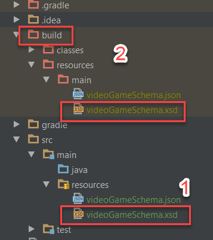
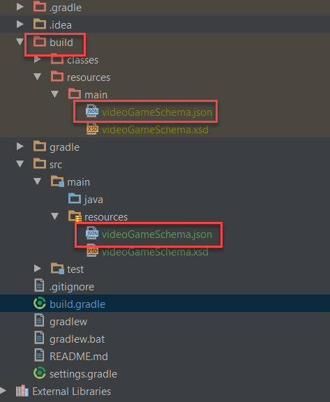

Another feature of **REST Assured** you will perhaps want to take advantage of is REST Assured Schema Validation. Implementing schema validation can be tricky if you aren’t familiar with the process. This post will walk you through setting up REST Assured Schema Validation for both JSON and XML.

Not familiar with schema validation? It basically ensures that the JSON or XML response that you get back from an endpoint matches a set of rules. The rules are defined in the schema. Rules could be that a number is within a certain range, or a property is not null etc.

Read more about [JSON Schema](http://json-schema.org/), and more about [XML Schema Definition](<https://en.wikipedia.org/wiki/XML_Schema_(W3C)>) (XSD), if you need to brush up.

---

# REST Assured Fundamentals – Out now on Udemy!

My Udemy course on **REST Assured Fundamentals** is out now on Udemy.

[](https://www.udemy.com/rest-assured-fundamentals/?couponCode=TECHIETESTER)

For readers of my blog, I am offering the course with an 80% discount – [just use this promotion code](https://www.udemy.com/rest-assured-fundamentals/?couponCode=TECHIETESTER) !

---

## REST Assured Schema Validation Setup

Before we can implement any REST Assured Schema Validation, we need to make sure we have the proper imports in our project. If you are just doing XML validation, then everything is already included in REST Assured. If you are doing JSON validation, you need to add the REST Assured Schema Validation to the dependencies in your build file:

```groovy
compile 'io.rest-assured:json-schema-validator:3.0.3'
```

## Test Class / Endpoint

In this blog post I will be using the [Video Game API Database](https://github.com/james-willett/VideoGameDB) application that I am developing for my upcoming REST Assured video tutorial series. I will publish all the necessary code snippets in this post so that you can follow along.

Let’s start with REST Assured Schema Validation for XML.

## XML

Firstly you need to generate an XML Schema definition for your endpoint. To do that, take the xml response from the endpoint and paste it into the [XSD generator](https://www.freeformatter.com/xsd-generator.html#ad-output)

This will generate an XSD file for you. Now we need to put that file on our classpath in our project. In my project, I put it in **src > main > resources** folder. I can tell that its on the classpath, because when I build the project it appears in the build files, as in the screenshot below:



// 1 We can see the schema file in the **src > main > resources** folder  
// 2 When the project builds, we can see the schema file appear inside the red build folder

Let’s now look at test code for REST Assured Schema Validation for XML:

```java
    @Test
    public void testVideoGameSchemaXml() {
        given().
                contentType("application/xml").
                header("Accept", "application/xml").
        when().
                get("http://localhost:8080/videogames/11").
        then().body(matchesXsdInClasspath("videoGameSchema.xsd"));
    }
```

In this code we are specifying that the contentType and accept headers are for XML, and are making a call to our endpoint at “http://localhost:8080/videogames/11“. We then use the REST Assured method matchesXsdInClasspath to check that the xml returned conforms to our schema.

Remember to include the static import for matchesXsdInClasspath at the top of your class like so:

```java
import static io.restassured.matcher.RestAssuredMatchers.matchesXsdInClasspath;
```

## JSON

Now let’s look at REST Assured Schema Validation in JSON.

Again we need to generate a schema first. Take a copy of the JSON returned by your api and paste it into the [JSON schema generator](https://jsonschema.net/#/editor)

Again you need to put the JSON schema file on your classpath like so:



This is the code that will check our response against the JSON schema:

```java
    @Test
    public void testVideoGameSchemaJson() {
        get("http://localhost:8080/videogames/11")
            .then()
                .assertThat().
                    body(matchesJsonSchemaInClasspath("videoGameSchema.json"));
    }
```

Again we call the endpoint “http://localhost:8080/videogames/11“. We didn’t specify any JSON headers as thats the default for this application. We then assert that the JSON response complies with the JSON schema in the classpath.

Remember again to include the static import:

```java
import static io.restassured.module.jsv.JsonSchemaValidator.matchesJsonSchemaInClasspath;
```

## Summary

This blog post should be all that you need to start adding REST Assured Schema Validation to your REST Assured tests. REST Assured Schema Validation will be included in my coming video tutorial series on REST Assured. Look out for more details soon!
