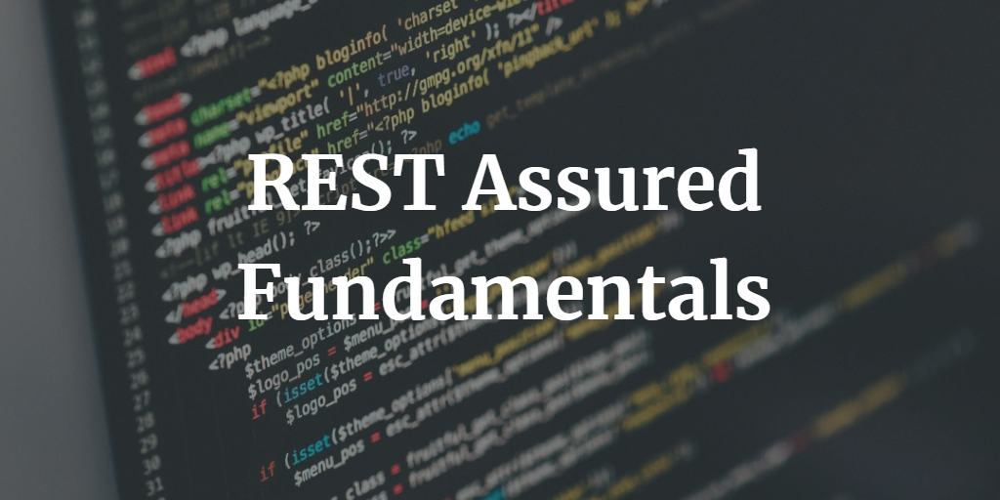
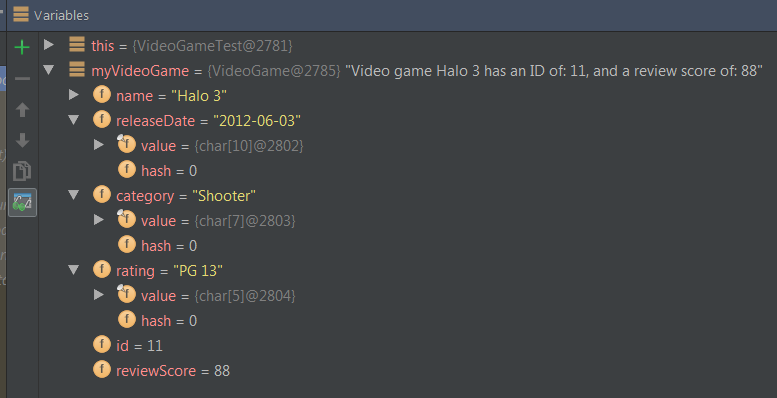

Often when you are using REST Assured, you will want to serialize a POJO (Plain old Java Object) and send that in your API call. Or you might want to take the API response and de-serialize the body to a POJO. This blog post on REST Assured Serialization will help you do that!

I got a lot of inspiration for this blog post from a similar one published by Bas Dijkstra called [(De)serializing POJOs in REST Assured](http://www.ontestautomation.com/deserializing-pojos-in-rest-assured/). Bas has a lot of great REST Assured posts you should definitely check out!

---

# REST Assured Fundamentals – Out now on Udemy!

My Udemy course on **REST Assured Fundamentals** is out now on Udemy.

[](https://www.udemy.com/rest-assured-fundamentals/?couponCode=TECHIETESTER)

For readers of my blog, I am offering the course with an 80% discount – [just use this promotion code](https://www.udemy.com/rest-assured-fundamentals/?couponCode=TECHIETESTER) !

---

## Setup

One important step with REST Assured Serialization is to add the [Jackson serialization](https://github.com/FasterXML/jackson-databind) to your classpath. This step isn’t obvious in most REST Assured documentation.

To do it, simply add the following dependency to your Maven or Gradle build script:

```groovy
compile 'com.fasterxml.jackson.core:jackson-databind:2.8.6'
```

Now you are ready to start some REST Assured Serialization!

## Test Class / Code

In this blog post I will be using the [Video Game Database](https://github.com/james-willett/VideoGameDB) API Application that I am developing for my upcoming REST Assured course. I will post the appropriate code snippets here too so that you can follow along.

In this post we will serialize / de-serialize a VideoGame object. So our VideoGame class looks something like this:

```java
public class VideoGame {

    String name;
    String releaseDate;
    String category;
    String rating;
    int id;
    int reviewScore;

    public VideoGame() {
    }
    public VideoGame(String name, int reviewScore, String releaseDate, String category, String rating, int id) {
        this.name = name;
        this.reviewScore = reviewScore;
        this.releaseDate = releaseDate;

        this.category = category;
        this.rating = rating;
        this.id = id;
    }

    public int getId() {
        return id;
    }

    public void setId(int id) {
        this.id = id;
    }

    // other getters & setters excluded for brevity

    public String toString() {
        return "Video game " + this.name + " has an ID of: " + this.id + ", and a review score of: " + this.reviewScore;
    }
}
```

Now that we have our POJO class we can start writing some REST Assured Serialization tests!

## JSON Serialization

Let’s start with REST Assured Serialization with JSON. I want to send a POST request to my VideoGame API that will add a new Video Game to the database. I will send a POJO of the video game in the request. This is what the code looks like in the test class:

```java
    @Test
    public void testVideoGameSerializationJSON() {

        VideoGame myVideoGame = new VideoGame("Halo 3", 88, "2012-06-03", "Shooter", "PG-13", 11);

        given().
                contentType("application/json").
                body(myVideoGame).
        when().
                post("http://localhost:8080/videogames").
        then().
                assertThat().
                body(equalTo("{\"status\": \"Record Added Successfully\"}"));
    }
```

So we instantiated a new Video Game object called myVideoGame. And we sent that came in the body of the POST request to the API. We then asserted that we got a successful response. Using a proxy, I can see that this is what the request body looked like:

```json
{
  "name": "Halo 3",
  "releaseDate": "2012-06-03",
  "category": "Shooter",
  "rating": "PG-13",
  "id": 11,
  "reviewScore": 88
}
```

REST Assured Serialization with Jackson handled all the serialization work for us. Great!

## JSON De-Serialization

Now let’s write another test that calls a GET request to the API to return the video game we just created. We are going to use Jackson REST Assured Serialization to convert the response straight into a POJO. Here’s the code:

```java
    @Test
    public void testVideoGameDeSerialization() {

        VideoGame myVideoGame = get("http://localhost:8080/videogames/13").as(VideoGame.class);

        System.out.println(myVideoGame.toString());
    }
```

We know that the deserialzation worked because of the output of the print line. To make sure, let’s take a look at the myVideoGame object in debug mode:



Rest Assured Serialization back to a POJO is looking good here!

## XML Serialization

The Video Game Database API that I have developed supports both JSON and XML. If we wanted to submit our POJO as XML, we just change the contentType to “application/xml”, as follows:

```java
    @Test
    public void testVideoGameSerializationXML() {

        VideoGame myVideoGame = new VideoGame("Little Big Adventure", 95, "2005-03-10", "RPG", "PG-13", 12);

        given().
                contentType("application/xml").
                body(myVideoGame).
        when().
                post("http://localhost:8080/videogames").
        then().
                assertThat().
                body(equalTo("{\"status\": \"Record Added Successfully\"}"));
    }
```

Again using a proxy, this is what the body of the message looked like when it got sent to the API:

```xml
<?xml version="1.0" encoding="ISO-8859-1" standalone="yes"?>
<videoGame category="RPG" rating="PG-13">
    <id>12</id>
    <name>Little Big Adventure</name>
    <releaseDate>2005-03-10</releaseDate>
    <reviewScore>95</reviewScore>
</videoGame>
```

Again, REST Assured Serialization with Jackson did all the work for us.

## Conclusion

Using the power of REST Assured Serialization is a useful tool to have in your REST Assured vocabulary. You can use any serialization software that you want (not just Jackson), and even your own custom serialize. Find out more at the [REST Assured documentation for Object Mapping](https://github.com/rest-assured/rest-assured/wiki/Usage#object-mapping)

Walkthroughs of REST Assured Serialization will be covered in my upcoming video tutorial series on REST Assured.
