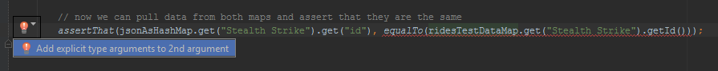
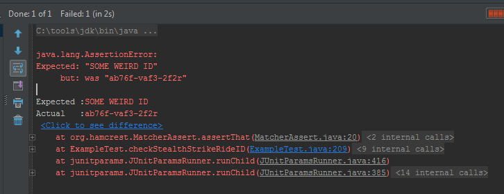

In the [previous blog post](http://james-willett.com/2015/06/extracting-a-json-response-with-rest-assured/) we looked at how we can extract data from an API call directly into our tests using Rest-Assured and had a look at a couple of basic tests that we could execute against that data. One small issue with the previous post is that we did not have an actual API that we could use (unless you happened to have access to one), but I wanted to demonstrate how the extracting functionality worked and how we can convert the response into a String. In this post, we will simply copy / paste the JSON directly into the IDE in a String and use that for our examples.

Another concept that I want to introduce in this post is writing your own classes that you can use for your test data. Similarly to the previous post, the JSON that we are testing provides some information on rides in a theme park. This is the JSON that would be returned from calling the API:

```json
[
  {
    "state": "open",
    "throughput": 800.0,
    "id": "ab76f-vaf3-2f2r",
    "name": "Stealth Strike",
    "description": "Are you brave enough to ride the legendary 'Stealth Strike' ?",
    "info": {
      "visible.restrictions.min_height": "140cm"
    }
  },
  {
    "state": "open",
    "throughput": 400.0,
    "id": "jfy3-34fg-45ht",
    "name": "The Rapids",
    "description": "Enjoy a leisurely ride on our famous boat ride",
    "info": {
      "visible.restrictions.min_height": "110cm",
      "visible.restrictions.min_accompanied_height": "90cm"
    }
  },
  {
    "state": "open",
    "throughput": 320.0,
    "id": "abfg-3432-gft5",
    "name": "Big Leap",
    "description": "Take a leap into the unknown on this scary roller coaster",
    "info": {
      "visible.restrictions.min_height": "130cm",
      "visible.restrictions.min_accompanied_height": "100cm"
    }
  }
]
```

The above JSON returns information for 3 rides. The following information is returned:

- State
- Throughput
- Id
- Name
- Description
- Minimum Height
- Minimum Accompanied Height

So when we make a call to this API and have the above JSON returned, we want to be able to write a test that checks that all of the data is as we expected. A good way to model the expected results / test data would be to create a ‘Ride’ class where we can create instances of the 3 rides above. In your IDE, in the ‘main > Java’ folder, create a new class called ‘Ride‘ and add the following code:

```java
public class Ride {
    // declare variables
    private String name;
    private String state;
    private String id;
    private String description;
    private String minHeight;
    private String minAccompaniedHeight;
    private Float throughput;
    // declare getters
    public String getName() {
        return name;
    }
    public String getState() {
        return state;
    }
    public Float getThroughput() {
        return throughput;
    }
    public String getId() {
        return id;
    }
    public String getDescription() {
        return description;
    }
    public String getMinHeight() {
        return minHeight;
    }
    public String getMinAccompaniedHeight() {
        return minAccompaniedHeight;
    }
    // constructor
    public Ride(String name, String state, Float throughput, String id, String description, String minHeight, String minAccompaniedHeight) {
        this.name = name;
        this.state = state;
        this.throughput = throughput;
        this.id = id;
        this.description = description;
        this.minHeight = minHeight;
        this.minAccompaniedHeight = minAccompaniedHeight;
    }
}
```

The above class for ‘Ride’ simply has variables for the various properties of the ride, getters to access those properties and a constructor to create an instance of the ride. I won’t go into more details about the code here as I am assuming you have a basic working knowledge of Java. As I mentioned in the previous post, I recommend this book [Java For Testers by Alan Richardson](https://leanpub.com/javaForTesters) if you need to learn more about Java.

Now that we have created the class we need to actually create 3 instances of Rides with all of the appropriate data. It seems to me like an array of these rides would be a solid choice in this case. In your ‘main > Java’ file create another file called ‘RideParameters‘ and add the following code:

```java
public class RideParameters {
    public static Ride[] getRidesArray()
    {
        Ride[] rides = new Ride[3];
        rides[0] = new Ride("Stealth Strike", "open", 800.0f, "ab76f-vaf3-2f2r", "Are you brave enough to ride the legendary 'Stealth Strike' ?", "140cm", null);
        rides[1] = new Ride("The Rapids", "open", 400.0f, "jfy3-34fg-45ht", "Enjoy a leisurely ride on our famous boat ride", "110cm", "90cm");
        rides[2] = new Ride("Big Leap", "open", 320.0f, "abfg-3432-gft5", "Take a leap into the unknown on this scary roller coaster", "130cm", "100cm");
        return rides;
    }
}
```

In the above code we have a single method, getRidesArray(), which when called will create an array of 3 Rides. The method will populate each of the 3 instances by calling the Ride constructor and passing in the specified data. Finally it will return the array of rides.

Before we move on to writing our actual test class, we need to write one more method. In our tests we will be creating a Java Map of our data in the JSON and so we need to put our test Ride data into a map also. Add the following method to the RideParameters class which when called will create a map of our test data:

```java
public static HashMap<String, Ride> getRidesMap(Ride[] rides)
    {
        HashMap<String, Ride> ridesMap = new HashMap<String, Ride>();
        for (Ride ride : rides) {
            ridesMap.put(ride.getName(), ride);
        }
        return ridesMap;
    }
```

When the above method is called it takes an array of rides as the argument. It creates a HashMap<String, Ride> called ridesMap. That map is populated by using a For Each loop to iterate over everything in the Rides array. For each entry in the array, it adds the ride name to the map as the KEY and adds the ride itself as the VALUE. Finally it returns the ridesMap.

We are now ready to start writing our test class. Inside the ‘test > java’ folder in the IDE, create a new file called ‘RestAssuredTest‘. The first thing that we will do is copy and paste the JSON above into the code directly so that we can work with it without having to call the API. Your class should initially look something like the following:

```java
public class RestAssuredTest {
    private final String exampleJSON = "[{\n" +
    "    \"state\": \"open\",\n" +
    "    \"throughput\": 800.0,\n" +
    "    \"id\": \"ab76f-vaf3-2f2r\",\n" +
    "    \"name\": \"Stealth Strike\",\n" +
    "    \"description\": \"Are you brave enough to ride the legendary 'Stealth Strike' ?\",\n" +
    "    \"info\": {\n" +
    "        \"visible.restrictions.min_height\": \"140cm\"\n" +
    "    }\n" +
    "}, {\n" +
    "    \"state\": \"open\",\n" +
    "    \"throughput\": 400.0,\n" +
    "    \"id\": \"jfy3-34fg-45ht\",\n" +
    "    \"name\": \"The Rapids\",\n" +
    "    \"description\": \"Enjoy a leisurely ride on our famous boat ride\",\n" +
    "    \"info\": {\n" +
    "        \"visible.restrictions.min_height\": \"110cm\",\n" +
    "        \"visible.restrictions.min_accompanied_height\": \"90cm\"\n" +
    "    }\n" +
    "}, {\n" +
    "    \"state\": \"open\",\n" +
    "    \"throughput\": 320.0,\n" +
    "    \"id\": \"abfg-3432-gft5\",\n" +
    "    \"name\": \"Big Leap\",\n" +
    "    \"description\": \"Take a leap into the unknown on this scary roller coaster\",\n" +
    "    \"info\": {\n" +
    "        \"visible.restrictions.min_height\": \"130cm\",\n" +
    "        \"visible.restrictions.min_accompanied_height\": \"100cm\"\n" +
    "    }\n" +
    "}]";
}
```

Ok we are ready to go! What we are going to do in the code below is create maps of both the JSON and our test data. We will then pull a bit of data from both of those maps and check that it is correct. Type out the following @Test that will check that the RideID of ‘Stealth Strike’ is correct:

```java
@Test
public void checkStealthStrikeRideID()
{
// first we put our 'exampleJSON' string into an ArrayList of Maps of type <String, ?>
ArrayList<Map<String,?>> jsonAsArrayList = from(exampleJSON).get("");
// next we create an empty HashMap of <Object, Map<String, ?>>
HashMap<Object, Map<String, ?>> jsonAsHashMap = new HashMap<Object, Map<String, ?>>();
// now populate the above map from the 'jsonAsArrayList'
for (Map<String, ?> entryInList : jsonAsArrayList) {
jsonAsHashMap.put(entryInList.get("name"), entryInList);
}
// finally we need to get hold of our test data into a map, so that we can compare the two
// we create another Map of type <String, Ride> to hold all the ride test data
// we populate it at initialisation by calling '.getRidesMap' method and passing in an array of rides by calling '.getRidesArray()', both from the RideParameters class
HashMap<String, Ride> ridesTestDataMap = RideParameters.getRidesMap(RideParameters.getRidesArray());
assertThat(jsonAsHashMap.get("Stealth Strike").get("id"), IsEqual.<Object>equalTo(ridesTestDataMap.get("Stealth Strike").getId()));
}
```

Let’s talk through the above code line by line to determine exactly what is going on. For the first line:

```java
ArrayList<Map<String,?>> jsonAsArrayList = from(exampleJSON).get("");
```

On this line we are creating an ArrayList of Maps that have the KEY / VALUE combination of <String, ?> . The reason for the ‘?’ is that one of the values in the JSON is a FLOAT (the throughput) and the rest are Strings, so we need to specify the generic data type with a ‘?’. We now populate this ArrayList by using the Rest-Assured method ‘from’ and passing in our ‘exampleJSON‘ . We use the ‘.get(“”)‘ to get everything from the JSON. Rest-Assured does all the hard work here and populates the ArrayList for us.

Now that we have our response data in an ArrayList, we next need to convert that into a HashMap. This is the next line:

```java
HashMap<Object, Map<String, ?>> jsonAsHashMap = new HashMap<Object, Map<String, ?>>();
```

This creates an empty HashMap of <Object, Map> called jsonAsHashMap. The ‘Map‘ within the ‘HashMap’ has the KEY / VALUE of <String, ?> (the same as in the ArrayList we created above).

On the next line we use a For Each loop to populate the jsonAsHashMap:

```java
for (Map<String, ?> entryInList : jsonAsArrayList)
        {
            jsonAsHashMap.put(entryInList.get("name"), entryInList);
        }
```

What the above code is doing is looking at each entry in the jsonAsArrayList in turn. For each entry, the code populates the jsonAsHashMap by putting the name of the ride as the KEY and then the map of all the ride data as the VALUE.

We now have the data from the JSON in a HashMap. The next step is to create a HashMap of our test data, so that we have something to compare our JSON to in order to check whether or not it is correct. Fortunately this is a little bit simpler than the above because we have already written most of the code. The following line will create and populate the test data HashMap:

```java
HashMap<String, Ride> ridesTestDataMap = RideParameters.getRidesMap(RideParameters.getRidesArray());
```

This line creates a HashMap with the KEY / VALUE of ‘String’ and ‘Ride’. To populate it, we simply call the RideParameters.getRidesMap() method that we created previously. That method requires that we pass in an array of rides, which we do by specifying a call to ‘RideParameters.getRidesArray()‘ within the method call.

We finally have both our Response data and our Test data in the format that we want, two HashMaps. In the final line, we execute a very simple test that will check that the RideId for ‘Stealth Strike’ is correct. We do this by pulling the rideId for Stealth Strike from both maps and asserting that they match:

```java
assertThat(jsonAsHashMap.get("Stealth Strike").get("id"), IsEqual.<Object>equalTo(ridesTestDataMap.get("Stealth Strike").getId()));
```

This assert statement has two parts separated by the ‘,’ where we are first getting the data from the jsonAsHashMap and then the ridesTestDataMap. On the left hand side, we look up the jsonAsHashMap by using the .get() method and providing the KEY, which is the ride name ‘Stealth Strike‘. From that map, we then look up the id of the ride by again using the .get() method and this time providing the KEY which is ‘id‘

On the right hand side, we first add Explicit argument types to the data that we are calling. Now your IDE should actually be able to handle this for you. What I do for the right hand side is type in the following:

```java
equalTo(ridesTestDataMap.get("Stealth Strike").getId()
```

Your IDE should detect the error, underline it in RED, and offer to correct the code for you:



Once the code is corrected, it will look like this, which is the correct format:

```java
IsEqual.<Object>equalTo(ridesTestDataMap.get("Stealth Strike").getId()
```

So similarly to the code on the left hand side of the ‘,’ the code on the right hand side looks up the ridesTestDataMap by using a .get() call and providing the KEY for the map which is the ride name ‘Stealth Strike‘. Remember that this map holds the Ride objects themselves, so we can now call all of the methods for that object. To get the ID, we can simply call the ‘.getID()‘ method, which we set when we created the ‘Ride‘ class originally:

```java
public class Ride {
    .. // ..
    public String getId()
    {
        return id;
    }
    .. // ..
}
```

Run the test, it should pass. Let’s prove that it is working by changing the test data in our parameters file. Open up the ‘RideParameters.java‘ class that you created before and change the Ride ID in the constructor so that it looks like this:

```java
public static Ride[] getRidesArray()
    {
       .. // ..
        rides[0] = new Ride("Stealth Strike", "open", 800.0f, "SOME WEIRD ID", "Are you brave enough to ride the legendary 'Stealth Strike' ?", "140cm", null);

        .. // ..
    }
```

Now run the test again, it should fail because the IDs are no longer the same:



We covered a lot of ground in this post. Chances are that you will need to work through it a couple of times to get a decent understanding of what is going on, but hopefully you can tell at least at a high level what the code is doing. We went through a lot of work to get our test data and response data into Java Maps but in the end we only pulled a tiny bit of information from each map. The reason for this is that I did not want to overload you with more information than was necessary in this post. In the next follow up post, we will be executing Parameterised Junit tests using the JUnitParams library that will enable us to check all of the data in our maps very quickly.

---

# REST Assured Fundamentals – Out now on Udemy!

My Udemy course on **[REST Assured Fundamentals](https://www.udemy.com/rest-assured-fundamentals/?couponCode=TECHIETESTER)** is out now on Udemy.

[](https://www.udemy.com/rest-assured-fundamentals/?couponCode=TECHIETESTER)

For readers of my blog, I am offering the course with an 80% discount – [just use this promotion code](https://www.udemy.com/rest-assured-fundamentals/?couponCode=TECHIETESTER) !
