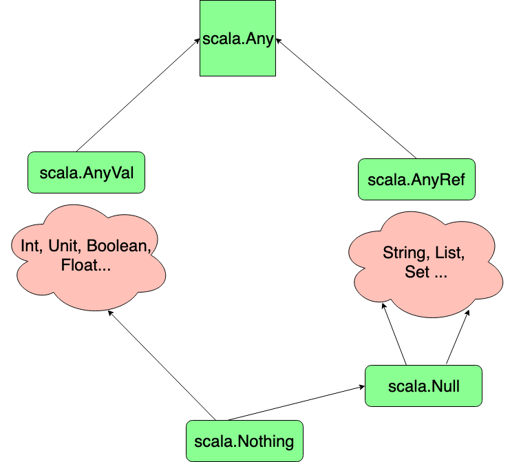

[[info]]
| This post is **part 4** of the Object Oriented Programming in Scala series.

In this blog post we will discuss **Inheritance** and **Traits** in Scala. There is nothing particularly different here in Scala compared to other languages, but it is important to understand the concepts and syntax well. Let's dive straight in and show a very simple example of Inheritance.

# Single Class Inheritance

We start by creating a simple class called Animal, with a single method. This will be our **Super Class**:

```scala
class Animal {
  def eat = println("I am eating!")
}
```

To create a class that inherits from the Animal class, we use the **extends** keyword. This would be a **Sub Class**:

```scala
class Cat extends Animal
```

Now we can instantiate a new instant of our Cat class, and the instance has access to the **eat** method from the _super_ class of Animal:

```scala
val cat = new Cat
cat.eat
```

# Access Modifiers in Scala Inheritance

In our method definitions, if we don't include any [access modifier](https://www.jesperdj.com/2016/01/08/scala-access-modifiers-and-qualifiers-in-detail/) then Scala will default to **public**.

If we mark the method in the super class as **private**, then calling the method in the sub class is not possible:

```scala
class Animal {
  private def eat = println("I am eating!")
}
```

The other thing we can do is mark the method as **protected** - this means it is only accessible within that class or within a subclass. So for example:

```scala
class Animal {
  protected def eat = println("I am eattng!")
}
```

So now this will no longer work:

```scala
cat.eat
```

But if we could still access the original eat method from within the subclass like so:

```scala
class Cat extends Animal {
  def burp = {
    eat
    println("Burp! Pardon me!")
  }
}
```

And then call the burp method (which calls the eat method):

```scala
cat.burp
```

# Constructors in Scala Inheritance

Next we will look at where **constructors** fit in with relation to Scala inheritance. We will define a couple of classes, one for Person, and one for Adult which inherits from Person:

```scala
class Person(name: String, age: Int)
class Adult(name: String, age: Int, idCard:String) extends Person
```

This code above will not compile because of an error:

> Unspecified value parameters for name and age

Remember, when you define a class like this (i.e. with parameters), you also define the [class constructor](/scala-object-oriented-basics#class-constructor).

This code doesn't compile because when you attempt to instantiate an instance of Adult, the JVM will need to call a parent class first (i.e. the constructor of Person). The Scala compiler forces you to guarantee that there is a correct **super constructor** to call when using such a derived class.

You must pass in the correct arguments otherwise the compiler will look for (and in this case fail) to find a constructor like the one provided (in this case for Person). When we extended the class, we specified a constructor of Person with no parameters, but that doesn't exist. We need to pass in the correct parameters like so:

```scala
class Adult(name: String, age: Int, idCard:String) extends Person(name, age)
```

This is the correct way of extending a class with parameters.

## Auxiliary Constructors

If you were using an auxiliary constructor within Person, then the code below would be OK.

```scala
class Person(name: String, age: Int) {
  def this(name: String) = this(name, 0)
}
class Adult(name: String, age: Int, idCard:String) extends Person(name)
```

This works because the compiler would find a constructor with just the name inside the super class.

# Overriding in Scala Inheritance

Let's look now at **overriding** when it comes to Scala inheritance. In this example, if we override the protected method eat from the super class, then we can now call that method from our instance:

```scala
class Dog extends Animal {
  override def eat = println("I am a dog eating!")
}
val dog = new Dog
dog.eat
```

This is because the overridden method is public, not protected.

We can also override values in our class, for example:

```scala
class Animal {
  val creatureType = "wild"
  protected def eat = println("I am eating!")
}

class Dog extends Animal {
  override val creatureType = "domestic"
  override def eat = println("I am a dog eating!")
}

val dog = new Dog
println(dog.creatureType)
```

## Overriding Fields

Fields, as opposed to methods, have a special property that they can be overridden in the constructor directly as well. For example:

```scala
class Dog(override val creatureType: String) extends Animal {
  override def eat = println("I am a dog eating!")
}
  val dog = new Dog("puppy")
  println(dog.creatureType)
```

This a valid definition, with the value of createType being directly overridden in the constructor.

Alternatively, you could override the field by writing the Dog class like this:

```scala
class Dog(dogType: String) extends Animal {
  override val creatureType = dogType
  override def eat = println("I am a dog eating!")
}
```

# Type Substitution aka Polymorphism

In Scala, the overall intention with overriding anything is that all instances of derived classes will use the overridden value whenever possible. But we can also do something called **Type Substitution** instead.

For example we could declare a class as an animal, but supply a Dog instead:

```scala
val unknownAnimal: Animal = new Dog("Boxer")
```

This is an example of **Polymorphism**.

Suppose that we removed the protected modifier from Animal, so that our animal class looks like so:

```scala
class Animal {
  val creatureType = "wild"
  def eat = println("I am eating!")
}
```

If we now call the eat method from our instance, we will see that even though unknownAnimal is an instance of **Animal**, it will use the **Dog** method of eat instead:

```scala
val unknownAnimal: Animal = new Dog("Boxer")
unknownAnimal.eat /// prints out "I am a dog eating!"
```

Remember that a method call will always go to the _most overridden method possible_.

Make sure you make the distinction between **Overriding** ( supplying a different implementation in derived classes) vs **Overloading** (methods with different signatures but the same name in the same class).

# Accessing Methods of the Super Class

If we want to access a method from the [super class](https://alvinalexander.com/scala/how-to-call-method-superclass-scala-cookbook) in our sub class, we can use the **super** keyword. Look at this example:

```scala
class Dog(dogType: String) extends Animal {
  override val creatureType = dogType
  override def eat = {
    super.eat
    println("I am a dog eating!")
  }
}
```

Now if we call this eat method, we end up calling both implementations of eat - the one in the super class and the one in the sub class:

```scala
val unknownAnimal: Animal = new Dog("Boxer")
unknownAnimal.eat
```

Which prints out:

```scala
I am eating!
I am a dog eating!
```

# Preventing Overrides

There are cases when you want to _prevent_ the overriding of fields and methods in your Scala applications. There are 3 ways that you can do this:

## Method 1 - Use the **final** Keyword on the Method

One way is to use the keyword **final** - this will prevent derived classes from overriding the eat method. For example:

```scala
class Animal {
  val creatureType = "wild"
  final def eat = println("I am eating!")
}
```

## Method 2 - Use the **final** Keyword on the Class

The final keyword can also be used on the class itself. This prevents the entire class from being extended:

```scala
final class Animal {
  val creatureType = "wild"
  def eat = println("I am eating!")
}
```

## Method 3 - **Seal** the Class

The third option is to [**seal**](https://www.scala-lang.org/old/node/123) the class. This is a softer restriction in that you can extend classes in **this file** only, but prevents extension in other files:

```scala
sealed class Animal {
  val creatureType = "wild"
  def eat = println("I am eating!")
}
```

You wouldn't now be able to extend this animal class in another file.

# Abstract Classes in Scala

There are situations in Scala when you need to leave fields or methods blank. In this situation we say the field is **abstract**. Classes that are allowed to have these blank fields or methods are called [Abstract Classes](https://www.geeksforgeeks.org/abstract-classes-in-scala/). They are defined by the keyword **abstract**, for example:

```scala
abstract class Animal {
  val creatureType: String
  def eat: Unit
}
```

Both of the methods in this class above are abstract, as they aren't assigned any value. This is because we want the sub classes to do that for us instead.

An Abstract class can not be instantiated. This should make sense because if some of the members aren't implemented, how would the compiler know what to do if we called one of these methods?

Let's declare an empty subclass called **Dog**:

```scala
class Dog extends Animal {

}
```

At this point the compiler complains:

> "class Dog must either be declared abstract or implement abstract members"

This makes sense based on what we just discussed. We can fix the error by adding the required members like so:

```scala
class Dog extends Animal {
  override val creatureType: String = "Canine"
  override def eat: Unit = println("I am a Dog eating!")
}
```

Note that the **override** key is not required here. This is because there is no prior implementation to replace. You can leave it here if you choose though.

# Traits in Scala Inheritance

Let's move on to talking about [traits in Scala](https://www.tutorialspoint.com/scala/scala_traits). Traits are the ultimate abstract data type in Scala.

They are created by using the keyword **trait** and then the name of the trait. The trait below, **Carnivore**, describes things that can eat Animals:

```scala
trait Carnivore {
  def eat(animal: Animal): Unit
}
```

Notice that the **eat** method above is also abstract. Traits by default (like abstract classes) have _abstract fields and methods_. What is special about traits is that, unlike abstract classes, they can be inherited along classes. What do we mean by that exactly?

Well if we declare a new class that extends from Animal, we can also inject a trait:

```scala
class Crocodile extends Animal with Carnivore {

}
```

This class inherits members from _both_ Animal and Carnivore. Of course we need to implement the required members from both Animal and Carnivore to make the compiler happy:

```scala
class Crocodile extends Animal with Carnivore with ColdBlooded {
  val creatureType: String = "croc"
  def eat: Unit = println("I am a Crocodile eating!")
  def eat(animal: Animal): Unit = println(s"I am a croc and I am eating ${animal.creatureType}")
}
```

Let's instantiate a couple of the classes to test out what we have so far:

```scala
  val dog = new Dog
  val croc = new Crocodile
  croc.eat(dog)
```

## Multiple Traits

Note that you can mix in multiple traits to your classes, for example if you had the trait:

```scala
trait ColdBlooded
```

You could add that to the Crocodile class like so:

```scala
class Crocodile extends Animal with Carnivore with ColdBlooded {
  val creatureType: String = "croc"
  def eat: Unit = println("I am a Crocodile eating!")
  def eat(animal: Animal): Unit = println(s"I am a croc and I am eating ${animal.creatureType}")
}
```

# Differences between Traits and Abstract Classes in Scala

We know that abstract classes can have both abstract and non-abstract types. But so can traits! For example, both of these are valid:

```scala
abstract class Animal {
  val creatureType: String = "wild"
  def eat: Unit
}
trait Carnivore {
  def eat(animal: Animal): Unit
  val preferredMeal: String = "fresh meat"
}
```

So what are the differences between abstract classes and traits then?

For one, traits can not have constructor parameters. You can't pass in parameters to the signature of a trait. This is invalid:

```scala
trait Carnivore(name: String)
```

Second, you can only extend one class, _but you can mix in multiple traits_. Multiple traits may be inherited by the same class. Scala has **single class inheritance**, _but multiple trace inheritance_.

Third, and this is more subtle, we choose a trait over an abstract class if the trait describes some sort of behavior. An abstract class on the other hand is a type of "thing" or object.

# Type Hierarchy in Scala

Now that we know a bit about how Scala does inheritance, we can talk about Scala's **Type Hierarchy**. Look at the diagram below:



- We start at the top with **scala.Any**, which is essentially the mother of all types.
- Derived from any is **scala.AnyRef** which is mapped to Java's object type. All classes you will use will derive from anyRef unless you specifically state some other classes. So all classes that you use like String, List, Set and all user derived classes will extend anyRef. Even though you don't specifically say so.
- Derived from all of these is the **scala.null** type which is very special. It's only instance is the null reference which basically means no reference. Null extends basically anything in the sense that you can replace anything with null, with no reference.
- On the left hand side you have **AnyVal**, which contains all the primitive vals like Int, Unit, Boolean etc. Some other classes extend AnyVal, but its very rare in Scala to need to extend from AnyVal, maybe for some memory optimisations. AnyVal normally contains just the primitive types in Scala.
- Derived from all of them is **Scala.Nothing** , in the sense that nothing can replace everything! This will make sense a little bit later when we talk about throwing exceptions and expressions returning nothing.
- But nothing is a subtype of every single thing in Scala... nothing means no instance of anything at all, not even Null or Unit.

# Detailed Example of Inheritance & Traits

To cement our understanding of Inheritance and Traits further, lets look an a more detailed example. We will create a small program that returns a list of integers with the following behavior:

- head = first element of the list
- tail = remainder of the list
- isEmpty = is this list empty?
- add(int) => new list with this element added
- toString = a string representation of the list

## Abstract Class

We start by creating an abstract class **MyList**, and defining our methods with the appropriate signatures (minus toString, which we will do later):

```scala
abstract class MyList {
  def head: Int
  def tail: MyList
  def isEmpty: Boolean
  def add(element: Int): MyList
}
```

## Object that Extends a Class

We will create an object for to represent an Empty list, and extend that from our super class. **Note therefore that objects can extend classes**. We will temporarily add in an empty implementation for the methods as well with **???**. This returns NOTHING, as we learned about above in the diagram:

```scala
object Empty extends MyList {
  def head: Int = ???
  def tail: MyList = ???
  def isEmpty: Boolean = ???
  def add(element: Int): MyList = ???
}
```

## Class for the Non-Empty List

Now for the non-empty list, we will use a class instead of an object. It will have two parameters, the **head** which is an Int and the **tail** which is also an Int. We could say this is called a [Linked List](https://en.wikipedia.org/wiki/Linked_list) - its composed of the head as an element, then the rest of the list:

```scala
class Cons(h: Int, t: MyList) extends MyList {
  def head: Int = ???
  def tail: MyList = ???
  def isEmpty: Boolean = ???
  def add(element: Int): MyList = ???
}
```

Note that we start again with empty implementations of nothing, for all the methods.

## Fill in the Empty Object

Let's work on the Empty object first, as it is easier to implement. Starting with the **head** and **tail**, we know that this is an empty list. So we wouldn't expect to return anything for either of these methods. Let's add an exception instead:

```scala
object Empty extends MyList {
  def head: Int = throw new NoSuchElementException
  def tail: MyList = throw new NoSuchElementException
  def isEmpty: Boolean = ???
  def add(element: Int): MyList = ???
}
```

The **isEmpty** method is going to always return true, as this is an empty list:

```scala
object Empty extends MyList {
  def head: Int = throw new NoSuchElementException
  def tail: MyList = throw new NoSuchElementException
  def isEmpty: Boolean = true
  def add(element: Int): MyList = ???
}
```

Now for the **Add** method, this is going to return a new instance of Cons, with the element in the signature as the head and the Empty list object as the tail:

```scala
object Empty extends MyList {
  def head: Int = throw new NoSuchElementException
  def tail: MyList = throw new NoSuchElementException
  def isEmpty: Boolean = true
  def add(element: Int): MyList = new Cons(element, Empty)
}
```

## Work on the Non-Empty List

Now let's look at the Cons class. For the **head** and **tail** methods, these will both just return the h and t parameters from the class signature respectively. Also the **isEmpty** method obviously returns False as well, this isn't the empty list. So far we have:

```scala
class Cons(h: Int, t: MyList) extends MyList {
  def head: Int = h
  def tail: MyList = t
  def isEmpty: Boolean = false
  def add(element: Int): MyList = ???
}
```

For the **add** method, we will again return a new instance of Cons, with the element in the signature as the new head. Then for the tail, the keyword THIS is used to return this instance of the Cons object:

```scala
class Cons(h: Int, t: MyList) extends MyList {
  def head: Int = h
  def tail: MyList = t
  def isEmpty: Boolean = false
  def add(element: Int): MyList = new Cons(element, this)
}
```

## Test what we have so far

To test this all out, let's create a new object and do some testing inside of that:

```scala
object ListTest extends App {

}
```

Inside the object, let's instantiate a new instance of a list and print out the head:

```scala
  val list = new Cons(1, Empty)
  println(list.head) // prints out 1
```

Instead of the tail of the list being empty, we could also create a linked list like this:

```scala
val list = new Cons(1, new Cons(2, new Cons(3, Empty)))
```

Here we are creating new lists (i.e. a new Cons instance) each time for the tail of the list.

We can print out the head of the second list (2) by doing the following:

```scala
println(list.tail.head)
```

Let's test the add method. We will add the element 4 to the list, and then print out the head of the list (in the same chained call):

```scala
println(list.add(4).head)
```

Of course we can also test that the isEmpty method works easily like so:

```scala
println(list.isEmpty)
```

## Implement the toString method

Let's now look at how we might implement the toString method. Going first back to our abstract class, we need to add a couple of methods. One to print out the elements and one to add the
square brackets for printing out to the console:

```scala
abstract class MyList {
  def head: Int
  def tail: MyList
  def isEmpty: Boolean
  def add(element: Int): MyList
  def printElements: String
  override def toString: String = "[" + printElements + "]"
}
```

We choose this implementation because **printElements** (which doesn't have an implementation) will delegate to the subclasses implementation when printing out the elements. I.e. whatever the implementation is in either the Empty object or the Cons class.

Let's look at the Empty object first to see what we mean. The printElements method in this Object will return an empty string:

```scala
object Empty extends MyList {
  def head: Int = throw new NoSuchElementException
  def tail: MyList = throw new NoSuchElementException
  def isEmpty: Boolean = true
  def add(element: Int): MyList = new Cons(element, Empty)

  def printElements: String = ""
}
```

But for the Cons class, the implementation of printElements will be different:

```scala
class Cons(h: Int, t: MyList) extends MyList {
  def head: Int = h
  def tail: MyList = t
  def isEmpty: Boolean = false
  def add(element: Int): MyList = new Cons(element, this)

  def printElements: String = {
    if(t.isEmpty) "" + h
    else h + " " + t.printElements
  }
}
```

We are using a recursive method here for printElements. If the tail is empty, then we return an empty string plus the head of the list. Otherwise, if the tail isn't empty, we return the head plus a space and we call printElements again recursively on the tail.

## Test the toString method

Now if we print the list.toString , this toString will go to the toString method in the abstract class.

```scala
println(list.toString)
```

This calls the printElements method, which is derived by the two implementations in the Empty object and Cons class. The appropriate printElements method is called later - i.e. a polymorphic call. Our list is an instance of Cons, so we are calling **printElement** from that class. The printElements call is called recursively, and then gets concatenated in the toString method of the abstract class MyList.

# Summary

We went through a lot of things in this post.

- We started with the fact that Scala offers a lot of **class based inheritance** with the **extends** key word.
- We discussed access modifiers for private, protected and public (i.e. default).
- Also that we need to pass in **constructor arguments** to parent classes when we are inheriting from them.
- Discussed **overriding** members or methods.
- Reusing parent fields/methods with the **super** class.
- Preventing inheritance with **final** and **sealed**.
- **Abstract classes** and **traits**, including how they are different and how they can be mixed in with the same extension scheme.

# Source Code

As always, the source code for this post is available on [Github](https://github.com/james-willett/ScalaBlog/tree/master/src/scalaBasics/objectOriented).
