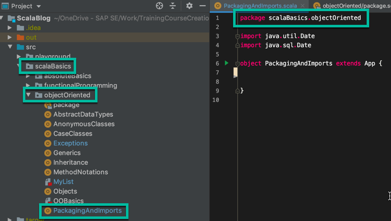
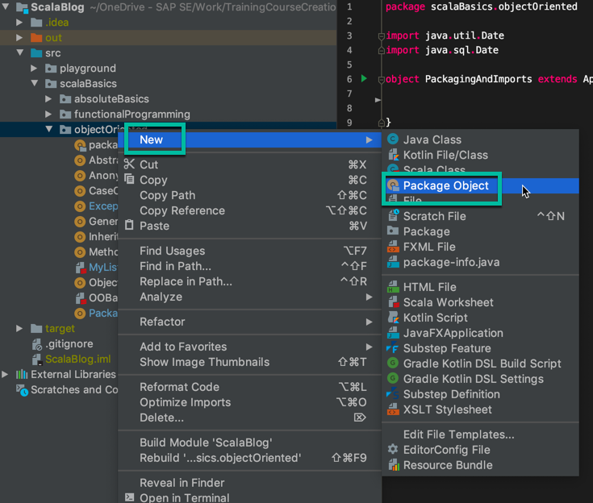
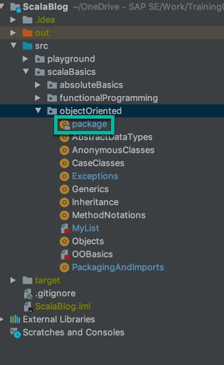

[[info]]
| This post is **part 10** and the final part of the _Object Oriented Programming in Scala_ series. You can view [all the posts in the series](../blog/scala_oo_series) here.

# TLDR;

In this post, we learn that a package is a group of definitions under the same name.

The top level package definition allows members of the package to use each other with their simple name. To use by a simple name, you need to be in the same package or import the package.

We use the fully qualified name to call a class within a package without explicitly importing it.

We learn about package objects which hold standalone methods / constants. They can only be one per package and are called '**package**'.

Finally we learn about different ways of doing imports, and how to implement aliasing when importing.

---

We will conclude our series of blogs posts on Object Oriented Programming in Scala with an in-depth look at packages.

# Packages in Scala

A **package** in Scala essentially means one or more class definitions that are grouped under the same name. Most of the time this matches the directory structure of the project.

As an example, at the top of a Scala file you will typically have something like:

```scala
package scalaBasics.objectedOriented
```

We can see from the screenshot of our project directory, how this structure relates:



## Accessing Members in a Package

Members within a package are visible and accessible by using their simple name, no matter where they are within the package.

For example they could be in a completely different file, but if that file is in the same package, they can be accessed.

If on the other hand they _aren't_ in the same package, then the member needs to be imported:

```scala
import someOtherPackage.SomeOtherClass
```

Alternatively, if you don't want to import the package, you can instead _supply the full name_ to the IDE:

```scala
val someVal = new someOtherPackage.someOtherClass
```

This is known as supplying the **fully qualified name**.

# The Package Object in Scala

A **Package Object** is a special feature of Scala. It originated from the problem that sometimes we might want to write methods or constants outside of everything else in our codebase. Currently we have to write out a member (i.e. a class, trait, object etc.) and put the values or constants in there.

But for universal constants or methods that should reside outside of classes, package objects were created for this purpose.

So to create a package object in Intellij, we right click on the package that this object should sit in and choose **New > Package Object**



Package objects can only be _1 per package_. The name of this file is simply **package** - again, this naming convention is rarely broken:



Inside this package object, we can define methods or constants and use them by their simple name inside the rest of the package. So for example, if we had a **package** file that looked like this:

```scala
package scalaBasics

package object objectOriented {

  def sayHello: Unit = println("Hello, Scala")
  val SPEED_OF_LIGHT = 299792458
}
```

Now throughout the rest of the **objectOriented** package, we can access these methods:

```scala
  sayHello
  println(SPEED_OF_LIGHT)
```

# Imports in Scala

If you want to import two different files from the same package, you can put them in curly braces:

```scala
import someOtherPackage.{SomeOtherClass, SecondClass}
```

Or to import everything from the package, use an _underscore_ instead:

```scala
import someOtherPackage._
```

Best practice is to only use the underscore when absolutely necessary - i.e. you are importing several things from the package

## Aliasing Imports

You can also set aliasing of classes in the import statement like so:

```scala
import someOtherPackage.{SomeOtherClass, SecondClass => SecondClassAlias }
```

This is useful if you need to import more than one class with the same name from different packages. If you imported both of these **Date** classes:

```scala
import java.util.Date
import java.sql.Date
```

And then did:

```scala
val d = new Date
```

The IDE will use the _first_ import statement, which may not be what you wanted.

If you wanted to use both of these dates in your code, you could either use a [fully qualified name](./scala-packaging-imports#accessing-members-in-a-package) or you can use aliasing.

To do that, for one of the imports, use curly braces and an arrow:

```scala
import java.sql.{Date => SqlDate}
```

## Default Imports

Default imports are packages that are automatically imported without you having to do anything.

An example is [java.lang](https://docs.oracle.com/javase/7/docs/api/java/lang/package-summary.html) - which contains String, Object, Exception etc. The [top level Scala package](https://www.scala-lang.org/files/archive/spec/2.12/09-top-level-definitions.html) is also imported - which contains Int, Nothing and Function. [Scala.PreDef](https://www.scala-lang.org/api/current/scala/Predef$.html) is imported automatically as well - this contains things like **println** and the **???** implementation.

---

# Source Code

As always, the source code for this post is available on [Github](https://github.com/james-willett/ScalaBlog/blob/master/src/scalaBasics/objectOriented/PackagingAndImports.scala).
