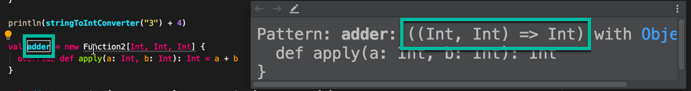

# TLDR;

The objective with functional programming is to use functions as **first class elements**. We want to be able to pass functions as _parameters_, or return functions as _values_ in results. Essentially, **we want to work with functions as we would work with any other kind of values.**

The problem is that Scala works on top of the JVM, _which was never design for functional programming_. In Java, first class programming elements are instances of classes.

The only solution that will work for a functional programming language is to _turn all Scala functions into instances of special function like types_.

In Scala, there are function traits of up to **22 parameters**.

A typical function trait looks like this:

```scala
trait Function1[A, B] {
 def apply(element: A): B
}
```

We also have **syntactic sugar** for function types. For example if we had:

```scala
Function2[Int. String, Int]
```

This can be rewritten as:

```scala
(Int, String) => Int
```

---

# Functions - First Class Citizens

For this first blog post in our series on Functional Programming in Scala, we will attempt to answer the question **What (really) is a function in Scala?**. Functions were first introduced in an early post in the [Absolute Basics in Scala series](../blog/scala_basics_series/) simply called [Functions in Scala](../scala-functions). In this post, we will go into far greater depth.

In Scala we want to treat functions as **first class citizens**. What we mean by that, is we want to work with **functions** like we would with regular **values**. There is a problem with this though... Coming from the object oriented Java world, everything is an object. Or at least an instance of some kind of class.

## Functional Programming - Java Style

The only way to simulate functional programming in Java, was to use classes and instances of those classes.

So in Java we would write something like this:

```scala
class Action {
  def execute(element: Int): String = ???
}
```

Here we write out a class (**Action**) and then the method `execute`. To make use of the `execute` function, we would need to instantiate the **Action** class (either anonymously or normally). As described in the [anonymous classes](../scala-anonymous-classes/) post, we would instantiate instances of classes and then override the methods on the spot.

The most that you could do would be to generalize most of the boilerplate code, so you can use generic types.

For example say we have an abstract type (like a trait). It takes two type parameters, `A` and `B`. We would say that the method takes an element of **type A** and returns an element of **type B**:

```scala
trait Action[A, B] {
  def execute(element: A): B
}
```

A slightly better way to write this in Scala, would be to rename the trait to **MyFunction**, then rename the method to `apply`. The apply method has a special meaning in Scala:

```scala{2}
trait MyFunction[A, B] {
  def apply(element: A): B
}
```

But this is the limits of what an object oriented language would be able to do.

The JVM is naturally constructed around these constraints. So Scala had to resort to some clever tricks to make it look like a truly functional programming language. We will explore those tricks in the rest of this post.

# Scala Function Types

Let's use the **MyFunction** trait that we just defined. We will create an instance of the **MyFunction** trait, which transforms an Int into another Int. The `apply` method of the class takes an element of type Int and returns another Int. The implementation is that we double the Int:

```scala
  val doubler = new MyFunction[Int, Int] {
    override def apply(element: Int): Int = element * 2
  }
```

This is an **instance** of the little function like class, i.e. the trait **MyFunction**.

The advantage of doing this in Scala (as opposed to Java), is that we can call the doubler directly with a parameter, as if it were a function:

```scala
println(doubler(2)) // prints out 4
```

If you run this, **doubler** will call the `apply` method within itself. The number `4` is printed out to the console.

So **doubler**, which is an instance of a function like class, can itself be called just like a function.

This is how Scala becomes a functional programming language.

## Function Types included Out of the Box

The interesting thing, is that Scala supports these function types right out of the box.

The function types are **Function1, Function2, Function3... up to Function22**.

But for a function with 1 parameter and 1 result, this is called as `scala±Function1[A,B]`. This is the function type which is by default supported in Scala.

Let's create another instance of **Function1**, to convert a string into an int:

```scala
val stringToIntConverter = new Function1[String, Int] {
    override def apply(string: String): Int = string.toInt
}
```

Notice that this time we supplied type parameters `String` and `Int`. We are providing a `String` and we want the value returned to be an `Int`.

We can now call `stringToIntConverter`, say with the string `3`, and add the result to the number `4` straight away:

```scala
println(stringToIntConverter("3") + 4) // will return 7
```

## Function Types Supported up to 22 Parameters

As mentioned previously, Scala supports these function types up to **22 parameters**.

So for example, say we had a function called `adder` that takes two Ints and returns an Int. That would be a `scala±Function2[Int, Int, Int]`. Two Ints for the parameter types and the final Int for the result type:

```scala
val adder = new Function2[Int, Int, Int] {
    override def apply(a: Int, b: Int): Int = a + b
}
```

The apply method takes two parameters, `a` and `b`, both Int. And the return type is an Int.

## Function Types Syntactic Sugar

If you hover over the `adder` val in the IDE, you can see the type is `scala±(Int, Int) => Int`.



This is syntactic sugar for `Function2`.

You could rewrite the `adder` val with the correct type like so:

```scala{1}
val adder: Function2[Int, Int, Int] = new Function2[Int, Int, Int] {
    override def apply(a: Int, b: Int): Int = a + b
}
```

Or if you wanted to rewrite it with syntactic sugar:

```scala{1}
val added: ((Int, Int) => Int) = new Function2[Int, Int, Int] {
    override def apply(a: Int, b: Int): Int = a + b
}
```

So to summarize, if we have a function with two type parameters `A` and `B`, and a result parameter `R`, this would be `scala±Function2[A,B,R]`. With syntactic sugar, we write this as `scala±(A, B) => R`. We will use this annotation a lot more in this blog post series.

## But all Scala Functions are Objects!

We must remember that all **Scala functions are objects OR instances of classes derived from Function1, Function2** etc.

This is laying the groundwork for Scala as a functional language based on the JVM. The JVM which was never designed with functional programming in mind, only objected oriented programming.

But through a series of syntactic features (that we will explore further in this blog series), we will get to Scala as a truly function language.

# Function Type Example - String Concatenator

Let's create a function that takes two strings and concatenates them. The function might look like this:

```scala
def concatenator: (String, String) => String = new Function2[String, String, String] {
  override def apply(a: String, b: String): String = a + b
}
```

Talking through the above in order, we first create a function `concatenator`, which is of type `scala±(String, String => String)` - i.e. it takes two strings and returns another string. The value is a new `Function2` with three string type parameters.

The implementation of the apply method takes two strings `scala±(a, b)` and returns a string. The implementation concatenates them together.

We can call the `concatenator` simply like so:

```scala
println(concatenator("Hello", "Bob"))
```

# Update MyList application to use Function Types

In the previous blog post series on [Object Oriented Programming in Scala](../blog/scala_oo_series) we created an application called **MyList**. This exercise showed how we can create a [covariant generic list](../scala-covariant-generic-list).

With the knowledge gained from this post, we can transform the implementation to instead use **Function Types**.

## Review the Traits

The **MyList** application previously had these two traits:

```scala
trait MyPredicate[-T] {
  def test(elem: T): Boolean
}

trait MyTransformer[-A, B] {
  def transform(elem: A): B
}
```

The **MyPredicate** and **MyTransformer** traits are basically function types.

_MyPredicate_ is a function type from T to Boolean - `scala±(T => Boolean)`.

_MyTransformer_ is a function type from `scala±(A => B)`.

Now that we know about function types, we don't actually need these traits anymore. So we can delete them from the code altogether. Of course when we do that, a bunch of things in our MyList application will now not compile, so lets go through and fix the errors.

## Update Abstract Class MyList to use Scala Function Types

### Map

Going from the top of the file, we can see the first things that have broken are in the **MyList** abstract class itself. The first thing to fix is the `map` function. Previously it looked like this:

```scala{5}
abstract class MyList[+A] {

// ... other code omitted for brevity

  def map[B](transformer: MyTransformer[A, B]): MyList[B]
}
```

We can fix this by changing the `transformer` to a `scala±Function1[A, B]` ... or to `scala±(A => B)` type:

```scala{5}
abstract class MyList[+A] {

// ... other code omitted for brevity

  def map[B](transformer: A => B): MyList[B]
}
```

### FlatMap

Next for the `flatMap` function, this is what it was previously:

```scala
def flatMap[B](transformer: MyTransformer[A, MyList[B]]): MyList[B]
```

This will change to `scala±A => MyList[B]` type:

```scala
def flatMap[B](transformer: A => MyList[B]): MyList[B]
```

### Filter

And for the `filter` method, we had this previously:

```scala
def filter(predicate: MyPredicate[A]): MyList[A]
```

This will become `scala±A => Boolean` , because it returns a Boolean:

```scala
def filter(predicate: A => Boolean): MyList[A]
```

## Update the Empty Object to use Scala Function Types

### Map

Next for the `map` in the `Empty` object, this was previously how it looked:

```scala{5}
case object Empty extends MyList[Nothing] {

  // ... other code omitted for brevity

  def map[B](transformer: MyTransformer[Nothing, B]): MyList[B] = Empty
}
```

This will become:

```scala{5}
case object Empty extends MyList[Nothing] {

  // ... other code omitted for brevity

  def map[B](transformer: Nothing => B): MyList[B] = Empty
}
```

### FlatMap

Next for the `flatMap`, we previously had:

```scala
def flatMap[B](transformer: MyTransformer[Nothing, MyList[B]]): MyList[B] = Empty
```

This will become:

```scala
def flatMap[B](transformer: Nothing => MyList[B]): MyList[B] = Empty
```

### Filter

And for the `filter`, we previously had:

```scala
def filter(predicate: MyPredicate[Nothing]): MyList[Nothing] = Empty
```

This will become:

```scala
def filter(predicate: Nothing => Boolean): MyList[Nothing] = Empty
```

## Update the Cons Class to use Scala Function Types

### Filter

Going down into the Cons class. Previously our `filter` looked like this:

```scala{5-8}
case class Cons[+A](h: A, t: MyList[A]) extends MyList[A] {

  // ... other code omitted for brevity

  def filter(predicate: MyPredicate[A]): MyList[A] = {
    if (predicate.test(h)) new Cons(h, t.filter(predicate))
    else t.filter(predicate)
  }
}
```

In the method, the `predicate` will become type `scala±(A => Boolean)`. The `scala±predicate.test` method doesn't make sense anymore. Instead we can call `scala±predicate.apply(h)`, or simply `predicate` with the the apply omitted. This is because we can call `predicate` like a function:

```scala{5-8}
case class Cons[+A](h: A, t: MyList[A]) extends MyList[A] {

  // ... other code omitted for brevity

  def filter(predicate: A => Boolean): MyList[A] = {
    if (predicate(h)) new Cons(h, t.filter(predicate))
    else t.filter(predicate)
  }
}
```

### Map

Going down the codebase, next is the `map` function:

```scala
def map[B](transformer: MyTransformer[A, B]): MyList[B] = {
  new Cons(transformer.transform(h), t.map(transformer))
}
```

The `transformer` method will become an `scala±(A => B)` type. And for the `transform` method that no longer exists, we can call the `apply` method or simply omit apply and just call `transformer` like a function:

```scala
def map[B](transformer: A => B): MyList[B] = {
  new Cons(transformer(h), t.map(transformer))
}
```

### FlatMap

Finally for `flatMap`, this was previously the implementation:

```scala
def flatMap[B](transformer: MyTransformer[A, MyList[B]]): MyList[B] = {
  transformer.transform(h) ++ t.flatMap(transformer)
}
```

Similar to the two methods above, it will become:

```scala
def flatMap[B](transformer: A => MyList[B]): MyList[B] = {
  transformer(h) ++ t.flatMap(transformer)
}
```

## Updating the ListTest object

Going down to the tests in `ListTest`, we were previously instantiating _MyTransformer_ and _MyPredicate_, i.e.:

```scala{7-9}
object ListTest extends App {

  // ... other code omitted for brevity

  val listOfIntegers: MyList[Int] = new Cons(1, new Cons(2, new Cons(3, Empty)))

  println(listOfIntegers.map(new MyTransformer[Int, Int] {
    override def transform(elem: Int): Int = elem * 2
  })).toString
}
```

We can replace this simply with `Function1`, i.e.:

```scala{7}
object ListTest extends App {

  // ... other code omitted for brevity

  val listOfIntegers: MyList[Int] = new Cons(1, new Cons(2, new Cons(3, Empty)))

  println(listOfIntegers.map(new Function1[Int, Int] {
    override def apply(elem: Int): Int = elem * 2
  })).toString
}
```

We also replace the method names that we were overwriting to always be `apply`.

The next test that used `MyPredicate` was this:

```scala
println(listOfIntegers.filter(new MyPredicate[Int] {
  override def test(elem: Int): Boolean = elem % 2 == 0
})).toString
```

This will become:

```scala
println(listOfIntegers.filter(new Function1[Int, Boolean] {
  override def apply(elem: Int): Boolean = elem % 2 == 0
})).toString
```

Finally, we were previously using `MyTransformer`:

```scala
println(listOfIntegers.flatMap(new MyTransformer[Int, MyList[Int]] {
  override def transform(elem: Int): MyList[Int] = new Cons(elem, new Cons(elem + 1, Empty))
}).toString)
```

This will become:

```scala
println(listOfIntegers4.flatMap(new Function1[Int, MyList[Int]] {
  override def apply(elem: Int): MyList[Int] = new Cons(elem, new Cons(elem + 1, Empty))
}).toString)
```

# Higher Order Functions

Functions are now being used as _First class values_ in the MyList application. We can now say that `map`, `flatMap` and `filter` are _Higher Order Functions_. [Higher order functions](https://docs.scala-lang.org/tour/higher-order-functions.html) either receive functions as parameters or return other functions as result. Higher order functions are critical to functional programming, because functions are used as **first class citizens**.

To explore this further, let's define a function that takes an int and returns another function that takes an int and returns an int.

First we need to decide what type this function is going to take. The type is going to be `Function1` that takes an Int, and the return type is going to be _another_ `Function1` that takes an Int and this time returns an Int. So the type is `scala±Function1[Int, Function1[Int, Int]]`. This is what the final function looks like:

```scala
val superAdder: Function1[Int, Function1[Int, Int]] = new Function1[Int, Function1[Int, Int]] {
 override def apply(x: Int): Function1[Int, Int] = new Function1[Int, Int] {
   override def apply(y: Int): Int = x + y
  }
}
```

Let's go through the workings inside the function:

- The first `apply` method takes an Int, lets say x, and returns `scala±Function1[Int, Int]`
- So because the return type is `Function1` with Int and Int, it will return a **new** `Function1` with Int and Int
- Going down, the second `apply` will take an Int, that we will call `y` of type Int, and it returns an Int
- The implementation isn't that important for this example, but we are just adding the numbers `x` and `y`

Because `x` is defined in the upper function, `x` is visible inside the function implementation below.

Let's use this `superAdder` function. We declare a `scala±val adder3` , and we call `scala±superAdder(3)` for it:

```scala
val adder3 = superAdder(3)
```

Now `adder3` is a new function, the type is `scala±(Int => Int)` - i.e. `scala±Function1[Int, Int]`

If we println `adder3`, with a parameter `4`:

```scala
println(adder3(4))
```

This will return `7`. This is because the implementation of `adder3` is:

```scala
override def apply(y: Int): Int = x + y
```

Which adds `x` (in this case 3) passed to `superAdder` before, and `y` which is the actual parameter.

In the same fashion, we can write `superAdder` with parameter `3` and then applied straight away with parameter `4`:

```scala
println(superAdder(3)(4))
```

# Curried Functions

So `superAdder` with parameter `3` returns a `Function1`, and then we can call that with parameter `4`.

This `superAdder` special function is called a **Curried Function**. [Curried functions](https://docs.scala-lang.org/tour/currying.html) have the property that they can be called with multiple parameter lists, just by their mere definition.

A curried function actually receives some kind of parameter and returns _another_ function that receives parameters. In this case, `superAdder` can be called with multiple parameter lists to get to the final result.

**Curried functions** and **higher order functions** will be showcased more in upcoming blog posts in this series.

---

# Source Code

As always, the source code for this post is available on [Github](https://github.com/james-willett/ScalaBlog/blob/master/src/scalaBasics/functionalProgramming/WhatsAFunction.scala).
